# Panel Discussion Story Articles — Plan

## Goal

1. **Write four ground-truth articles first** — these become the basis sources and references for the panel content.
2. **Use your experience + interview answers** to draft **vignettes** — short stories that illustrate and extend those ground-truth articles.
3. **Stitch vignettes** into one narrative per panel topic, explicitly anchored to the corresponding ground-truth article(s).

The vignettes are not standalone; they are **stories that stand on** the ground-truth articles and your experience.

---

## 1. Ground-truth articles (write these first)

These four articles are written **before** the vignettes. They state your position, frameworks, and principles. The vignettes then **reference** them and bring them to life with concrete stories from your experience.

| #   | Ground-truth article                             | Purpose                                                                                                                                                                                                                                                                                                                                                                                                                                                                                                           | Anchors panel                                                                                                                     |
| --- | ------------------------------------------------ | ----------------------------------------------------------------------------------------------------------------------------------------------------------------------------------------------------------------------------------------------------------------------------------------------------------------------------------------------------------------------------------------------------------------------------------------------------------------------------------------------------------------- | --------------------------------------------------------------------------------------------------------------------------------- |
| 1   | **Gen AI / agentic in product and engineering**  | Your POV on when and how PMs and architects use Gen AI; **at least one Gen AI solution you deployed to production** (walk-through); **customer-facing agentic solutions** you've built or shipped (probe deeper); **future:** how you would transition to the customer-facing side. Also: setting direction for data and AI when business priorities evolve quickly; vision and strategic roadmap; defining data product and roadmap in Gen AI context. What "good" looks like; how you explain it to leadership. | Andres Mendoza (Gen AI vignettes; optionally product sense). See **Interview feedback — Andres** below.                           |
| 2   | **Stakeholder management for technical leaders** | How you align Sales Ops, support, and other non-eng stakeholders; manage escalation and expectations; translate technical deliverables into their language.                                                                                                                                                                                                                                                                                                                                                       | Donovan Hamlet (all three vignettes).                                                                                             |
| 3   | **Experimentation and GTM for data products**    | **Experimentation:** Data science methods — A/B testing, process mapping, unstructured feedback (e.g. time with vs without the data product), and industrial engineering / data science lens (e.g. time studies). **GTM:** Actual deployment and rollout (how you take the product to market); adoption and rollout plan. *Measuring value for data products* is the tie-in for **measuring success** (value); this article covers **how you run experiments** and **how you deploy/roll out**.                   | Megan Ma & Ke Feng (Experimentation + GTM vignettes). Data Science vignette can also lean on *Measuring value for data products*. |
| 4   | **Leading data and analytics teams**             | How you lead in data-specific contexts: data maturity, CoEs, governance, analytics delivery (scorecards, OKRs, dashboards). Complements *my_leadership_style*.                                                                                                                                                                                                                                                                                                                                                    | Greg Elliot (all three vignettes).                                                                                                |

**Suggested order:** (1) Gen AI, (2) Stakeholder management, (3) Experimentation and GTM, (4) Leading data teams. Existing articles (*measuring_value_for_data_products*, *my_leadership_style*, *my_background*, *the_enabling_team_framework*) remain additional references where they fit.

**Output location:** `whitepapers/` — e.g. `gen_ai_agentic_product_engineering.md`, `stakeholder_management_technical_leaders.md`, `experimentation_gtm_data_products.md`, `leading_data_analytics_teams.md`.

**Experimentation + GTM article (tie-in with *Measuring value for data products*):** Your existing paper *Measuring value for data products* fits well with **measuring success** of a data product (external/internal/foundational value). It is not primarily about rollout plan or deployment. The new **Experimentation and GTM** ground-truth article should: (1) **Experimentation** — emphasize data science methods (A/B testing, process mapping, unstructured feedback such as time spent with vs without the data product, and the industrial engineering + data science angle, e.g. time studies); (2) **GTM** — cover actual deployment and rollout (how you take the product to market, rollout plan, adoption). Use *Measuring value for data products* as the reference for *measuring* success; use the new article for *running experiments* and *deploying/rolling out*.

---

## 2. Discussion → Topic mapping (vignettes anchor to ground truth)

Each panel’s vignettes are **short stories** that use the corresponding ground-truth article(s) as **basis sources**: they illustrate the article’s ideas with your experience and cite or extend it.

| Discussion             | Duration | Topics                                      | Ground-truth article(s) (basis)                                                                 | Vignette plan                                                                                                                                                                                                                                                                                    |
| ---------------------- | -------- | ------------------------------------------- | ----------------------------------------------------------------------------------------------- | ------------------------------------------------------------------------------------------------------------------------------------------------------------------------------------------------------------------------------------------------------------------------------------------------ |
| **Andres Mendoza**     | 30 min   | Leadership, Product Sense, Gen AI           | Gen AI article; my_leadership_style; my_background                                              | **3 vignettes:** leadership moment, product sense moment, Gen AI moment — each story references the relevant ground-truth article.                                                                                                                                                               |
| **Donovan Hamlet**     | 30 min   | Sales Ops Stakeholder Management            | **Stakeholder management** article; the_enabling_team_framework where it overlaps               | **3 vignettes:** difficult stakeholders, **competing priorities across teams**, decision-making when teams disagree; working with business partners (Sales Ops/Marketing Solutions). See Section 3 feedback.                                                                                     |
| **Megan Ma & Ke Feng** | 45 min   | Data Science, Experimentation, GTM          | **Experimentation and GTM** article; measuring_value_for_data_products for data science / value | **3 stories:** (1) Data Science (THS, recommendation engine, value) — ref Measuring value; (2) **Experiment design** (e.g. prove a Gen AI/model)—hypothesis, metrics, rollout; (3) GTM + domain understanding. Include **how you define and build metrics** (technical). See Section 3 feedback. |
| **Greg Elliot**        | 30 min   | People Management, Data, Advanced Analytics | **Leading data and analytics teams** article; my_leadership_style                               | **3 vignettes:** people/team (Viz CoE, DMM), data program maturity, advanced analytics — stories that illustrate the leading-data-teams article + experience.                                                                                                                                    |

---

## 3. Interview feedback and prep (by discussion)

Use this section to align ground-truth articles and vignettes with actual interview focus and feedback. Add feedback from other rounds as you receive it.

### Andres Mendoza — Leadership, Product Sense, and Gen AI

**Round feedback (incorporate into Gen AI article and vignettes):**

- **Rating:** 4/5 — excellent (5/5 is super rare).
- **Strengths:** Structured and analytical; build customer health and tools.
- **Probe deeper:** Gen AI solutions and **customer-facing agentic solutions** — you've done it in the past; be ready to walk through a concrete example.
- **Future:** Think about how you would **transition this to the customer-facing side** (vision for taking Gen AI/agentic from internal to customer-facing).

**Interview focus areas (from the round):**

- Vision and strategic roadmap and leadership.
- Defining data product and roadmap.
- **"Walk me through a Gen AI solution and how it was deployed to production"** — they want candidates comfortable and excited by the Gen AI landscape; have one deployment story ready.
- Set direction for data and AI when business priorities are evolving quickly.

**Prep implications:** The Gen AI ground-truth article and at least one Andres vignette should (1) include a **concrete Gen AI solution deployed to production** (walk-through: what, how, outcome), (2) address **customer-facing agentic solutions** you've built or how internal agentic work could transition customer-facing, and (3) show **vision/roadmap** and **setting direction when priorities evolve**.

### Donovan Hamlet — Sales Ops Stakeholder Management

**Round context and focus:**

- **Donovan's role:** Sr. Manager — Sales Ops — Marketing Solutions.
- **Themes:** Working with business partners; **managing difficult stakeholders**; **multiple teams have competing priorities and are making decisions**.

**Interview focus areas:**

- Working with business partners (Sales Ops, Marketing Solutions context).
- How you **manage difficult stakeholders**.
- How you navigate **competing priorities across multiple teams** and support or drive **decision-making** when teams disagree or pull in different directions.

**Prep implications:** The Stakeholder management ground-truth article and Donovan vignettes should emphasize **difficult stakeholders**, **competing priorities across teams**, and **decision-making amid conflict** (e.g. Orbitz 90K partners, CoE, escalation). Include at least one story where you had to broker or decide when several teams had competing priorities.

### Megan Ma and Ke Feng — Data Science, Experimentation, and GTM Fundamentals

**Round context and focus:**

- **Ke:** Staff level (most senior in the group). **Megan:** Reports into the group (directly to Andres). **Format:** May include **reverse interview** — IC (may or may not be on the team) — so you may be answering technical depth for an IC audience or being reverse-interviewed.
- **GTM fundamentals:** Domain understanding.
- **Technical data science deep dive:** **"How might you design an experiment to prove a Gen AI or data science model?"** — be ready to walk through experiment design (hypothesis, metrics, control/treatment, rollout, success criteria).
- **How to define and build metrics** — TECHNICAL (not just product narrative; they want technical rigor).

**Interview focus areas:**

- GTM fundamentals and **domain understanding** (e.g. customer success, data products, adoption).
- **Design an experiment to prove a Gen AI or data science model** — technical experiment design.
- **Define and build metrics** — technical approach (what to measure, how to instrument, how to validate).

**Prep implications:** The Experimentation and GTM ground-truth article and Megan/Ke vignettes should include (1) a **concrete experiment design** (e.g. to validate a model or feature)—hypothesis, metrics, design, rollout—and (2) **how you define and build metrics** technically (instrumentation, validation, ties to data stack). GTM story can lean on **domain understanding** (who the user is, what success looks like in that domain). Prepare for technical depth and possibly reverse-interview dynamics.

### Greg Elliot — People Management, Data, and Advanced Analytics

**Round context and focus:**

- **Greg's context:** In the team now; reports into Andres. **Topics:** Focused on **leadership in data, specifically for advanced analytics** (peer/leadership lens).
- **Clarify Advanced Analytics:** **Dashboarding and insights** (not only ML pipelines)—so advanced analytics here includes dashboards, scorecards, and insight delivery.
- **People:** How you **develop talent** on your team; **underperformer**; **technical levels and bars** on the team.
- **Technical:** Data stack, **data quality management**, **data contracts**, **modeling pipelines**.

**Interview focus areas:**

- **Advanced analytics** = dashboarding, insights, scorecards (plus modeling pipelines where relevant).
- **Developing talent**; handling **underperformance**; **technical levels and bars** (how you set and raise the bar).
- **Data stack, data quality management, data contracts, modeling pipelines** — how you lead or influence these in your role.

**Prep implications:** The Leading data and analytics teams article and Greg vignettes should cover **advanced analytics as dashboarding/insights** (e.g. OKR scorecards, Viz CoE, 4K employees), **talent development and underperformers**, **technical levels and bars**, and **data stack / data quality / data contracts / modeling pipelines** (governance, standards, how you hold the bar). Peer leadership angle: how you lead in data and advanced analytics alongside (or as peer to) others reporting to Andres.

---

## 4. Interview questions by discussion                                                                                                                                                                                                                                                                                                                                                                                                                                                                                                                                                                                                                                                                                                             |

| ---------------------- | -------- | ----------------------------------------------- | --------------------------------------------------------------------------------------------------------------------------------------------------------------------------------------------------------------------------------------------------------------------------------------------------------------------------------------------------------------------------------------------------------------------------- | ---------------------------------------------------------------------------------------------------------------------------------------------------------------------------------------------------------------------------------------------------------------------------------------------------------- |
| **Andres Mendoza**     | 30 min   | Leadership, Product Sense, Gen AI               | [my_leadership_style_engineering_manager.md](whitepapers/my_leadership_style_engineering_manager.md), [my_background_ten_years_at_the_intersection.md](whitepapers/my_background_ten_years_at_the_intersection.md)                                                                                                                                                                                                          | **3 vignettes:** one each for leadership moment, product sense moment, Gen AI / agentic moment. Single narrative thread possible (e.g. “how I lead product in the Gen AI era”).                                                                                                                            |
| **Donovan Hamlet**     | 30 min   | Sales Ops Stakeholder Management                | [the_enabling_team_framework.md](whitepapers/the_enabling_team_framework.md); [09_05_orbitz-worldwide.md](thomsas-bohn-resume/long-form/09_05_orbitz-worldwide.md) (90K partners, escalation, CoE)                                                                                                                                                                                                                          | **3 vignettes:** stakeholder alignment, escalation/expectations, cross-org or Sales Ops-style delivery. New article or “Stakeholder Management” section extending enabling team playbook.                                                                                                                  |
| **Megan Ma & Ke Feng** | 45 min   | Data Science, Experimentation, GTM Fundamentals | [measuring_value_for_data_products.md](whitepapers/measuring_value_for_data_products.md); [09_01](thomsas-bohn-resume/long-form/09_01_senior-manager-ai-product-management.md) (THS, PAD), [09_03](thomsas-bohn-resume/long-form/09_03_data-governance-and-data-science-products.md) (recommendation engine), [09_04](thomsas-bohn-resume/long-form/09_04_digital-technology-and-data-analytics.md) (attrition, scorecards) | **3 sub-topics → 1 story each:** (1) Data Science: THS/recommendation engine, model interpretability, value of data products. (2) Experimentation: A/B, metrics, causal inference. (3) GTM: launch, adoption, internal/external value. Stitch into one “Data Science, Experimentation, and GTM” narrative. |
| **Greg Elliot**        | 30 min   | People Management, Data, Advanced Analytics     | [my_leadership_style_engineering_manager.md](whitepapers/my_leadership_style_engineering_manager.md); [09_02_data-maturity-and-viz-coe.md](thomsas-bohn-resume/long-form/09_02_data-maturity-and-viz-coe.md) (DMM, Viz CoE, 200+ creators); [09_04](thomsas-bohn-resume/long-form/09_04_digital-technology-and-data-analytics.md) (scorecards, analytics)                                                                   | **3 vignettes:** people/team development (Viz CoE, DMM coaching), data program maturity, advanced analytics (scorecards, OKRs, dashboards). Can anchor in leadership article + data/analytics stories.                                                                                                     |

Use these to **document** before or after the conversation so you have raw material for the vignettes. Answer in bullet or short paragraph form; keep situation, action, and outcome clear.

---

### Andres Mendoza — Leadership, Product Sense, and Gen AI (30 min)

**Interview prompts to prepare for (from round):**

- Walk me through a **Gen AI solution and how it was deployed to production**.
- How do you **set direction for data and AI when business priorities are evolving quickly**?
- Vision and strategic roadmap; defining data product and roadmap (in Gen AI context).

**Leadership**

- Describe a time when you had to **reduce ambiguity** for a team (e.g. Definition of Done, priorities, ownership). What was the situation, what did you do, and what changed?
- When have you **“made yourself irrelevant”**—delegated or empowered so the team could run without you in the loop? What did you put in place (docs, cadences, roles)?
- Give one example where **building culture or identity** (e.g. “what it means to be an engineer here”) directly improved delivery or quality. What did you do and what was the result?

**Product sense**

- What’s one **product decision** you made (e.g. THS, PAD, CSS) where you had to say “no” or “not yet” to scope or stakeholders? How did you explain the tradeoff and outcome?
- Describe a moment when **product sense** (understanding the job-to-be-done or user need) changed the design or roadmap. What was the insight and how did you use it?
- How do you **balance product intuition with data** (e.g. scores, experiments)? One concrete example from CSS, THS, or another data product.

**Gen AI / agentic (align with feedback: deployment to production, customer-facing, future)**

- **Walk me through a Gen AI solution and how it was deployed to production.** One end-to-end example: what it was, how you deployed it, outcome. (Required for the round.)
- Where have you built or shipped **customer-facing agentic solutions** (or internal agentic that could transition customer-facing)? Probe deeper here — they want to hear you've done it.
- How would you **transition** your Gen AI/agentic work **to the customer-facing side** in the future? Vision and one or two concrete steps.
- Where have you used **Gen AI or agentic workflows** in product or eng (e.g. Cursor, specs, roll-ups)? What improved (speed, quality, clarity)?
- How do you **set direction for data and AI when business priorities are evolving quickly**? One example.
- How do you **explain to leadership or stakeholders** when and why you use AI for writing, design, or code? Any pushback and how you addressed it?
- What does **“good” look like** when a PM or architect uses AI to produce strategy docs or specs? One “before vs after” or bar you set.

---

### Donovan Hamlet — Sales Ops Stakeholder Management (30 min)

**Interview prompts to prepare for (from round):**

- Working with business partners (Sales Ops, Marketing Solutions context).
- How do you **manage difficult stakeholders**?
- **Multiple teams have competing priorities and are making decisions** — how do you navigate this and support or drive decisions?

**Stakeholder alignment**

- Describe a **Sales Ops or revenue-facing** situation where you had to align multiple stakeholders (sales, ops, product, eng) on one goal or metric. What was the conflict or misalignment and how did you resolve it?
- When have you had to **translate technical or data deliverables** (e.g. scorecards, health signals) into language Sales Ops or GTM could use? What format or cadence worked?
- Give one example of **managing expectations** with a high-pressure stakeholder (e.g. escalation, timeline, scope). What did you do and what was the outcome?
- Describe a situation where **multiple teams had competing priorities** and were making (or blocking) decisions. How did you work with business partners to align or decide? What was the outcome?

**Cross-org delivery**

- Tell the story of **Orbitz Service Cloud for 90K hotel partners**: who were the key stakeholders, what did they want, and how did you keep them aligned during the transformation?
- When have you **owned escalation support and resolution** with a partner or customer-facing org? One example: how you triaged, communicated, and closed the loop.
- Describe a case where you **built a CoE or central team** (e.g. Salesforce CoE at Orbitz) and had to “sell” it to multiple internal customers. How did you manage competing priorities?

**Enabling without owning**

- How do you **advise and facilitate** without owning the operational process? One example where your team set policy or tooling and another team executed; what made it stick or fail?
- When has **stakeholder management** failed (missed expectation, miscommunication)? What did you learn and what would you do differently?

---

### Megan Ma and Ke Feng — Data Science, Experimentation, and GTM (45 min)

**Interview prompts to prepare for (from round):**

- **Technical deep dive:** How might you **design an experiment to prove a Gen AI or data science model**? (Hypothesis, metrics, control/treatment, rollout, success criteria.)
- **How do you define and build metrics?** — TECHNICAL (instrumentation, validation, ties to data stack).
- GTM fundamentals and **domain understanding** (who the user is, what success looks like in that domain).
- Note: Ke is Staff (most senior); Megan reports to Andres. May include **reverse interview** (IC, may or may not be on team)—prepare for technical depth and possibly being reverse-interviewed.

**Data science**

- **THS or recommendation engine:** Describe one **technical or product decision** (e.g. interpretability, stencil-and-token, feature set) that improved trust or actionability. What was the problem and the result?
- How have you **measured the value of a data product** that isn’t sold standalone (e.g. THS inside CSS)? Walk through one example: external vs internal vs foundational health.
- When did **data quality or metadata** block a data science launch? What did you do to fix it and how did you prevent it next time?

**Experimentation**

- **How might you design an experiment to prove a Gen AI or data science model?** Walk through: hypothesis, what you'd measure, control/treatment, rollout plan, success criteria. (Required for the round—technical deep dive.)
- How do you **define and build metrics** for a data product or model—technically? (Instrumentation, validation, how you tie metrics to the data stack.)
- Describe one **experiment or A/B-style decision** you actually ran (metric choice, rollout, success criteria). What was the hypothesis, what did you measure, and what did you decide?
- How do you **balance rigor (e.g. causal inference) with speed** when shipping data science to customers or internal users? One concrete example.
- When have you had to **explain experiment results or metrics** to non-technical stakeholders (execs, CS, Sales Ops)? What worked (framing, visualization, one-pager)?

**GTM fundamentals**

- **Launch:** One example of **taking a data product to market** (internal or external)—e.g. THS in Success Plans, adoption depth. What was the GTM motion and what would you do differently?
- How do you **drive adoption** of a score or dashboard (e.g. 85K customers for CSS, 30K for Viz)? One tactic that worked and one that didn’t.
- How do you **align data product roadmap with GTM** (sales, CS, marketing)? One example of a decision or process that connected the two.

---

### Greg Elliot — People Management, Data, and Advanced Analytics (30 min)

**Interview prompts to prepare for (from round):**

- **Advanced analytics** here = **dashboarding and insights** (scorecards, dashboards, insight delivery) plus modeling pipelines where relevant.
- **How do you develop talent** on your team? How do you handle an **underperformer**? **Technical levels and bars** — how do you set and raise the bar?
- **Data stack, data quality management, data contracts, modeling pipelines** — how do you lead or influence these?
- Note: Greg reports into Andres; focus is **leadership in data, specifically for advanced analytics** (peer/leadership).

**People management**

- **Viz CoE:** How did you **develop and mentor** 200+ creators and engineers (hiring, coaching, community)? One story: what you set up and one measurable outcome.
- How do you **develop talent** on your team? What practices or rituals do you use?
- When have you had to **manage an underperformer** (or underperformance/conflict) on a data/analytics team? What did you do and what did you learn about handling it earlier next time?
- How do you set **technical levels and bars** on the team? How do you raise the bar over time?
- How do you **balance “maker” work (architecture, product) with people leadership**? One example of a tradeoff you made and how you communicated it.

**Data (programs and maturity)**

- **DMM / data governance:** Describe **coaching 13 business units** on data management roadmaps. One unit or situation: resistance, win, or lesson.
- When have you **defined or changed an operating model** for data (e.g. governance, standards, lifecycle)? What was the before/after and who had to align?
- How do you **measure maturity** (e.g. DMM score, adoption, quality) and turn it into a story for leadership? One example.

**Advanced analytics (dashboarding, insights, scorecards + pipelines)**

- **Clarify:** Advanced analytics here includes **dashboarding and insights** (not only ML). **Scorecards / OKRs:** One example of **delivering analytics that changed behavior** (e.g. OKR scorecards to 4K employees, 80% TCO reduction). What made it stick?
- When have you **combined advanced analytics** (dashboards, scorecards, predictive, ML) with **operational process** (e.g. CS, renewals)? What was the workflow and impact?
- How do you lead or influence **data stack, data quality management, data contracts, modeling pipelines**? One example per area if possible.
- How do you **prioritize advanced analytics work** against BAU and governance? One example of saying “no” or deprioritizing and the outcome.

---

## 5. Story and article structure

- **Per discussion:** Aim for **3 short stories (vignettes)** of 200–400 words each, with clear **situation → action → outcome** and, where possible, a number (%, $, users, time).
- **Megan/Ke (3 sub-topics):** Use **1 story per sub-topic** (Data Science, Experimentation, GTM), then stitch into one narrative (e.g. “From model to launch: data science, experimentation, and GTM”).
- **Stitching:** Each article = **intro (hook + why this topic)** → **vignette 1** → **vignette 2** → **vignette 3** → **brief takeaway or pattern** (and optional references to your frameworks).
- **Voice:** First-person, conversational, problem-focused; reuse patterns from [AGENTS.md](AGENTS.md) (“Throughout my career…”, “Time and time again…”, concrete examples).

---

## 6. Work sequence

**Ground-truth articles are written first.** They are the basis sources; vignettes then illustrate and reference them.

```mermaid
flowchart LR
  subgraph groundtruth [Ground truth first]
    A1[Gen AI article]
    A2[Stakeholder mgmt article]
    A3[Experimentation + GTM article]
    A4[Leading data teams article]
  end
  subgraph prep [Prep]
    B[Interview questions doc]
    C[Map to long-form + ground-truth articles]
  end
  subgraph capture [Capture]
    D[Answer questions per discussion]
    E[Optional: record/notes from live panel]
  end
  subgraph vignettes [Vignettes anchored to ground truth]
    F[Draft 3 vignettes per discussion]
    G[Reference and extend ground-truth articles]
  end
  subgraph finish [Finish]
    H[Stitch into one narrative per topic]
    I[Voice pass + pre-publication]
  end
  A1 --> A2 --> A3 --> A4
  A4 --> B --> C --> D --> E --> F --> G --> H --> I
```

| Phase               | Deliverable                                                                                                                 | Location / action                                                                                                                                                                                                                             |
| ------------------- | --------------------------------------------------------------------------------------------------------------------------- | --------------------------------------------------------------------------------------------------------------------------------------------------------------------------------------------------------------------------------------------- |
| **0. Ground truth** | **Four ground-truth articles** (Gen AI, Stakeholder mgmt, Experimentation+GTM, Leading data teams)                          | `whitepapers/` — e.g. `gen_ai_agentic_product_engineering.md`, `stakeholder_management_technical_leaders.md`, `experimentation_gtm_data_products.md`, `leading_data_analytics_teams.md`. Write these first; they are the basis for vignettes. |
| **1. Prep**         | Single **interview-questions** doc with all four discussion question sets                                                   | e.g. `plans/panel_discussion_stories/interview_questions.md` in thomas-bohn-articles                                                                                                                                                          |
| **2. Capture**      | Your **answers** (bullets or paragraphs) per discussion                                                                     | Same plan folder: `interview_answers_andres.md`, `interview_answers_donovan.md`, etc., or one file with sections                                                                                                                              |
| **3. Draft**        | **3 vignettes per discussion** (or 1 per sub-topic for Megan/Ke), **anchored to** the corresponding ground-truth article(s) | Draft in plan folder or in `whitepapers/`; each vignette references and illustrates the relevant ground-truth article + your experience.                                                                                                      |
| **4. Stitch**       | **One narrative article per topic** (4 total), with vignettes as short stories that stand on the ground-truth articles      | `whitepapers/` — new files or sections; explicitly tie back to the basis articles.                                                                                                                                                            |
| **5. Polish**       | Structure and voice aligned to ground-truth articles; pre-publication check                                                 | Use [content-creation](.cursor/resources/technical-writing/checklists/content-creation.md) and [pre-publication](.cursor/resources/technical-writing/checklists/pre-publication.md) checklists                                                |

---

## 7. Suggested file layout (thomas-bohn-articles)

- **Plan and capture:**  
`plans/panel_discussion_stories/`  
  - `README.md` — short overview and link to this plan  
  - `interview_questions.md` — all questions (this plan’s Section 4)  
  - `interview_answers_<name>.md` — your documented answers per discussion
- **Ground-truth articles (write first):** `whitepapers/` — `gen_ai_agentic_product_engineering.md`, `stakeholder_management_technical_leaders.md`, `experimentation_gtm_data_products.md`, `leading_data_analytics_teams.md`.
- **Panel narratives (vignettes stitched, anchored to ground truth):** Andres → Gen AI article + my_leadership_style + my_background. Donovan → Stakeholder management article (+ enabling_team). Megan/Ke → Experimentation+GTM article + measuring_value_for_data_products. Greg → Leading data teams article + my_leadership_style.

---

## 8. Optional: more context you can add

- **Panel format:** Is this a live Q&A, pre-recorded, or prep-only? That may change how much you capture during vs after.
- **Audience:** Who will read the final articles (e.g. PMs, eng leaders, Sales Ops)? Adjust emphasis in vignettes.
- **Word or time targets:** Desired length per article (e.g. 1,500 vs 3,000 words) and per vignette.
- **Existing drafts:** Any prior notes or slides for these panels to fold into the answers and vignettes.

Once the four ground-truth articles are written, use the interview-questions doc and your answers to draft vignettes that **reference and illustrate** those articles. Stitch each discussion's vignettes into one narrative per topic. The vignettes are short stories from your experience that stand on the ground-truth articles as basis sources.