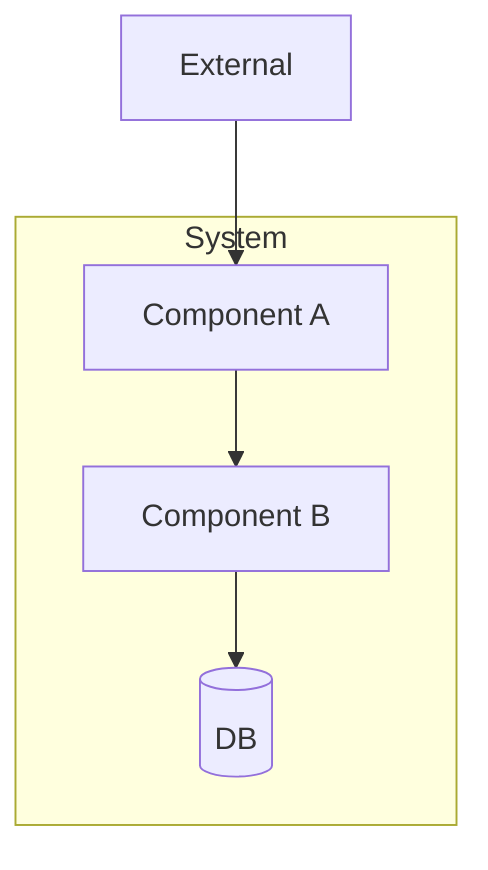
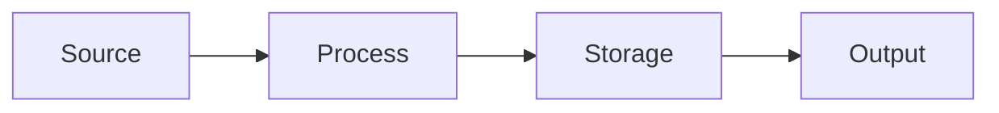
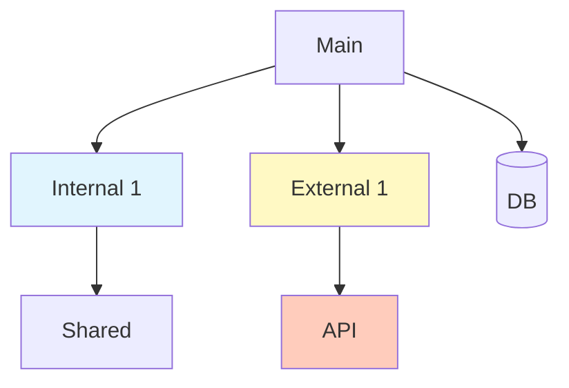
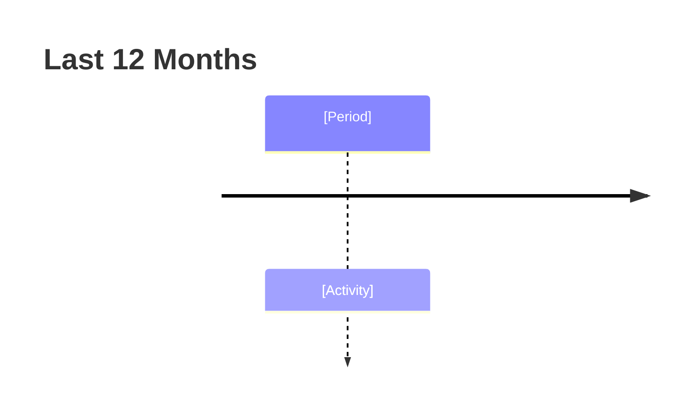

# Repository Analysis: [Repository Name]

**Analysis Date:** [YYYY-MM-DD] | **Analyst:** [Name/Agent] | **Repository URL:** [GitHub/GitLab URL] | **Duration:** [Time spent] | **Version:** 1.0

---

## Executive Summary

### Quick Assessment

| Dimension | Score | Summary |
|-----------|-------|---------|
| Overall Health | 🟢🟡🟠🔴 | [One sentence] |
| Code Quality | 🟢🟡🟠🔴 | [One sentence] |
| Architecture | 🟢🟡🟠🔴 | [One sentence] |
| Documentation | 🟢🟡🟠🔴 | [One sentence] |
| Operational Health | 🟢🟡🟠🔴 | [One sentence] |

**Legend:** 🟢 Excellent (90-100%) | 🟡 Good (70-89%) | 🟠 Fair (50-69%) | 🔴 Poor (<50%)

**Purpose:** [1-2 sentence description]

**Strengths:** 1) [Evidence] 2) [Evidence] 3) [Evidence]

**Concerns:** 1) [Evidence] 2) [Evidence] 3) [Evidence]

**Recommendation:** [Proceed/Refactor/Caution/Modernization]

---

## 1. Repository Overview

| Attribute | Value |
|-----------|-------|
| **Name** | [name] |
| **Language(s)** | [Python, JS, etc.] |
| **Age** | [First commit] |
| **Last Activity** | [Recent commit] |
| **Size** | Files: X, LOC: Y |
| **License** | [MIT, Apache, etc.] |

**Tech Stack:**

| Component | Technology |
|-----------|------------|
| **Framework** | [Django, React, dbt] |
| **Language Version** | [Python 3.11, Node 18] |
| **Key Dependencies** | [Top 5-10] |
| **Database(s)** | [PostgreSQL, MongoDB] |
| **External Services** | [APIs, cloud services] |
| **Build/Deploy** | [Docker, Make, CI/CD] |

**Structure:**
```
repo/
├── [dir]/  # [Purpose]
├── [dir]/  # [Purpose]
└── [key files]  # [Purpose]
```

---

## 2. Architecture Analysis

**Pattern:** [Monolith/Microservices/Event-driven/Layered]

**Component Diagram:**


**Major Components:**

| Component | Responsibility | Location | Dependencies |
|-----------|---------------|----------|--------------|
| [Name] | [Description] | `[path/]` | [Others] |

**Data Flow:**


**Integration Points:**

| Integration | Type | Purpose | Location |
|-------------|------|---------|----------|
| [Service] | API/DB/Queue | [Purpose] | `[file]` |

**Design Patterns:** [Pattern names and where used]

**Separation of Concerns:** 🟢🟡🟠🔴 - [Findings with evidence]

---

## 3. Code Quality Assessment

### Scorecard

| Dimension | Score | Weight | Notes |
|-----------|-------|--------|-------|
| Code Structure | 🟢🟡🟠🔴 | 20% | [Rationale] |
| Code Quality | 🟢🟡🟠🔴 | 25% | [Rationale] |
| Testing | 🟢🟡🟠🔴 | 20% | [Rationale] |
| Documentation | 🟢🟡🟠🔴 | 15% | [Rationale] |
| Maintainability | 🟢🟡🟠🔴 | 10% | [Rationale] |
| Dev Practices | 🟢🟡🟠🔴 | 10% | [Rationale] |
| **Overall** | 🟢🟡🟠🔴 | 100% | [Weighted avg] |

**Code Structure:** 🟢🟡🟠🔴 - [Findings] **Evidence:** [Cite files]

**DRY Adherence:** 🟢🟡🟠🔴 - [Findings] **Evidence:** [Cite examples]

**Testing:** Framework: [pytest/Jest/etc.], Coverage: [X%] 🟢🟡🟠🔴

| Type | Present | Quality | Notes |
|------|---------|---------|-------|
| Unit | ✅/❌ | 🟢🟡🟠🔴 | [Notes] |
| Integration | ✅/❌ | 🟢🟡🟠🔴 | [Notes] |
| E2E | ✅/❌ | 🟢🟡🟠🔴 | [Notes] |

**Error Handling:** 🟢🟡🟠🔴 - [Findings] **Evidence:** [Cite examples]

**Logging:** Framework: [library], 🟢🟡🟠🔴 - [Findings] **Evidence:** [Cite examples]

**Technical Debt:** 🟢🟡🟠🔴

| Indicator | Count/Assessment | Notes |
|-----------|------------------|-------|
| TODO/FIXME | [Count] | [Context] |
| Deprecated | [Count] | [Examples] |
| Complexity Hotspots | [Files] | [Notes] |
| Dead Code | [Assessment] | [Examples] |

**Priorities:** 1) [Debt item with impact] 2) [Debt item] 3) [Debt item]

**Dependencies:** 🟢🟡🟠🔴

| Aspect | Status | Notes |
|--------|--------|-------|
| Up-to-date | 🟢🟡🟠🔴 | [X outdated] |
| Security | 🟢🟡🟠🔴 | [CVEs?] |
| Pinning | 🟢🟡🟠🔴 | [Locked/ranges?] |
| Unused | 🟢🟡🟠🔴 | [Any?] |

**Key Dependencies:** `[package]` v[X.Y.Z] - [Purpose, status, notes]

**Documentation:** 🟢🟡🟠🔴 - [Findings] **Evidence:** [Cite examples]

---

## 4. Operational Health

**Commits:** Total: [Count], Frequency: [Daily/Weekly/Monthly], Recent: [Active last 30/90d?], Quality: 🟢🟡🟠🔴

**Sample Recent:**
```
[hash] - [author], [date]: [message]
```

**Findings:** [Patterns, message quality (Conventional Commits?), commit size]

**Contributors:** Total: [Count], Primary (Top 5):

| Contributor | Commits | Last Active | Role |
|-------------|---------|-------------|------|
| [Name] | [Count] | [Date] | [Primary/Active] |

**Activity:** 🟢🟡🟠🔴 - [Active vs inactive, bus factor, diversity]

**PRs:** Quality: 🟢🟡🟠🔴

| PR # | Title | Author | Lines | Review Time | Status |
|------|-------|--------|-------|-------------|--------|
| [#123] | [Title] | [Author] | +X -Y | [N days] | Merged |

**Findings:** [Description quality, review process, PR size, turnaround]

**CI/CD:** Tool: [GitHub Actions/Jenkins/etc.], Maturity: 🟢🟡🟠🔴

- ✅/❌ **Build:** [Notes]
- ✅/❌ **Test:** [Notes]
- ✅/❌ **Quality:** [Linting, type checking, security]
- ✅/❌ **Deploy:** [CD to staging/prod]

**Findings:** [Completeness, reliability, speed]

**Branching:** Model: [GitFlow/Trunk-based], Assessment: 🟢🟡🟠🔴

**Findings:** [Conventions, long-lived branches, protection rules]

**Releases:** Scheme: [SemVer/CalVer], Frequency: [Continuous/Weekly/etc.], Quality: 🟢🟡🟠🔴

| Version | Date | Changes | Notes |
|---------|------|---------|-------|
| [v1.2.3] | [Date] | [Summary] | [Notes] |

**Findings:** [Release notes quality, versioning consistency, cadence]

---

## 5. Capability Matrix

| Capability | Description | Maturity | Notes |
|------------|-------------|----------|-------|
| [Name] | [What it does] | 🟢🟡🟠🔴 | [Stable/experimental] |

**Key Workflows:**

**Workflow 1:** 1) [Step] 2) [Step] 3) [Step]

**Workflow 2:** 1) [Step] 2) [Step] 3) [Step]

**Public Interfaces:**

**REST API:**

| Endpoint | Method | Purpose | Auth |
|----------|--------|---------|------|
| `/api/[resource]` | GET | [Purpose] | [Type] |

**CLI:**

| Command | Purpose | Example |
|---------|---------|---------|
| `[cmd]` | [Purpose] | `$ [cmd] --option` |

**Exported Modules:**

| Module | Purpose | Stability |
|--------|---------|-----------|
| `[module.function]` | [Purpose] | 🟢🟡🟠🔴 |

**Extensibility:** 🟢🟡🟠🔴 - [Plugin system, hooks/callbacks, config options]

**Learning Curve:** 🟢 Easy | 🟡 Moderate | 🟠 Difficult | 🔴 Very Difficult

**Factors:** [Docs quality, code complexity, prerequisite knowledge, contributor guide]

---

## 6. External Dependencies & Integration Points

**Total External:** [Count] | **Internal/Team-Owned:** [Count]

**Package Dependencies (by language):**

| Package | Version | Type | Source | Status | Notes |
|---------|---------|------|--------|--------|-------|
| [pkg] | [X.Y.Z] | Internal/External/Private | [URL/Registry] | 🟢🟡🟠🔴 | [Notes] |

**Legend:** Type: Internal (team), External (public), Private (licensed) | Status: 🟢 Current | 🟡 Minor update | 🟠 Major update | 🔴 Outdated/vulnerable

**Git Submodules:**

| Submodule | Path | Source | Commit | Purpose |
|-----------|------|--------|--------|---------|
| [name] | `[path/]` | `[URL]` | `[hash]` | [Purpose] |

**Vendored:**

| Library | Path | Source | Version | Purpose | Notes |
|---------|------|--------|---------|---------|-------|
| [lib] | `vendor/[path]` | [Repo] | [Ver] | [Purpose] | [Why?] |

**Containers:**

| Image | Tag | Type | Source | Purpose |
|-------|-----|------|--------|---------|
| [image] | [tag] | Base/Internal/External | [Registry] | [Purpose] |

**External Services:**

| Service | Type | Purpose | Auth | Config |
|---------|------|---------|------|--------|
| [Name] | API/SaaS/DB/Queue | [Purpose] | [OAuth/Key/JWT] | `[file]` |

**Infrastructure:**

| Tool | Purpose | Config |
|------|---------|--------|
| [CI/CD/IaC] | [Purpose] | `[files]` |

**Dependency Graph:**



**Notes:** [Dependencies & critical paths]

**Additional Repositories to Analyze:**

1. **[repo-name]** - `github.com/org/repo`
   - Used By: `[file]` (v[X.Y.Z]) | Purpose: [Description] | Integration: [How] | Priority: 🔴/🟡/🟢 | Status: ⏳/✅

**Notes:** [Total internal deps requiring analysis, circular deps, deprecated packages, version conflicts]

**Integration Complexity:** 🟢 Simple | 🟡 Moderate | 🟠 Complex | 🔴 Very Complex

**Findings:** [Integration points, API contracts, auth patterns, data contracts] **Evidence:** [Cite files]

---

## 7. Visualizations

**Component Architecture:**
```mermaid
[C4 context/component diagram]
```

**Dependency Graph:** [See section 6 or expand here]

**Data Flow:**
```mermaid
[Flowchart/sequence diagram]
```

**Code Organization:**
```
[ASCII tree/Mermaid mindmap]
```

**Activity Timeline:**


---

## 8. Findings & Recommendations

**Strengths:**
1. **[Title]** - Finding: [Description] | Evidence: [Cite] | Impact: [Why matters]
2. **[Title]** - Finding: [Description] | Evidence: [Cite] | Impact: [Why matters]
3. **[Title]** - Finding: [Description] | Evidence: [Cite] | Impact: [Why matters]

**Concerns:**
1. **[Title]** - Finding: [Description] | Evidence: [Cite] | Impact: [Why matters] | Risk: 🔴/🟡/🟢
2. **[Title]** - Finding: [Description] | Evidence: [Cite] | Impact: [Why matters] | Risk: 🔴/🟡/🟢
3. **[Title]** - Finding: [Description] | Evidence: [Cite] | Impact: [Why matters] | Risk: 🔴/🟡/🟢

**Reuse Opportunities:**

| Component | Location | Stability | Reuse Context | Dependencies |
|-----------|----------|-----------|---------------|--------------|
| [Name] | `[path]` | 🟢🟡🟠🔴 | [When] | [What's needed] |

**Recommendations:**

**Priority 1 (Critical):**
1. **[Title]** - Issue: [What's wrong] | Action: [What to do] | Rationale: [Why critical] | Effort: S/M/L | Impact: [Outcome]

**Priority 2 (Important):**
1. **[Title]** - Issue: [What's wrong] | Action: [What to do] | Rationale: [Why matters] | Effort: S/M/L | Impact: [Outcome]

**Priority 3 (Nice-to-have):**
1. **[Title]** - Opportunity: [What could be better] | Action: [What to do] | Rationale: [Why helps] | Effort: S/M/L | Impact: [Outcome]

**Modernization:** Currency: 🟢🟡🟠🔴 | Current: [What's up-to-date] | Outdated: [Needs updating] | Deprecated: [Using deprecated] | Complexity: 🟢 Easy | 🟡 Moderate | 🟠 Difficult | 🔴 Very Difficult

**Path:** 1) [Step with effort] 2) [Step] 3) [Step]

---

## 9. Risk Assessment

| Risk | Likelihood | Impact | Severity | Mitigation |
|------|------------|--------|----------|------------|
| [Risk] | 🔴🟡🟢 | 🔴🟡🟢 | 🔴🟡🟢 | [Strategy] |

**Legend:** 🔴 High | 🟡 Medium | 🟢 Low

**Integration Risks:** [Breaking changes, undocumented deps, performance bottlenecks] **Mitigation:** [Strategies]

**Maintainability:** Bus factor: [Assessment] | Tech debt: [Level/impact] | Dependencies: [Unmaintained/vulnerable]

---

## 10. Solution Architecture Guidance

**Fit:** 🟢🟡🟠🔴 - [Alignment/conflicts, consistent/inconsistent patterns]

**Integration:** Approach: [Microservice/Monolith/Library/API] | Plan: 1) [Step with deps] 2) [Step] 3) [Step] | Risks: [Key risks]

**Refactoring:** Patterns: [To adopt with rationale] | Phases: 1) [Phase] 2) [Phase] 3) [Phase]

**Evolution:** Short (0-3m): [Actions] | Medium (3-6m): [Actions] | Long (6-12m): [Actions]

---

## 11. Appendices

**Metrics:** Files: [Count] | LOC: [Count] | Avg file: [Lines] | Largest: [List] | Tests: [Count] | Cases: [Count] | Coverage: [%] | Deps: [Count] | Outdated: [Count] | Vulnerabilities: [Count]

**Key Files:**

| File | Purpose | Importance |
|------|---------|------------|
| `[path]` | [Description] | 🔴 Critical / 🟡 Important / 🟢 Reference |

**Commits:** [Sample 10-15 showing patterns]

**Resources:** [Links to external docs, API refs, related repos]

---

## Revision History

| Version | Date | Changes | Author |
|---------|------|---------|--------|
| 1.0 | [Date] | Initial analysis | [Analyst] |

---

**End of Report**
