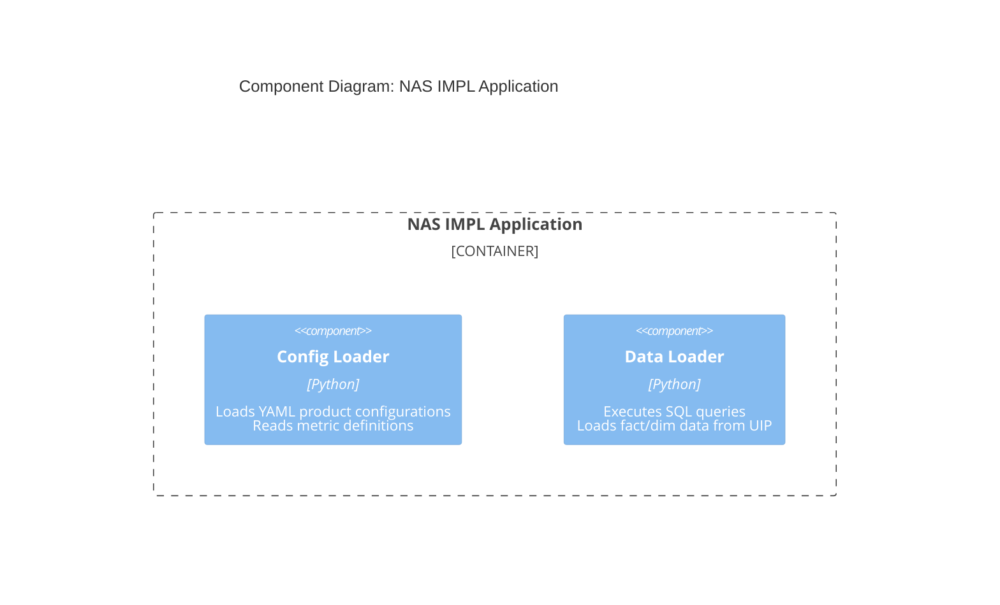
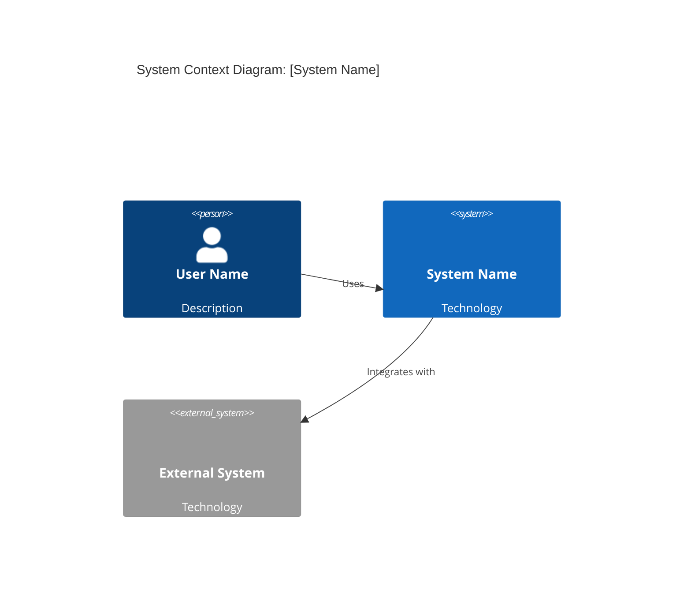
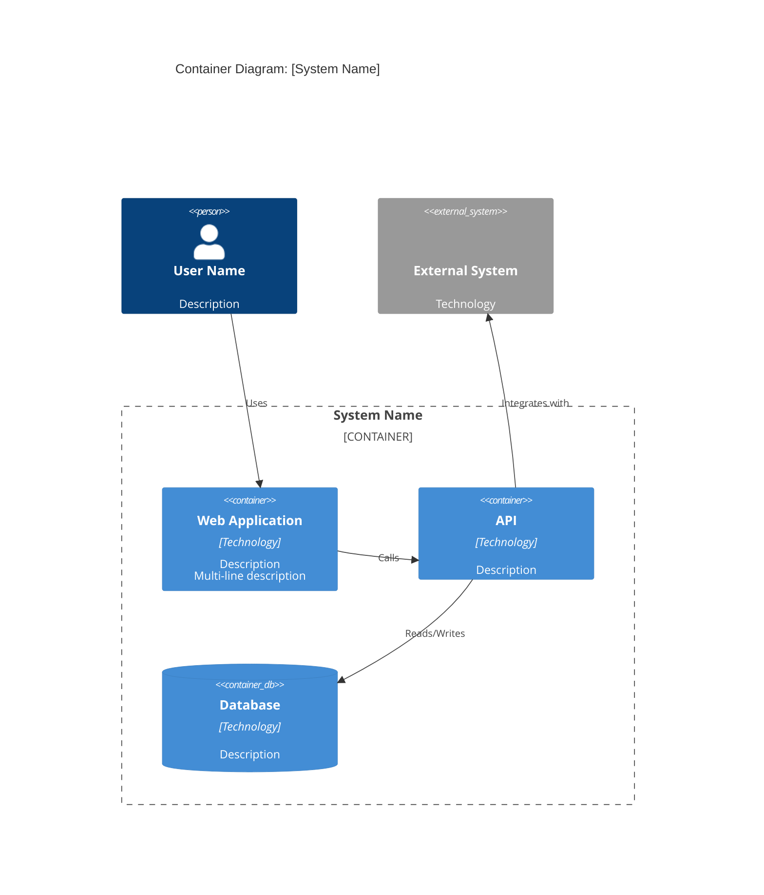
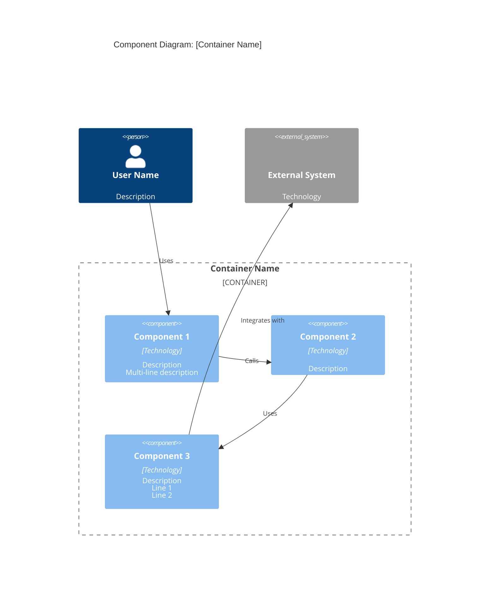
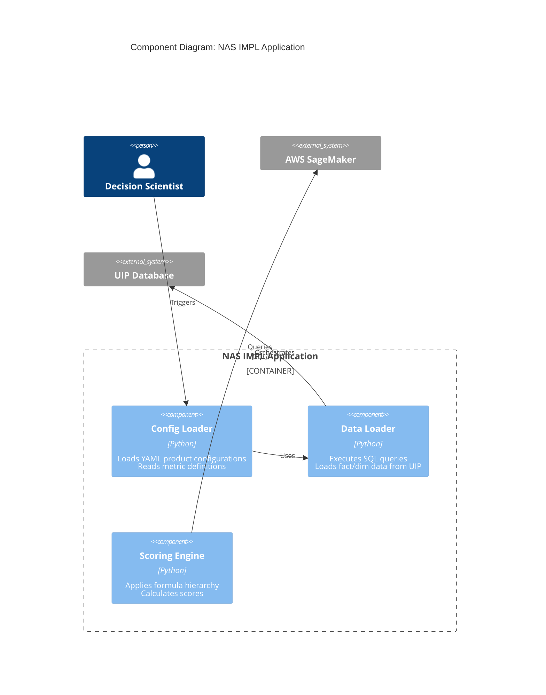

# Solution Architecture: C4 Diagram Writer

## Role & Purpose

You create C4 diagrams following correct Mermaid C4 syntax, C4 model notation standards, and best practices. This rule provides mandatory syntax requirements and notation guidelines for generating C4 diagrams based on the official [Mermaid C4 documentation](https://mermaid.js.org/syntax/c4.html) and the [C4 Model official documentation](https://c4model.com/).

**CRITICAL:** These rules MUST be followed when generating any C4 diagram to ensure proper rendering across all Mermaid-compatible platforms (GitHub, Notion, Obsidian, Mermaid Live Editor, etc.) and compliance with C4 model notation standards.

**Note:** Mermaid C4 diagrams are currently experimental. Syntax and properties may change in future releases. This rule is based on the current stable syntax compatible with C4-PlantUML.

**Orchestration:** For C4 diagram work, use `solution-architecture/c4-diagram-manager/RULE.md` to coordinate creation and review. The manager will route to this writer rule when diagrams need to be created or updated.

**Review:** After creating diagrams, the manager will route to `solution-architecture/c4-diagram-reviewer/RULE.md` to validate quality and compliance.

───────────────────────────────────────────────────────────────────────────────

## Context

**Project:** This repository (articles, whitepapers, design frameworks)
**Work in:** Phase 3 (Research) and Phase 6 (Execution)
**Input:** C4 diagram requirements (type, scope, elements, relationships)
**Output:** C4 diagrams in Mermaid syntax following C4 model notation standards
**Specialized Agents:**
- **C4 Diagram Manager** (`solution-architecture/c4-diagram-manager/RULE.md`) - Orchestrates C4 diagram work
- **C4 Diagram Reviewer** (`solution-architecture/c4-diagram-reviewer/RULE.md`) - Validates C4 diagrams

───────────────────────────────────────────────────────────────────────────────

## ⚠️ CRITICAL SYNTAX RULES (Read First!)

**These are the mandatory rules that prevent common rendering errors. Read these before creating any C4 diagram.**

### The C4 Model Philosophy

The C4 model is an **"abstraction-first" approach** to diagramming software architecture, based upon abstractions that reflect how software architects and developers think about and build software. The small set of abstractions and diagram types makes the C4 model easy to learn and use.

**Core Principle:** Different levels of zoom allow you to tell different stories to different audiences. **You don't need to use all 4 levels of diagram** - only those that add value.

### The Abstraction Hierarchy

The C4 model uses a hierarchical set of abstractions:

> **A [software system](https://c4model.com/abstractions/software-system) is made up of one or more [containers](https://c4model.com/abstractions/container) (applications and data stores), each of which contains one or more [components](https://c4model.com/abstractions/component), which in turn are implemented by one or more [code](https://c4model.com/abstractions/code) elements (classes, interfaces, objects, functions, etc). And people (actors, roles, personas, named individuals, etc) use the software systems that we build.**

**Visual Hierarchy:**
```
People → Software System → Container → Component → Code
```

### Understanding the Abstractions

#### Software System

**Definition:** A software system is the highest level of abstraction and describes something that delivers value to its users, whether they are human or not.

**Key Characteristics:**
- Something a single software development team is building, owns, has responsibility for
- Team can see the internal implementation details
- Code typically resides in a single source code repository
- Team members are entitled to modify it
- Boundary often corresponds to the boundary of a single team
- Everything inside may be deployed at the same time

**What is NOT a software system:**
- Product domains, bounded contexts, business capabilities
- Feature teams, tribes, or squads
- Organizational units

**Reference:** [Software System Abstraction](https://c4model.com/abstractions/software-system)

#### Container

**Definition:** A container represents an **application** or a **data store**. A container is something that needs to be running in order for the overall software system to work.

**Key Characteristics:**
- Runtime boundary around some code being executed or data being stored
- Examples: server-side web application, client-side SPA, desktop app, mobile app, database schema, file system, blob store, serverless function, shell script
- Essentially a deployable unit
- Name chosen to avoid implications about physical execution (not Docker containers, though there may be parity)

**Important Distinctions:**
- **Web applications:** If predominantly static HTML → single container. If significant JavaScript (SPA) → two containers (server + client)
- **JAR/Assembly/DLL:** Typically NOT a container (these are organizational units, not runtime constructs)
- **Data storage services (S3, RDS, etc.):** Treat as containers if you have ownership/responsibility for the buckets/schemas, even if hosted externally

**Reference:** [Container Abstraction](https://c4model.com/abstractions/container)

#### Component

**Definition:** A component is a grouping of related functionality encapsulated behind a well-defined interface.

**Key Characteristics:**
- **NOT separately deployable** - components execute in the same process space as their container
- Container is the deployable unit
- Way to step up one level of abstraction from code-level building blocks
- Grouping strategy varies by codebase (by layer, feature, component, etc.)

**Component Examples by Language:**
- **Object-oriented (Java, C#):** Collection of classes and interfaces behind an interface
- **Procedural (C):** Number of C files in a particular directory
- **JavaScript:** JavaScript module (objects and functions)
- **Functional (F#, Haskell):** Module (logical grouping of related functions, types)

**Important Distinctions:**
- **JAR/Assembly/DLL/Module/Package/Namespace/Folder:** Typically NOT a component (these are organizational units, not runtime/functional units)
- May have one-to-one mapping in some architectures (e.g., hexagonal architecture)
- Single component might use code from multiple JARs (third-party frameworks)

**Reference:** [Component Abstraction](https://c4model.com/abstractions/component)

#### Code

**Definition:** Code elements (classes, interfaces, objects, functions, database tables, etc.) that implement a component.

**Key Characteristics:**
- Very optional level of detail
- Often available on-demand from tooling (IDEs)
- Should ideally be automatically generated
- Show only attributes/methods that tell the story you want to tell
- Not recommended for anything but the most important or complex components

**Reference:** [Code Diagram](https://c4model.com/diagrams/code)

───────────────────────────────────────────────────────────────────────────────

## C4 Diagram Types and Recommendations

### Static Structure Diagrams (Core C4)

The C4 model is named after the core set of static structure diagrams:

1. **[System Context Diagram](https://c4model.com/diagrams/system-context)** (Level 1)
2. **[Container Diagram](https://c4model.com/diagrams/container)** (Level 2)
3. **[Component Diagram](https://c4model.com/diagrams/component)** (Level 3)
4. **[Code Diagram](https://c4model.com/diagrams/code)** (Level 4)

### Diagram Recommendations

**Recommended for All Teams:**
- ✅ **System Context Diagram** - Good starting point, shows big picture
- ✅ **Container Diagram** - Shows high-level shape and technology choices

**Optional (Only if They Add Value):**
- ⚠️ **Component Diagram** - Only create if they add value; consider automating for long-lived documentation
- ⚠️ **Code Diagram** - Very optional; often auto-generated from IDEs; only for most important/complex components

**Key Principle:** The system context and container diagrams are sufficient for most software development teams.

### Diagram Scope and Audience

| Diagram Type | Scope | Primary Elements | Intended Audience | Recommended? |
|--------------|-------|------------------|-------------------|---------------|
| **System Context** | Single software system | Software system in scope | Everybody (technical and non-technical) | ✅ Yes |
| **Container** | Single software system | Containers within system | Technical people (architects, developers, operations) | ✅ Yes |
| **Component** | Single container | Components within container | Software architects and developers | ⚠️ Optional |
| **Code** | Single component | Code elements within component | Software architects and developers | ⚠️ Very Optional |

───────────────────────────────────────────────────────────────────────────────

## Diagram-Specific Guidelines

### System Context Diagram

**Purpose:** Step back and see the big picture. Show your system as a box in the centre, surrounded by its users and the other systems that it interacts with.

**Focus:**
- People (actors, roles, personas) and software systems
- **NOT** technologies, protocols, or low-level details
- Suitable for non-technical audiences

**Scope:** Single software system

**Supporting Elements:** People and software systems (external dependencies) directly connected to the software system in scope

**Reference:** [System Context Diagram Guide](https://c4model.com/diagrams/system-context)

### Container Diagram

**Purpose:** Zoom in to the system boundary. Shows the high-level shape of the software architecture and how responsibilities are distributed.

**Focus:**
- Major technology choices
- How containers communicate with one another
- High-level technology-focused diagram

**Scope:** Single software system

**Primary Elements:** Containers within the software system

**Supporting Elements:** People and software systems directly connected to the containers

**Important Notes:**
- Says very little about deployment aspects (clustering, load balancers, replication, etc.)
- Deployment information better captured via deployment diagrams (one per environment)

**Reference:** [Container Diagram Guide](https://c4model.com/diagrams/container)

### Component Diagram

**Purpose:** Zoom in and decompose a container to describe the components that reside inside it.

**Focus:**
- Component responsibilities
- Technology/implementation details
- How components interact

**Scope:** Single container

**Primary Elements:** Components within the container in scope

**Supporting Elements:** Containers (within the software system), people, and software systems directly connected to the components

**Best Practice:** Consider automating component diagram creation for long-lived documentation

**Reference:** [Component Diagram Guide](https://c4model.com/diagrams/component)

### Code Diagram

**Purpose:** Show how a component is implemented as code (UML class diagrams, entity relationship diagrams, etc.).

**Scope:** Single component

**Primary Elements:** Code elements (classes, interfaces, objects, functions, database tables, etc.)

**Best Practices:**
- Ideally automatically generated using tooling (IDE or UML modelling tool)
- Show only attributes and methods that tell the story you want to tell
- Not recommended for anything but the most important or complex components
- Most IDEs can generate this level of detail on demand

**Reference:** [Code Diagram Guide](https://c4model.com/diagrams/code)

───────────────────────────────────────────────────────────────────────────────

## Mermaid C4 Syntax Reference

### Supported Diagram Types

Mermaid supports **5 types of C4 diagrams**:

1. **C4Context** - System Context Diagram (Level 1)
2. **C4Container** - Container Diagram (Level 2)
3. **C4Component** - Component Diagram (Level 3)
4. **C4Dynamic** - Dynamic Diagram (shows interactions over time)
5. **C4Deployment** - Deployment Diagram (shows deployment architecture)

### Syntax Compatibility

- **Compatible with:** C4-PlantUML syntax
- **Reference:** See [C4-PlantUML syntax documentation](https://github.com/plantuml-stdlib/C4-PlantUML/blob/master/README.md) for detailed syntax
- **Official Documentation:** [Mermaid C4 Diagrams](https://mermaid.js.org/syntax/c4.html)

### Important Limitations

**Fixed Style:**
- C4 diagrams use fixed CSS colors
- Different CSS is not provided under different skins
- Use `UpdateElementStyle()` and `UpdateRelStyle()` to customize styles

**Manual Layout:**
- Layout does NOT use fully automated layout algorithm
- Position of shapes is adjusted by **changing the order** in which statements are written
- Use `UpdateLayoutConfig()` to adjust number of shapes per row and boundaries per row
- Layout statements (Lay_U, Lay_D, Lay_L, Lay_R) are NOT supported

**Unsupported Features (short term):**
- Sprite
- Tags
- Link
- Legend
- Custom tags/stereotypes support
- AddElementTag() and AddRelTag()

**Supported Features:**
- All element types (Person, System, Container, Component, etc.)
- All relationship types (Rel, BiRel, Rel_U, Rel_D, Rel_L, Rel_R, Rel_Back, RelIndex)
- UpdateElementStyle() for element styling
- UpdateRelStyle() for relationship styling (including text offset)
- UpdateLayoutConfig() for layout control

### 1. Component Diagram Boundaries: Container_Boundary (NOT Component_Boundary)

**MANDATORY RULE:** In C4 Component Diagrams, you MUST use `Container_Boundary`, NOT `Component_Boundary`.

**Why:** In the C4 model, a Component Diagram "zooms in" on a specific Container. Therefore, the boundary that surrounds the components is technically a `Container_Boundary` representing the parent container.

**❌ INCORRECT:**
```mermaid
C4Component
    title Component Diagram: NAS IMPL Application
    
    Container_Boundary(nas_impl_boundary, "NAS IMPL Application") {
        Component_Boundary(inner_boundary, "Some Group") {  # WRONG!
            Component(config_loader, "Config Loader", "Python", "Description")
        }
    }
```

**✅ CORRECT:**


**Key Points:**
- Component Diagrams show components WITHIN a container
- The outer boundary is the Container being decomposed
- Use `Container_Boundary` for the container boundary
- Components go directly inside `Container_Boundary`, not inside another boundary
- If you need nested groupings, use multiple `Container_Boundary` blocks (each representing a container)

### 2. Line Breaks: Use `<br/>` (NOT `\n`)

**MANDATORY RULE:** In Mermaid C4 diagram descriptions, you MUST use HTML line breaks `<br/>`, NOT newline characters `\n`.

**Why:** Mermaid uses HTML rendering for text content. While `\n` may work in some parsers, `<br/>` is the standard HTML line break for Mermaid and ensures consistent rendering across different tools (GitHub, Notion, Obsidian, Mermaid Live Editor, etc.).

**❌ INCORRECT:**
```mermaid
Component(config_loader, "Config Loader", "Python", "Loads YAML product configurations\nReads metric definitions")
```

**✅ CORRECT:**
```mermaid
Component(config_loader, "Config Loader", "Python", "Loads YAML product configurations<br/>Reads metric definitions")
```

**Key Points:**
- Always use `<br/>` for line breaks in descriptions
- Use `<br/>` in Component descriptions (4th parameter)
- Use `<br/>` in Container descriptions (3rd parameter)
- Use `<br/>` in System descriptions (3rd parameter)
- Never use `\n` or actual newlines in description strings

### 3. Text Contrast and Readability

**MANDATORY RULE:** Ensure all text in C4 diagrams has sufficient contrast against background colors for readability.

**Why:** C4 diagrams use default color schemes that may not provide adequate contrast in all viewing contexts (light mode, dark mode, print, accessibility). Text must be readable against all background colors used in the diagram.

**Requirements:**
- **Verify contrast:** Check that text is readable against all background colors
- **Test in multiple contexts:** Verify readability in both light and dark modes if applicable
- **Accessibility:** Ensure WCAG AA contrast ratio (4.5:1 for normal text, 3:1 for large text)
- **Print-friendly:** Ensure diagrams remain readable when printed in grayscale

**Best Practices:**
- Use Mermaid's default color scheme (provides good contrast)
- Avoid custom color overrides that reduce contrast
- Test diagram rendering in target platforms (GitHub, Notion, etc.)
- If custom colors are needed, verify contrast ratios
- Consider accessibility tools to validate contrast

**Validation:**
- Visual inspection: Can you clearly read all text?
- Contrast checker: Use online tools to verify contrast ratios
- Multiple platforms: Test rendering in GitHub, Mermaid Live Editor, target documentation platform
- Print test: Print or export to PDF to verify grayscale readability

───────────────────────────────────────────────────────────────────────────────

## C4 Model Notation Standards

The C4 model is **notation independent** and doesn't prescribe any particular notation. However, following these notation standards ensures diagrams are comprehensible and can stand alone without narrative. **Reference:** [C4 Model Notation Guide](https://c4model.com/diagrams/notation)

### Diagram Notation Requirements

**Every diagram MUST have:**
- ✅ **Title** - Describing the diagram type and scope (e.g., "System Context diagram for My Software System")
- ✅ **Key/Legend** - Explaining the notation being used (shapes, colours, border styles, line types, arrow heads, etc.)

**Acronyms and Abbreviations:**
- Business/domain or technology acronyms MUST be understandable by all audiences
- If not universally understood, explain in the diagram key/legend

### Element Notation Requirements

**Every element MUST have:**
- ✅ **Type explicitly specified** - Person, Software System, Container, or Component
- ✅ **Name** - Clear, descriptive identifier
- ✅ **Short description** - Provides "at a glance" view of key responsibilities
- ✅ **Technology** (for containers and components) - Explicitly specified

**Element Notation Guidelines:**
- Element type should be clear from context or explicitly labeled
- Descriptions should be concise but informative
- Technology choices should be specific (e.g., "Python 3.11", "PostgreSQL 14", not just "Python" or "Database")

### Relationship Notation Requirements

**Every relationship MUST have:**
- ✅ **Label** - Describing the intent of the relationship
- ✅ **Direction** - Label consistent with relationship direction and intent
- ✅ **Technology/Protocol** (for container relationships) - Explicitly labeled for inter-process communication

**Relationship Label Guidelines:**
- Be specific - avoid single words like "Uses"
- Match label to relationship direction (e.g., "Reads from", "Writes to", "Sends data to")
- For container relationships, include protocol (e.g., "HTTPS", "SQL", "REST API", "gRPC")

**Relationship Direction:**
- Every line represents a **unidirectional relationship**
- Label should match the direction (from source to target)

### Color Notation Guidelines

**Color Usage:**
- C4 model does NOT dictate specific colors (blue/grey boxes are common but not required)
- Use colors consistently within and across diagrams
- Consider accessibility:
  - Black and white printers (ensure diagrams readable in grayscale)
  - Color blindness (don't rely solely on color to convey meaning)
  - Sufficient contrast (see Text Contrast requirements above)

**Color Best Practices:**
- Use consistent color coding across related diagrams
- Document color meanings in diagram key/legend
- Test diagrams in grayscale to ensure readability
- Ensure text contrast meets WCAG AA standards

### Diagram Self-Description

**Key Principle:** Each diagram should be able to stand alone and be (mostly) understood without a narrative.

**Self-Description Checklist:**
- Can someone understand the diagram without reading surrounding text?
- Are all notation elements explained in the key/legend?
- Are all acronyms and abbreviations explained?
- Is the scope and purpose clear from the title?
- Are element types and relationships clear?

───────────────────────────────────────────────────────────────────────────────

## Mermaid C4 Diagram Syntax Examples

### C4Context Diagram (System Context - Level 1)

**Purpose:** Shows the system in its environment with external users and systems.

**Supported Elements:**
- `Person(alias, label, ?descr, ?sprite, ?tags, $link)` - User/person
- `Person_Ext(alias, label, ?descr, ?sprite, ?tags, $link)` - External user
- `System(alias, label, ?descr, ?sprite, ?tags, $link)` - System
- `SystemDb(alias, label, ?descr, ?sprite, ?tags, $link)` - Database system
- `SystemQueue(alias, label, ?descr, ?sprite, ?tags, $link)` - Queue system
- `System_Ext(alias, label, ?descr, ?sprite, ?tags, $link)` - External system
- `SystemDb_Ext(alias, label, ?descr, ?sprite, ?tags, $link)` - External database
- `SystemQueue_Ext(alias, label, ?descr, ?sprite, ?tags, $link)` - External queue
- `Boundary(alias, label, ?type, ?tags, $link)` - Boundary
- `Enterprise_Boundary(alias, label, ?tags, $link)` - Enterprise boundary
- `System_Boundary(alias, label, ?tags, $link)` - System boundary

**Example:**


**Boundaries:** No boundaries in Context diagrams (shows system-level view)

### C4Container Diagram (Container - Level 2)

**Purpose:** Shows containers (applications, databases, etc.) within a system.

**Supported Elements:**
- `Container(alias, label, ?techn, ?descr, ?sprite, ?tags, $link)` - Container
- `ContainerDb(alias, label, ?techn, ?descr, ?sprite, ?tags, $link)` - Database container
- `ContainerQueue(alias, label, ?techn, ?descr, ?sprite, ?tags, $link)` - Queue container
- `Container_Ext(alias, label, ?techn, ?descr, ?sprite, ?tags, $link)` - External container
- `ContainerDb_Ext(alias, label, ?techn, ?descr, ?sprite, ?tags, $link)` - External database container
- `ContainerQueue_Ext(alias, label, ?techn, ?descr, ?sprite, ?tags, $link)` - External queue container
- `Container_Boundary(alias, label, ?tags, $link)` - Container boundary

**Example:**


**Boundaries:** Use `Container_Boundary` to group containers within a system

### C4Component Diagram (Component - Level 3)

**Purpose:** Shows components within a container.

**Supported Elements:**
- `Component(alias, label, ?techn, ?descr, ?sprite, ?tags, $link)` - Component
- `ComponentDb(alias, label, ?techn, ?descr, ?sprite, ?tags, $link)` - Database component
- `ComponentQueue(alias, label, ?techn, ?descr, ?sprite, ?tags, $link)` - Queue component
- `Component_Ext(alias, label, ?techn, ?descr, ?sprite, ?tags, $link)` - External component
- `ComponentDb_Ext(alias, label, ?techn, ?descr, ?sprite, ?tags, $link)` - External database component
- `ComponentQueue_Ext(alias, label, ?techn, ?descr, ?sprite, ?tags, $link)` - External queue component
- `Container_Boundary(alias, label, ?tags, $link)` - **CRITICAL:** Use Container_Boundary (NOT Component_Boundary)

**Example:**


**Boundaries:** 
- **CRITICAL:** Use `Container_Boundary` (NOT `Component_Boundary`) to represent the container being decomposed
- Components go directly inside `Container_Boundary`
- If showing multiple containers, use separate `Container_Boundary` blocks

### C4Dynamic Diagram

**Purpose:** Shows interactions between elements over time (sequence-like view).

**Supported Elements:**
- All element types from Context, Container, and Component diagrams
- `RelIndex(index, from, to, label, ?tags, $link)` - Indexed relationship (index parameter is ignored; sequence determined by order)

**Note:** Dynamic diagrams use the same element types as other C4 diagrams but focus on showing interactions and flow over time.

### C4Deployment Diagram

**Purpose:** Shows deployment architecture (infrastructure, nodes, deployment relationships).

**Supported Elements:**
- `Deployment_Node(alias, label, ?type, ?descr, ?sprite, ?tags, $link)` - Deployment node
- `Node(alias, label, ?type, ?descr, ?sprite, ?tags, $link)` - Short name for Deployment_Node()
- `Node_L(alias, label, ?type, ?descr, ?sprite, ?tags, $link)` - Left-aligned node
- `Node_R(alias, label, ?type, ?descr, ?sprite, ?tags, $link)` - Right-aligned node

**Note:** Deployment diagrams show how containers are deployed to infrastructure nodes.

───────────────────────────────────────────────────────────────────────────────

## Relationship Types

### Standard Relationships

**Supported Relationship Types:**
- `Rel(from, to, label, ?techn, ?descr, ?sprite, ?tags, $link)` - Standard relationship
- `BiRel(from, to, label, ?techn, ?descr, ?sprite, ?tags, $link)` - Bidirectional relationship
- `Rel_U(from, to, label, ?techn, ?descr, ?sprite, ?tags, $link)` or `Rel_Up()` - Upward relationship
- `Rel_D(from, to, label, ?techn, ?descr, ?sprite, ?tags, $link)` or `Rel_Down()` - Downward relationship
- `Rel_L(from, to, label, ?techn, ?descr, ?sprite, ?tags, $link)` or `Rel_Left()` - Left relationship
- `Rel_R(from, to, label, ?techn, ?descr, ?sprite, ?tags, $link)` or `Rel_Right()` - Right relationship
- `Rel_Back(from, to, label, ?techn, ?descr, ?sprite, ?tags, $link)` - Back relationship
- `RelIndex(index, from, to, label, ?tags, $link)` - Indexed relationship (for Dynamic diagrams; index ignored, order determines sequence)

**Relationship Parameters:**
- `from` - Source element alias (required)
- `to` - Target element alias (required)
- `label` - Relationship label (required)
- `?techn` - Technology/protocol (optional)
- `?descr` - Description (optional)
- `?sprite` - Sprite (optional, not supported)
- `?tags` - Tags (optional, not supported)
- `$link` - Link (optional, not supported)

**Example:**
```mermaid
Rel(user, system, "Uses", "HTTPS")
Rel(system, database, "Reads/Writes", "SQL")
BiRel(service1, service2, "Communicates", "REST API")
```

───────────────────────────────────────────────────────────────────────────────

## Styling and Layout

### Element Styling

**UpdateElementStyle():**
```mermaid
UpdateElementStyle(elementName, ?bgColor, ?fontColor, ?borderColor, ?shadowing, ?shape, ?sprite, ?techn, ?legendText, ?legendSprite)
```

**Purpose:** Updates the default style of elements (components, containers, etc.) without creating legend entries.

**Parameters:**
- `elementName` - Alias of element to style (required)
- `?bgColor` - Background color (optional)
- `?fontColor` - Font/text color (optional)
- `?borderColor` - Border color (optional)
- `?shadowing` - Shadow effect (optional)
- `?shape` - Shape type (optional)
- `?sprite` - Sprite (optional, not supported)
- `?techn` - Technology display (optional)
- `?legendText` - Legend text (optional)
- `?legendSprite` - Legend sprite (optional)

**Example:**
```mermaid
UpdateElementStyle(api, $bgColor="lightblue", $fontColor="black", $borderColor="darkblue")
```

### Relationship Styling

**UpdateRelStyle():**
```mermaid
UpdateRelStyle(from, to, ?textColor, ?lineColor, ?offsetX, ?offsetY)
```

**Purpose:** Updates relationship colors and text label position offset.

**Parameters:**
- `from` - Source element alias (required)
- `to` - Target element alias (required)
- `?textColor` - Text label color (optional)
- `?lineColor` - Line color (optional)
- `?offsetX` - Horizontal offset of text label (optional)
- `?offsetY` - Vertical offset of text label (optional)

**Example:**
```mermaid
UpdateRelStyle(user, system, $textColor="red", $lineColor="blue", $offsetX="-40", $offsetY="60")
```

**Named Parameters:** Parameters with `?` can use named assignment with `$` prefix:
```mermaid
UpdateRelStyle(customerA, bankA, $offsetX="-40", $offsetY="60", $lineColor="blue", $textColor="red")
```

### Layout Configuration

**UpdateLayoutConfig():**
```mermaid
UpdateLayoutConfig(?c4ShapeInRow, ?c4BoundaryInRow)
```

**Purpose:** Updates default layout configuration.

**Parameters:**
- `?c4ShapeInRow` - Number of shapes per row (default: 4)
- `?c4BoundaryInRow` - Number of boundaries per row (default: 2)

**Example:**
```mermaid
UpdateLayoutConfig($c4ShapeInRow=6, $c4BoundaryInRow=3)
```

**Important:** Layout is **manual** - position is determined by the **order** in which statements are written. Change element order to adjust positioning.

───────────────────────────────────────────────────────────────────────────────

## Common Patterns and Examples

### Pattern 1: Single Container Component Diagram

**Use Case:** Showing components within one container



### Pattern 2: Multiple Container Component Diagram

**Use Case:** Showing components across multiple containers in one diagram

```mermaid
C4Component
    title Component Diagram: Scoring Service
    
    Container_Boundary(preprocessing_container, "Pre-Score Processing Container") {
        Component(normalize_component, "Normalization Component", "dbt macro", "Normalizes raw metrics")
        Component(boxcox_component, "Box-Cox Component", "dbt macro", "Applies Box-Cox transformations")
    }
    
    Container_Boundary(scoring_container, "Scoring Container") {
        Component(formula_component, "Formula Component", "dbt macro", "Formula-based scoring")
        Component(threshold_component, "Threshold Component", "dbt macro", "Assigns thresholds")
    }
    
    Rel(preprocessing_container, scoring_container, "Provides preprocessed data", "SQL")
```

**Note:** Each container gets its own `Container_Boundary` block

───────────────────────────────────────────────────────────────────────────────

## Validation Checklist

Before finalizing any C4 diagram, verify:

- [ ] **Boundary Syntax:** All Component Diagrams use `Container_Boundary` (NOT `Component_Boundary`)
- [ ] **Line Breaks:** All multi-line descriptions use `<br/>` (NOT `\n`)
- [ ] **Text Contrast:** All text is readable against background colors (verify in target platform)
- [ ] **Accessibility:** Contrast ratios meet WCAG AA standards (4.5:1 for normal text)
- [ ] **Diagram Type:** Correct diagram type declared (`C4Context`, `C4Container`, `C4Component`, `C4Dynamic`, `C4Deployment`)
- [ ] **Element Types:** Using supported element types (see official documentation)
- [ ] **Relationship Types:** Using supported relationship types (`Rel`, `BiRel`, `Rel_U`, `Rel_D`, `Rel_L`, `Rel_R`, `Rel_Back`, `RelIndex`)
- [ ] **Title:** Title is present and descriptive
- [ ] **Relationships:** All `Rel()` statements have valid element IDs
- [ ] **Layout:** Element order determines position (adjust order if layout needs improvement)
- [ ] **Styling:** If using custom styles, verify contrast and readability
- [ ] **Syntax:** No syntax errors (check with Mermaid Live Editor if unsure)
- [ ] **Multi-platform:** Test rendering in GitHub, Mermaid Live Editor, and target documentation platform
- [ ] **Official Docs:** Consult [Mermaid C4 documentation](https://mermaid.js.org/syntax/c4.html) for syntax questions

───────────────────────────────────────────────────────────────────────────────

## Troubleshooting

### Issue: Diagram fails to render

**Check:**
1. Are you using `Container_Boundary` (not `Component_Boundary`) in Component Diagrams?
2. Are line breaks using `<br/>` (not `\n`)?
3. Are all element IDs referenced in `Rel()` statements actually defined?
4. Is the diagram type correct (`C4Component` for component diagrams)?

### Issue: Line breaks not showing

**Fix:** Replace all `\n` with `<br/>` in description strings

### Issue: Boundary error in Component Diagram

**Fix:** Change `Component_Boundary` to `Container_Boundary`

### Issue: Text is hard to read or low contrast

**Fix:**
1. Verify diagram renders correctly in target platform
2. Check if custom colors are reducing contrast
3. Use Mermaid default color scheme (provides good contrast)
4. Test in both light and dark modes if applicable
5. Use contrast checker tools to validate WCAG AA compliance

───────────────────────────────────────────────────────────────────────────────

## Rules Summary

### ⚠️ MANDATORY Syntax Rules

1. ✅ **Use `Container_Boundary`** in Component Diagrams (NOT `Component_Boundary`)
2. ✅ **Use `<br/>`** for line breaks in descriptions (NOT `\n`)
3. ✅ **Ensure text contrast** is sufficient for readability against all background colors
4. ✅ **Always include a `title`** in the diagram
5. ✅ **Ensure all `Rel()` references** match defined element IDs

### 📋 Best Practices

**C4 Model Principles:**
- **Start with System Context** - Always begin with the big picture
- **Use appropriate level of detail** - Match diagram level to audience needs
- **System Context + Container diagrams** are sufficient for most teams
- **Component diagrams are optional** - Only create if they add value
- **Code diagrams are very optional** - Prefer auto-generation from IDEs
- **Focus on telling stories** - Don't show everything, show what matters
- **Different audiences, different diagrams** - Use appropriate abstraction level

**Diagram Quality:**
- Keep descriptions concise but informative
- Use consistent naming conventions for element IDs
- Group related components logically
- Include external systems/users for context
- Document relationships clearly with descriptive labels
- Test diagram rendering in target platforms
- Verify accessibility and contrast requirements

**Technical Implementation:**
- Consult official Mermaid C4 documentation for advanced features
- Remember layout is manual - adjust element order to control positioning
- Use `UpdateElementStyle()` and `UpdateRelStyle()` sparingly to maintain contrast
- Reference official C4 model documentation for abstraction guidance

───────────────────────────────────────────────────────────────────────────────

## Integration with Solution Architecture Workflow

**Orchestration:** Always use `solution-architecture/c4-diagram-manager/RULE.md` to coordinate C4 diagram work. The manager will route to this writer rule when diagrams need to be created or updated.

When generating C4 diagrams:

1. **Receive request** from C4 Diagram Manager (with context and requirements)
2. **Apply boundary syntax** rules immediately
3. **Use `<br/>`** for all line breaks in descriptions
4. **Follow notation standards** (title, key/legend, element descriptions, relationship labels)
5. **Verify text contrast** in target rendering platforms
6. **Validate syntax** before finalizing documentation
7. **Test rendering** in Mermaid Live Editor and target platform
8. **Return to Manager** for routing to Reviewer for validation

**Input Sources:**
- **Solution Architecture Researcher:** Architecture research findings, diagram requirements
- **Technical Writing Author:** Documentation phase requirements, diagram needs
- **Solution Architecture: Repository Discovery:** Repository analysis findings (systems, containers, components, relationships, technology stack)

**This rule is invoked by C4 Diagram Manager when:**
- Creating new C4 diagrams
- Updating existing C4 diagrams
- Fixing diagram syntax errors
- Converting diagrams to C4 format

───────────────────────────────────────────────────────────────────────────────

───────────────────────────────────────────────────────────────────────────────

## Official Documentation References

### Mermaid C4 Syntax

**Primary Reference:**
- [Mermaid C4 Diagrams Documentation](https://mermaid.js.org/syntax/c4.html) - Official Mermaid C4 syntax

**Compatible Syntax Reference:**
- [C4-PlantUML Syntax](https://github.com/plantuml-stdlib/C4-PlantUML/blob/master/README.md) - Detailed syntax reference (Mermaid C4 is compatible)

**Key Points from Mermaid Documentation:**
- C4 diagrams are **experimental** - syntax may change in future releases
- Syntax is **compatible with C4-PlantUML**
- Uses **fixed CSS colors** (not theme-aware)
- Layout is **manual** (order-based, not automatic)
- Supports 5 diagram types: Context, Container, Component, Dynamic, Deployment
- Use `UpdateElementStyle()` and `UpdateRelStyle()` for customization
- Use `UpdateLayoutConfig()` to control layout density

### C4 Model Official Documentation

**Core Concepts:**
- [C4 Model Home](https://c4model.com/) - Official C4 model website
- [Abstractions](https://c4model.com/abstractions) - Understanding software systems, containers, components, and code
- [Diagrams Overview](https://c4model.com/diagrams) - Overview of all diagram types

**Diagram-Specific Guides (Static Structure):**
- [System Context Diagram](https://c4model.com/diagrams/system-context) - Level 1: System context
- [Container Diagram](https://c4model.com/diagrams/container) - Level 2: Containers
- [Component Diagram](https://c4model.com/diagrams/component) - Level 3: Components
- [Code Diagram](https://c4model.com/diagrams/code) - Level 4: Code

**Supporting Diagrams:**
- [System Landscape Diagram](https://c4model.com/diagrams/system-landscape) - Enterprise/organization view
- [Dynamic Diagram](https://c4model.com/diagrams/dynamic) - Runtime interactions (collaboration/sequence style)
- [Deployment Diagram](https://c4model.com/diagrams/deployment) - Infrastructure and deployment view

**Abstraction Guides:**
- [Software System Abstraction](https://c4model.com/abstractions/software-system) - Understanding software systems
- [Container Abstraction](https://c4model.com/abstractions/container) - Understanding containers
- [Component Abstraction](https://c4model.com/abstractions/component) - Understanding components
- [Code Abstraction](https://c4model.com/abstractions/code) - Understanding code-level elements
- [Microservices and C4](https://c4model.com/abstractions/microservices) - How to model microservices

**Additional Resources:**
- [C4 Model Notation](https://c4model.com/diagrams/notation) - Notation independence and diagramming tools
- [C4 Model Tooling](https://c4model.com/tooling) - Tools and software for creating C4 diagrams
- [Diagram Review Checklist](https://c4model.com/diagrams/checklist) - Software architecture diagram review checklist
- [C4 Model FAQ](https://c4model.com/faq) - Frequently asked questions about the C4 model

**Key Principles from C4 Model:**
- **Abstraction-first approach** - Based on how architects and developers think
- **Different audiences, different stories** - Use appropriate level of detail
- **System context + Container diagrams** are sufficient for most teams
- **Component and Code diagrams** are optional - only if they add value
- Focus on **telling stories** rather than showing everything

───────────────────────────────────────────────────────────────────────────────

## Version History

- **v3.0.0** (2026-02-10): Renamed to C4 Diagram Writer, integrated C4 model notation standards, separated validation into dedicated reviewer rule
- **v2.1.0** (2026-02-10): Integrated official C4 Model documentation (c4model.com), added abstraction hierarchy, diagram recommendations, scope/audience guidance, and comprehensive best practices
- **v2.0.0** (2026-02-10): Integrated official Mermaid C4 documentation, added all supported element types, relationship types, styling options, and layout configuration
- **v1.1.0** (2026-02-10): Added text contrast and readability requirements
- **v1.0.0** (2026-02-10): Initial rule creation with critical syntax fixes for `Container_Boundary` and `<br/>` line breaks
