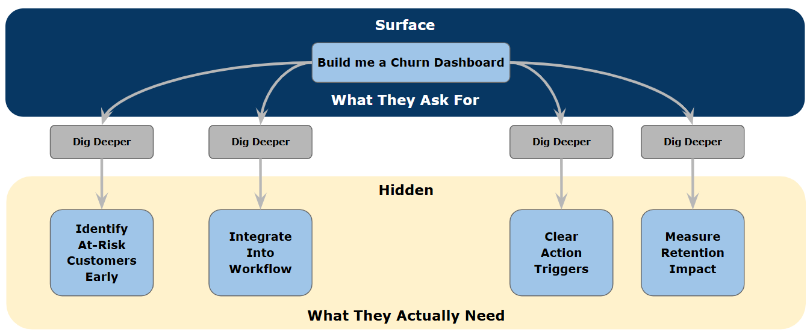

# The Digital Transformation Framework: Understanding What Your Business Partners Really Need

Throughout my career, I've watched analytics teams make the same mistake repeatedly: they take requests at face value, gather requirements, build what was asked for, and then wonder why adoption is low and business value never materializes. When I ask these teams what went wrong, they say, "We built exactly what they asked for."

That's precisely the problem.

These conversations always follow a familiar pattern. A business partner comes with a request—"We need a dashboard showing customer churn," or "Can you build us a predictive model for inventory optimization?" The analytics team treats it as a delivery project: gather requirements, build the solution, hand it over. Six months later, the dashboard sits unused, the model isn't integrated into any business process, and the business partner is frustrated that their "analytics investment" didn't deliver value.

Time and time again, I've used this framework to help analytics teams understand a fundamental truth: the maturity of your business partner's request reveals how much value you can add—and how much danger you're in of becoming a replaceable order-taker rather than a strategic partner.

## The Digital Transformation Framework

The Digital Transformation Framework is a diagnostic tool for understanding how well your business partners can articulate what they need and how much value you can add as a technology and analytics expert. The framework recognizes three distinct levels of business partner maturity—**Transformation**, **Innovation**, and **Delivery**—each requiring a fundamentally different approach to partnership and value creation.

The framework's power lies in revealing a critical insight about partnership and value creation. **The less your business partner knows about what they need, the more value you can add—and the more essential you become to their success**. When a business partner can't articulate exactly what they want or how to achieve their objectives, you have the opportunity to be a trusted advisor who shapes the solution, builds deep relationships, and becomes irreplaceable.

But here's the paradox: **truly mature business partners understand this dynamic and actively seek deep partnership**. They know they need your technical expertise in the ideation phase. They want you to experiment and iterate on ideas with them. They recognize that your software and technical skills are essential to discovering the right solution, not just building a predetermined one. Mature partners ask for transformation and innovation work because they understand the value of partnership.

Less mature business partners don't know to ask for this. They come with surface-level requests and expect you to just execute. If you accept this framing, you're stuck in delivery mode. **To escape the delivery danger zone with less mature partners, you need to sell them on the value of deeper partnership**—helping them understand why ideation, experimentation, and iteration will lead to better outcomes than just building what they asked for.

This framework helps you diagnose where your business partners are in their analytics maturity, recognize whether they're asking for partnership or just execution, and position yourself strategically. With mature partners, lean into the transformation and innovation work they're requesting. With less mature partners, educate them on why partnership delivers more value than transactional delivery. The goal is to spend as much time as possible in transformation and innovation work—where you add the most value and build the strongest relationships—and as little time as possible in pure delivery mode, where you're most easily replaced.

The framework is visualized in the diagram below, showing how the three pathways differ in their sequence and complexity, and how they're all supported by common foundations.

As shown in the diagram, the **Transformation** pathway includes the full sequence of Strategy and Planning, Business Requirements Gathering, Ideation, Iteration and Definition, and Development and Productionalization. The **Innovation** pathway streamlines this by removing the Iteration and Definition phase, while the **Delivery** pathway moves directly from requirements to development. All three pathways are supported by Business Analytics Process, Methodology, and Frameworks; Documentation; and Analytics and Process Tools.

## Understanding the Three Levels of Business Partner Maturity

The framework distinguishes three fundamentally different levels of business partner maturity, each revealing how much your business partner understands about what they need and how much value you can add as their technology partner.

### Transformation: Your Partner Knows the Problem, Not the Solution

**Transformation** describes the situation where your business partner knows they have a problem and wants to achieve different outcomes, but they don't know how to think about the solution or what's even possible with analytics and technology.

This is where you add the most value. Your business partner might say, "Our customer retention is declining, and we need to do something about it," but they can't articulate what that "something" is. They're not asking for a specific dashboard or model—they're asking you to help them understand how to approach the problem differently.

The transformation pathway follows a comprehensive sequence: **Strategy and Planning** → **Business Requirements Gathering** → **Ideation** → **Iteration and Definition** → **Development and Productionalization**. Notice how much work happens before any development begins. That's because your role is to help the business partner discover what they actually need.

**Your role as a technology partner:** You're a trusted advisor and thought partner. You dig deep to understand the business problem, not just the surface request. You ask questions like: "What decisions are you trying to make differently?" "How do you currently think about this problem?" "What would success look like?" You introduce possibilities they haven't considered. You help them understand how analytics could change their approach. You iterate with them to define what "better" looks like.

Consider a financial services company where the head of customer experience says, "We're losing customers to competitors, and we need better analytics." If you treat this as a delivery request, you might build a churn dashboard showing historical attrition rates. But if you dig deeper, you discover they don't actually know what drives churn, they don't have processes for acting on churn signals, and they've never thought about proactive retention. Your value isn't in building a dashboard—it's in helping them shift from reactive reporting to predictive intervention, from asking "Who left?" to "Who's at risk, and what should we do about it?"

This is where you build deep, strategic relationships. You're not replaceable because you're not just delivering technology—you're shaping how the business thinks about their problems and what's possible. You're defining what needs to be built and why. The business partner depends on your expertise to navigate uncertainty and discover the right solution.

**The danger:** If you treat transformation-level work as delivery—taking the surface request, gathering requirements, and building what was asked for—you'll deliver solutions that don't get adopted because they don't actually solve the underlying problem. The business partner will be disappointed, and you'll have missed the opportunity to add strategic value.

### Innovation: Your Partner Knows What They Want, Not How to Get There

**Innovation** describes the situation where your business partner has a clear idea of what they want to achieve and why, but they don't know how to get there or what's technically feasible. They understand analytics and its value, but they need your expertise to turn their vision into reality.

This is where you add significant value, but in a different way than transformation. Your business partner might say, "We want to use customer sentiment from social media to inform our product roadmap," and they understand why this would be valuable. But they don't know if it's technically feasible, what data sources are available, what analytical approaches would work, or how to integrate it into their existing processes.

The innovation pathway follows a streamlined sequence: **Strategy and Planning** → **Business Requirements Gathering** → **Ideation** → **Development and Productionalization**. The business partner can articulate clear requirements about what they want to achieve, but you still need ideation to explore how to achieve it.

**Your role as a technology partner:** You're a solutions architect and technical advisor. You take their vision and figure out how to make it real. You ask questions like: "What data do we have access to?" "What analytical techniques would work for this use case?" "How does this integrate with your existing workflows?" "What are the technical constraints and trade-offs?" You bring technical expertise and creative problem-solving to turn their idea into a practical solution.

Consider a retail company with mature sales analytics. The VP of Marketing says, "We want to predict which customers are likely to respond to our promotions so we can target more effectively." They understand the value of predictive analytics and have a clear business objective. Your value isn't in helping them understand what they need—they already know. Your value is in determining the right modeling approach, identifying the relevant features, building the prediction pipeline, and integrating it into their marketing automation platform.

You're still building a strategic relationship, but it's based on technical expertise and solution design rather than business problem discovery. The business partner depends on your ability to navigate technical complexity and deliver innovative solutions. You're not easily replaced because you bring specialized knowledge and creative problem-solving.

**The danger:** If you treat innovation work as simple delivery—just building what was asked for without exploring alternatives or providing technical guidance—you'll miss opportunities to add value through better technical approaches, and you'll position yourself as a commodity service provider rather than a valued expert.

### Delivery: Your Partner Knows Exactly What They Want and How—The Danger Zone

**Delivery** describes the situation where your business partner knows exactly what they want, how it should work, and can provide complete specifications. They're data literate, analytically mature, and can articulate precise requirements. This is the danger zone for analytics teams.

When you're in pure delivery mode, you're an order-taker. The business partner says, "Build me a dashboard with these five metrics, using this data source, with these filters," and you build it. There's no exploration, no discovery, no shaping of the solution—just execution.

The delivery pathway follows the shortest sequence: **Strategy and Planning** → **Business Requirements Gathering** → **Development and Productionalization**. Requirements are complete and precise. The business partner knows what they need. Your job is to build it efficiently.

**Your role as a technology partner:** You're a service provider executing specifications. The business partner doesn't need your strategic thinking or technical creativity—they need reliable, efficient execution. You're judged on speed, cost, and quality of execution, not on the value of your insights or the strength of your relationships.

**Here's the hard truth:** When you're operating purely in delivery mode, you're replaceable. The business partner could outsource this work, hire contractors, or use low-code tools to build it themselves. You're not adding strategic value—you're providing a commodity service. And in today's world of increasingly accessible analytics tools and platforms, commodity services get automated, outsourced, or eliminated.

Consider a manufacturing company with a mature analytics program. The operations director sends you a detailed specification: "Create a production efficiency dashboard for our new facility. Use the same data model as our existing facilities, include these specific KPIs with these exact calculations, and replicate the layout from our standard template." They know exactly what they want because they've done this five times before. Your role is pure execution.

**The critical question:** If you find yourself doing mostly delivery work, you should be asking: "How is my team adding value as data experts and technologists? What makes us valuable beyond execution? How are we building relationships that make us strategic partners rather than replaceable vendors?"

**The reality of maturity:** Yes, when you have highly data-literate business partners who understand analytics deeply, some work will naturally be delivery-focused. But even with mature partners, you should be looking for opportunities to add value beyond execution—suggesting better approaches, identifying adjacent opportunities, proactively bringing insights. If you're purely taking orders and delivering, you're in danger.

### The Maturity Paradox: Mature Partners Seek Partnership, Not Just Delivery

Here's a critical insight that many analytics teams miss: **truly mature business partners don't just send you specifications and expect delivery—they actively seek your partnership in ideation and innovation work**.

Mature business partners understand that analytics and technology problems are complex, that the best solutions emerge from experimentation and iteration, and that your technical expertise is essential to discovering the right approach. They know that coming to you with complete specifications would be premature—they need your partnership to explore possibilities, test ideas, and iterate toward the best solution.

When a mature business partner comes to you with a challenge, they're not saying "Build this exact thing." They're saying "Help me figure out how to solve this problem. I need your technical expertise to explore what's possible, experiment with approaches, and iterate until we find the right solution."

**Example:** A sophisticated VP of Marketing at a data-mature company doesn't say "Build me a customer segmentation dashboard with these five segments and these metrics." Instead, they say "We need to fundamentally rethink how we segment customers for personalization. Our current approach isn't working. I need your team to partner with us—bring your data science expertise, help us explore what's possible with our data, experiment with different segmentation approaches, and iterate until we find something that actually drives better marketing outcomes."

This is transformation or innovation work, even though the business partner is highly mature. The maturity shows in their recognition that they need deep partnership, not just execution.

**The trap with mature partners:** The danger is when mature business partners are *willing* to engage in partnership, but you position yourself as a delivery service. They come with an open-ended problem, and you immediately try to pin down requirements and specifications so you can start building. You're inadvertently pushing the relationship toward transactional delivery when they were offering you the opportunity for strategic partnership.

**With less mature partners, you need to sell partnership:** Less mature business partners don't understand the value of deep partnership. They come with surface requests—"Build me a churn dashboard"—and expect you to gather requirements and deliver. They don't know to ask for ideation, experimentation, and iteration because they don't understand how much value that adds.

This is where you need to educate and sell. When they come with a surface request, you dig deeper: "Let me understand the business problem you're trying to solve. Before we jump to building a dashboard, let's explore what you're really trying to achieve and what approaches might work best. I'd like to spend some time in discovery and ideation with your team to make sure we're solving the right problem in the right way."

You're selling them on the value of partnership over transactional delivery. Some will embrace it. Some will resist and insist they just want what they asked for. Your job is to help them understand why partnership delivers better outcomes—and if they won't engage, to recognize that you're stuck in low-value delivery work with that particular partner.

## Building Strategic Partnerships: The Value of Digging Deeper

The framework isn't just about categorizing work—it's about understanding how to build strategic partnerships with your business stakeholders. The key insight is this: **the more you dig deeper to understand what your business partners really need versus what they're asking for on the surface, the more value you add and the stronger your partnership becomes**.

### The Art of Understanding Needs vs. Requests

Every analytics request has two layers: what the business partner is asking for (the surface request) and what they actually need (the underlying objective). The difference between being a strategic partner and an order-taker is whether you dig deeper to understand that second layer.

Think of it like an iceberg—the surface request is just the visible tip, while the real needs lie hidden beneath the surface.

**Surface request:** "Build me a customer churn dashboard."

**What they might actually need:** A way to identify at-risk customers early enough to intervene, integrated into their customer success team's workflow, with clear action triggers and ownership.

When you take the surface request at face value and build the dashboard, you've delivered what was asked for but not what was needed. The dashboard sits unused because it doesn't actually help them solve their problem. When you dig deeper—asking about their current process, what decisions they're trying to make, what happens when they identify at-risk customers—you discover the real need and can shape a solution that actually gets adopted and delivers value.

**This is especially critical in transformation and innovation work**, where business partners often can't articulate what they actually need because they don't fully understand what's possible or how to think about the problem. Your value comes from helping them discover the right solution through exploration and iteration.

But even in delivery-oriented work with mature partners, there's value in digging deeper. A mature business partner might come with complete specifications, but by asking strategic questions—"What's changed that makes this a priority now?" "How does this connect to your broader objectives?" "What adjacent problems could we solve with similar approaches?"—you can identify opportunities to add value beyond pure execution.

### The Relationship Spectrum: From Transactional to Strategic

Your relationship with business partners exists on a spectrum, with each maturity level corresponding to a different type of relationship and level of partnership.

**Transactional relationship (Delivery):** Business partner sends specifications, you build to spec, you deliver. Minimal interaction, no collaboration, no shared discovery. You're a vendor.

**Collaborative relationship (Innovation):** Business partner shares objectives and vision, you work together to figure out how to achieve it, you bring technical expertise and creative solutions. Regular interaction, joint problem-solving. You're a valued expert.

**Strategic partnership (Transformation):** Business partner shares problems and aspirations, you help them understand what's possible and how to think differently, you co-create the solution and the approach. Deep, ongoing relationship, mutual trust, shared success. You're irreplaceable.

The strongest analytics teams build strategic partnerships. They're not waiting for requests—they're proactively engaging with business leaders, understanding their challenges, and shaping how the organization thinks about analytics. They're trusted advisors who get invited to strategy discussions, not order-takers who get handed specifications.

### Why Delivery Is the Danger Zone

Here's what I tell analytics leaders: **if your team is operating primarily in delivery mode, you're in danger**. Not because delivery work isn't important—it is. But because:

1. **You're not adding strategic value.** You're executing specifications, not shaping solutions or building business understanding.

2. **You're replaceable.** If the work is purely execution, it can be outsourced, automated, or done by lower-cost resources.

3. **You're not building relationships.** Transactional interactions don't create the trust and partnership that make you essential to the business.

4. **You're missing opportunities.** When you're just taking orders, you're not seeing the bigger picture or identifying adjacent problems you could solve.

5. **You're not developing your team.** Pure execution work doesn't build the business acumen, strategic thinking, and consultative skills that make analysts valuable.

The goal isn't to avoid delivery work entirely—some delivery work is inevitable and necessary. The goal is to ensure your team is adding value beyond execution, building strategic relationships, and positioning yourselves as partners rather than vendors.

## The Supporting Foundations

The three levels of business partner maturity don't exist in isolation. They're supported by four critical foundations that enable you to add value and build strategic partnerships across all types of work.

### Strategy and Planning: Diagnosing Maturity and Opportunity

**Strategy and Planning** is where you diagnose the maturity of your business partner's request and determine how much value you can add. This is the critical first step that determines whether you'll be a strategic partner or an order-taker.

The key diagnostic questions aren't about the work itself—they're about your business partner's understanding:

- **How clearly can they articulate what they want?** Vague problem statements suggest transformation-level work where you can add significant value by helping them discover what they need.

- **Do they know how to achieve their objectives?** If they have a clear vision but don't know the path, that's innovation-level work where you add value through technical expertise and solution design.

- **Can they provide complete specifications?** If yes, that's delivery-level work where you're at risk of being an order-taker.

- **What's driving this request?** Understanding the business context helps you dig deeper and potentially reframe the problem.

This diagnostic phase also helps you set appropriate expectations and engagement models. Transformation work requires deep collaboration, regular stakeholder engagement, and tolerance for discovery. Innovation work requires technical partnership and joint problem-solving. Delivery work requires clear specifications and efficient execution.

**The strategic opportunity:** Even when a request initially looks like delivery work, the strategy and planning phase gives you the chance to dig deeper and potentially elevate the conversation. By asking about broader objectives, related challenges, and strategic priorities, you might discover opportunities to add more value than pure execution.

### Business Analytics Process, Methodology, and Frameworks: Matching Approach to Maturity

**Business Analytics Process, Methodology, and Frameworks** provide the structured approaches for engaging with business partners at different maturity levels. The key insight is that your approach must match your partner's maturity—using the wrong approach destroys value and damages relationships.

For transformation-level work, your methodology emphasizes discovery and co-creation. You're using techniques like stakeholder interviews, journey mapping, and iterative prototyping to help business partners understand what they need. Your process includes extensive time for exploration, experimentation, and learning together. You're facilitating discovery, not just gathering requirements.

For innovation-level work, your methodology balances structure with exploration. You're using techniques like technical feasibility analysis, solution design workshops, and proof-of-concept development. Your process includes clear decision points but allows room for technical creativity and refinement. You're architecting solutions, not just following blueprints.

For delivery-level work, your methodology emphasizes efficiency and reliability. You're using techniques like requirements documentation, sprint planning, and quality assurance. Your process is optimized for predictable execution. You're delivering to specifications.

**The mistake analytics teams make:** They use a delivery methodology for all work. They treat transformation-level work as if it's delivery—gathering "requirements" when they should be facilitating discovery, rushing to development when they should be exploring possibilities. This approach fails because the business partner can't provide complete requirements for something they don't fully understand yet. The result is solutions that don't get adopted because they don't solve the real problem.

### Documentation: Capturing Value and Building Institutional Knowledge

**Documentation** serves different purposes depending on the maturity level of the work, but it's always about capturing and sharing the value you've added.

For transformation work, documentation captures the insights and learning from your partnership with the business. What did you discover about their needs? What approaches did you test? Why did certain solutions work or fail? This documentation demonstrates the value you added through discovery and helps future work with similar partners. It's evidence of your strategic contribution.

For innovation work, documentation captures the technical expertise and solution design you brought to the problem. What approaches did you evaluate? What trade-offs did you consider? Why did you choose this architecture? This documentation demonstrates your technical value and enables others to build on your work.

For delivery work, documentation captures operational knowledge that enables efficient execution. How does this work? How do you maintain it? How do you troubleshoot issues? This documentation enables scaling and reduces dependency on specific individuals.

**The strategic value of documentation:** Good documentation makes your value visible. When you document the discovery process in transformation work, you're showing how much you contributed beyond just building technology. When you document technical decisions in innovation work, you're demonstrating your expertise. Documentation is evidence of the value you add as strategic partners, not just executors.

### Analytics and Process Tools: Enabling Partnership at Every Level

**Analytics and Process Tools** provide the technical infrastructure that enables you to add value at different maturity levels. The tools you need differ based on the type of partnership you're building.

Transformation work requires tools that facilitate collaboration and exploration—visualization tools for stakeholder workshops, prototyping platforms for testing ideas, collaboration tools for co-creation. These tools help you work with business partners to discover solutions together. The focus is on enabling communication and shared understanding, not production reliability.

Innovation work requires tools that enable technical creativity and solution design—development environments for experimentation, proof-of-concept platforms, integration testing tools. These tools help you explore technical approaches and demonstrate feasibility. The focus is on rapid iteration with a path to production.

Delivery work requires tools that enable efficient, reliable execution—standardized development environments, automated testing, deployment pipelines, monitoring systems. These tools help you deliver consistently and predictably. The focus is on operational excellence.

**The tool trap:** Organizations often force all work through production-grade delivery tools, which makes transformation and innovation work unnecessarily slow and bureaucratic. When you're trying to explore possibilities with a business partner in transformation work, you don't need production-grade data pipelines—you need flexible tools that let you quickly test ideas and visualize options. Match your tools to the type of partnership you're building.

## Common Failures: When You Miss the Opportunity to Add Value

The framework's power lies in helping you diagnose when you're missing opportunities to add value or when you're treating your business partners inappropriately for their maturity level. These failures damage relationships, waste resources, and position you as replaceable rather than strategic.

### The Order-Taker Failure: Treating Transformation as Delivery

This is the most common and damaging failure: your business partner doesn't know what they really need, but you treat their surface request as if it were a complete specification. You gather "requirements," build what was asked for, and deliver—missing the entire opportunity to add strategic value.

**Example:** A healthcare organization's Chief Medical Officer says, "We need a population health dashboard to help us shift from reactive to proactive care." If you treat this as a delivery request, you gather requirements about what metrics to show, build a dashboard displaying population health indicators, and hand it over. Six months later, no one is using it.

Why? Because the CMO's request was a surface-level articulation of a much deeper need. What they actually needed was help understanding how to shift clinical workflows from reactive to proactive, how to identify high-risk patients early enough to intervene, how to change care team processes, and how to measure success differently. The dashboard was just their best guess at a solution—but it wasn't the right solution because they didn't fully understand the problem space.

**What you should have done:** Recognized this as transformation-level work and positioned yourself as a strategic partner. Dug deeper with questions like: "How do clinicians currently think about their work?" "What would need to change in your care processes to be proactive?" "What decisions would you make differently with better data?" Through ideation and iteration with care teams, you would have discovered that they needed risk stratification integrated into clinical workflows, care management tools for high-risk patients, and process changes for care coordination—not just a dashboard.

**The cost of this failure:** You delivered what was asked for but not what was needed. The solution doesn't get adopted. The business partner is disappointed. You've positioned yourself as an order-taker who builds what's requested rather than a strategic partner who helps discover what's needed. You've missed the opportunity to build a deep relationship and demonstrate your value as a trusted advisor.

### The Solution-in-Search-of-a-Problem Failure: Innovation Without Partnership

This failure occurs when you get excited about technical possibilities without deeply understanding your business partner's needs. You build technically impressive solutions that don't deliver business value because you didn't dig deep enough to understand the real problem.

**Example:** A retail company's analytics team hears about recommendation engines and decides to build one. They assemble a data science team, invest in machine learning infrastructure, and develop sophisticated models. They're proud of the technical achievement—the models are accurate and performant.

But nine months later, the models aren't deployed. Why? Because the analytics team never deeply engaged with the e-commerce and marketing teams to understand their actual needs, constraints, and workflows. The e-commerce platform wasn't designed to support personalized recommendations. The marketing team doesn't understand how to use the recommendations in their campaigns. The business stakeholders don't trust the "black box" models. And most critically, no one ever validated that recommendation-driven purchases would actually improve business outcomes enough to justify the investment.

**What you should have done:** Treated this as innovation-level work requiring deep partnership with business stakeholders. Started with strategy and planning to understand the business problem—not the technical solution. Asked questions like: "What are you trying to achieve?" "How do customers currently discover products?" "What's the biggest constraint in driving purchases?" "How would recommendations integrate into your existing processes?" Through this discovery, you might have learned that the real problem wasn't product discovery—it was cart abandonment, or that customers needed help with sizing, or that the merchandising team needed better inventory optimization. The right solution might not have been a recommendation engine at all.

**The cost of this failure:** You've built something technically impressive that doesn't deliver business value. You've wasted resources on a solution that doesn't get adopted. You've damaged your credibility with business partners who see you as technologists who don't understand their business. You've missed the opportunity to solve their real problems and build trust as a partner who understands their needs.

### The Firefighting Trap: Delivery Without Foundation

This failure occurs when you're operating in pure delivery mode without the infrastructure to do it efficiently. You're taking requests, building solutions, and delivering—but every request is a custom one-off, nothing is standardized, and you're constantly firefighting. You're adding minimal value and burning out your team.

**Example:** A financial services company has an analytics team that responds to business requests as they come in. A business unit asks for a customer profitability report—the team builds it with custom SQL queries and manual data pulls. Another unit asks for a risk dashboard—the team builds it from scratch with different tools and approaches. A third unit asks for a variation of the first report—but the original analyst has left, the code is undocumented, and no one knows how it works, so they rebuild it.

The team is constantly firefighting—fixing broken reports, recreating lost analyses, explaining how things work. They can't take vacation because they're the only ones who understand their solutions. They can't take on strategic work because they're drowning in maintenance and support. They're miserable, burned out, and adding minimal value.

**What you should have done:** If you're going to operate in delivery mode, you need the infrastructure to do it efficiently. That means standardized processes, reusable components, comprehensive documentation, and automated tooling. More importantly, you should be asking: "Why are we operating purely in delivery mode? How can we add more value? Can we proactively identify patterns across these requests and build strategic solutions? Can we help business partners think differently about their needs?"

**The cost of this failure:** Your team is trapped in a cycle of reactive, low-value work. You're not building strategic relationships or adding significant value. You're replaceable—any other team with similar technical skills could do what you're doing. Your team members are burning out and leaving. You're missing opportunities to do more strategic, impactful work.

**The deeper issue:** This failure often happens because the analytics team has positioned itself as an order-taking service provider rather than a strategic partner. Business stakeholders see you as the people who build reports, not as trusted advisors who can help them solve problems. Breaking out of this trap requires deliberately repositioning your team and changing how you engage with business partners.

### The Over-Engineering Failure: Treating Innovation as Transformation

This failure occurs when you apply transformation-level discovery and iteration to work that doesn't need it. Your business partner knows what they want and how to use it, but you insist on extensive exploration and stakeholder engagement. You're adding process overhead without adding value, and you're frustrating business partners who just want you to solve their problem.

**Example:** A technology company's VP of Customer Support has a clear vision: "We want to analyze customer support chat logs to proactively identify product issues before they become widespread problems." They understand the value, they know how they'll use the insights, and they have a clear process for acting on findings. This is innovation work—they need your technical expertise to build the analytical capability, but they don't need help understanding their problem or discovering what they need.

But the analytics team insists on a full transformation-level process: extensive stakeholder interviews to understand current processes, multiple rounds of iteration to define requirements, formal change management workshops. Six months in, they're still in the discovery phase, and the VP is frustrated: "I told you what I need. Why haven't you built it yet?"

**What you should have done:** Recognized that this business partner has a clear vision and doesn't need extensive discovery. Your value is in technical execution and solution design, not in helping them understand their problem. You should have moved quickly through strategy and ideation to development, focusing your partnership on technical approach, integration patterns, and solution architecture—not on business process discovery.

**The cost of this failure:** You've frustrated a business partner by adding unnecessary overhead. You've slowed time-to-value when speed was important. You've positioned yourself as bureaucratic and slow rather than responsive and helpful. You've damaged the relationship by not listening to what your partner actually needed from you.

### The False Innovation Failure: Making Delivery Work Complicated

This failure occurs when you treat straightforward delivery work as if it were innovative or transformational, creating unnecessary complexity and slowing down execution. You're trying to add value where none is needed, and you're frustrating business partners who just want efficient execution.

**Example:** A manufacturing company needs a production efficiency dashboard for their new facility. They've deployed this same dashboard at five other facilities—same metrics, same data sources, same layout. The plant manager sends complete specifications: "Build us the standard production dashboard, customized for our facility." This is pure delivery work—the requirements are clear, the approach is proven, and the business partner just needs efficient execution.

But the analytics team treats it as an innovation project. They schedule ideation workshops to explore new visualization approaches. They propose experimenting with different analytical techniques. They want to iterate on the design with stakeholders. Three months later, they're still in the design phase, and the plant manager is furious: "I gave you complete specifications. I just need the standard dashboard. Why is this taking so long?"

**What you should have done:** Recognized this as delivery work and executed efficiently. Your value in this situation comes from speed, reliability, and quality of execution—not from innovation or exploration. The business partner doesn't need your strategic thinking or creative problem-solving; they need you to deliver what was requested quickly and well.

**The cost of this failure:** You've frustrated a business partner by making simple work complicated. You've wasted resources on unnecessary exploration. You've positioned yourself as slow and bureaucratic rather than responsive and efficient. You've damaged your credibility by not recognizing when straightforward execution is what's needed.

**The deeper issue:** Sometimes analytics teams make this mistake because they're uncomfortable with pure delivery work—they want every project to be strategic and innovative. But the reality is that some work is routine execution, and that's okay. The key is to execute it efficiently so you have capacity for more strategic work, and to look for opportunities to add value beyond execution without forcing complexity where it's not needed.

## Diagnosing Your Analytics Portfolio: Where Are You Adding Value?

The framework provides a diagnostic lens for evaluating where your analytics team is adding value and where you're at risk of becoming replaceable. The critical question isn't just "What work are we doing?" but "How much strategic value are we adding, and how strong are our business partnerships?"

### Portfolio Balance: The Value-Add Spectrum

Your analytics portfolio should reflect a healthy balance across the maturity spectrum, but with a clear understanding of where you're adding the most value.

**Transformation work (High value-add):** This is where you're adding the most strategic value—helping business partners discover what they need, shaping solutions, building deep relationships. You're irreplaceable because you're not just delivering technology; you're helping the business think differently.

**Innovation work (Medium value-add):** This is where you're adding significant technical value—bringing expertise, creative problem-solving, and solution design. You're valuable because you're solving complex problems and enabling new capabilities.

**Delivery work (Low value-add):** This is where you're adding execution value—building what's specified efficiently and reliably. You're at risk of being replaceable because you're providing a commodity service.

**The diagnostic question:** What percentage of your portfolio is transformation vs. innovation vs. delivery? If you're heavily weighted toward delivery, you're in danger. You're not building strategic relationships, you're not adding significant value beyond execution, and you're replaceable.

**The maturity paradox reconsidered:** Many analytics teams assume that as business partners become more data-literate and analytically mature, more work naturally shifts toward delivery. But this is a misconception. **Truly mature business partners understand the value of partnership and actively seek transformation and innovation work**. They want your expertise in ideation and experimentation. They know they need your technical skills to iterate on ideas and discover the right solutions.

`

If you're working with supposedly "mature" business partners but all your work is delivery-focused, one of two things is happening:

1. **They're not as mature as you think.** They may be data-literate, but they don't understand the value of deep partnership in solving complex problems. You need to educate them.

2. **You've positioned yourself as a delivery service.** Through your actions and engagement model, you've trained them to come to you with specifications rather than problems. You need to reposition yourself as a strategic partner.

The truly mature business partners—the ones who understand analytics deeply—are the ones most likely to pull you into transformation and innovation work because they understand how much value you can add through partnership.

### Engagement Models: Matching Partnership Depth to Maturity

Different maturity levels require different engagement models with business partners. The key is matching your level of engagement to the value you can add.

**Transformation-level engagement (Deep partnership):** Regular working sessions with business stakeholders, joint discovery workshops, iterative prototyping with feedback loops, executive sponsorship and steering. You're embedded in the business problem, not just responding to requests. This is time-intensive but builds strategic relationships and delivers high value.

**Innovation-level engagement (Collaborative partnership):** Regular check-ins with business stakeholders, technical design reviews, proof-of-concept demonstrations, clear decision gates. You're collaborating on solution design, not just taking orders. This requires moderate engagement but delivers significant technical value.

**Delivery-level engagement (Transactional):** Requirements gathering, progress updates, delivery and handoff. You're executing specifications with minimal ongoing engagement. This is efficient but low-value and doesn't build strategic relationships.

**The diagnostic question:** Are you matching your engagement model to the maturity level? If you're using transactional engagement for transformation-level work, you'll fail to discover what's really needed. If you're using deep partnership engagement for delivery-level work, you're wasting resources and frustrating business partners who just want efficient execution.

**The strategic opportunity:** Even in delivery-oriented relationships, you can look for opportunities to deepen engagement. Proactive communication about adjacent opportunities, strategic suggestions about better approaches, and regular business reviews can elevate a transactional relationship toward partnership—if there's value to add.

### Team Development: Building Strategic Partnership Skills

Different maturity levels require different skills from your analytics team. The critical insight is that strategic partnership skills are more valuable—and harder to develop—than pure technical execution skills.

**Transformation-level skills (Strategic partner):** Business acumen, consultative skills, facilitation and workshop leadership, stakeholder management, change management, strategic thinking, communication with executives. These are the skills that make you irreplaceable—the ability to understand business problems, facilitate discovery, and shape solutions.

**Innovation-level skills (Technical expert):** Deep technical expertise, solution architecture, creative problem-solving, technical communication, proof-of-concept development, integration design. These are the skills that make you valuable—the ability to solve complex technical problems and design innovative solutions.

**Delivery-level skills (Executor):** Technical proficiency, efficient execution, quality assurance, documentation, operational reliability. These are the skills that make you competent—the ability to build things well and reliably.

**The diagnostic question:** Are you developing your team's strategic partnership skills, or just their technical execution skills? If you're only building delivery-level skills, you're commoditizing your team. The most valuable analytics professionals can operate at all three levels—they can be strategic partners when needed, technical experts when appropriate, and efficient executors when required.

**The development opportunity:** Use transformation and innovation work as development opportunities for your team. These engagements build the consultative skills, business acumen, and strategic thinking that make analytics professionals valuable. Pure delivery work doesn't develop these skills—it only reinforces execution capabilities.

## Measuring Success: Are You Adding Strategic Value?

The driving goal of the Digital Transformation Framework is to help analytics teams add maximum value by building strategic partnerships with business stakeholders. Success isn't just about delivering projects—it's about building relationships, adding value beyond execution, and positioning yourself as irreplaceable.

Success metrics differ by maturity level, but they should all ultimately measure the strength of your partnerships and the value you're adding.

### Transformation Metrics: Partnership and Impact

For transformation work, success is measured by the depth of your partnership and the impact on how the business thinks and operates:

- **Partnership Depth:** Are you invited to strategy discussions? Do business leaders seek your advice proactively? Are you seen as a trusted advisor?
- **Behavior Change:** Are business stakeholders asking different questions and making decisions differently because of your work?
- **Adoption and Usage:** Are the solutions you co-created being used consistently and driving business outcomes?
- **Relationship Strength:** Do business partners view you as irreplaceable? Would they fight to keep you on their team?

These metrics are qualitative and relationship-focused. Transformation work builds strategic partnerships that last beyond individual projects. Success is measured by the strength of relationships and the lasting impact on how the business operates.

### Innovation Metrics: Technical Value and Solution Quality

For innovation work, success is measured by the technical value you add and the quality of solutions you design:

- **Solution Quality:** Are your technical designs elegant, scalable, and maintainable? Do they solve the problem well?
- **Technical Credibility:** Do business partners trust your technical judgment? Do they seek your advice on technical approaches?
- **Business Value:** Do your solutions deliver measurable business outcomes? Are they adopted and used?
- **Innovation Success Rate:** What percentage of innovations you develop get scaled to production and deliver value?

These metrics focus on your technical expertise and solution design capabilities. Innovation work demonstrates your value as a technical expert who can solve complex problems and design effective solutions.

### Delivery Metrics: Efficiency and Reliability (But Watch for Danger Signs)

For delivery work, success is measured by operational excellence and efficiency:

- **Cycle Time:** How quickly can you execute standard requests?
- **Quality:** What percentage of deliverables meet requirements without rework?
- **Reliability:** Are analytics capabilities consistently available and accurate?
- **Efficiency:** What's the cost per delivery, and is it improving over time?

These metrics are quantitative and operational. But here's the critical question: **If these are your only metrics, you're in danger.** These metrics measure execution efficiency, not strategic value. If you're only measuring delivery metrics, you're positioning yourself as a commodity service provider.

**The danger signs:**
- Your portfolio is mostly delivery work
- Business partners only engage with you transactionally
- You're not invited to strategic discussions
- You're measured purely on speed and cost
- Your team could be easily outsourced or replaced

If you see these signs, you need to deliberately shift toward more transformation and innovation work, build deeper partnerships, and find ways to add strategic value beyond execution.

### Portfolio Health: Are You Adding Enough Strategic Value?

Beyond individual project metrics, you need to measure the overall health of your analytics portfolio and partnerships:

- **Portfolio Mix:** What percentage of your work is transformation vs. innovation vs. delivery? Are you too heavily weighted toward low-value delivery work?
- **Partnership Depth:** How many strategic partnerships do you have versus transactional relationships? Are you building deep relationships with key business leaders?
- **Strategic Visibility:** Are analytics leaders invited to executive strategy discussions? Is analytics seen as strategic or operational?
- **Team Development:** Are your team members developing strategic partnership skills, or just execution skills?
- **Replaceability Risk:** If your team disappeared tomorrow, would business partners fight to get you back, or would they just hire contractors to execute specifications?

These portfolio-level metrics help you assess whether you're positioning your analytics team for long-term success or drifting toward commoditization. If you're seeing warning signs—too much delivery work, mostly transactional relationships, low strategic visibility—you need to deliberately reposition your team and change how you engage with business partners.

## Putting It Into Practice: Building Strategic Partnerships

The next time a business partner comes to you with an analytics request, don't just take it at face value and start gathering requirements. Use this framework as your diagnostic tool to understand what they really need and how much value you can add.

Ask yourself the hard questions:

- **How well does my business partner understand what they need?** Can they articulate the problem clearly but not the solution (transformation)? Do they know what they want but not how to get there (innovation)? Or can they provide complete specifications (delivery)?

- **Am I digging deeper to understand needs vs. requests?** Am I taking the surface request at face value, or am I asking questions to understand the underlying business problem, objectives, and constraints?

- **What value can I add beyond execution?** Can I help them think differently about their problem? Can I bring technical expertise and creative solutions? Or am I just executing specifications?

- **What kind of partnership am I building?** Am I positioning myself as a trusted advisor and strategic partner, or am I acting like an order-taker and service provider?

- **Is my portfolio too heavily weighted toward delivery?** Am I spending most of my time on low-value execution work, or am I building strategic relationships and adding significant value?

The framework won't guarantee success, but it will reveal where you're adding value and where you're at risk of becoming replaceable. **If you're operating primarily in delivery mode—taking requests, gathering requirements, and building what was asked for—you're in danger.** You're not building strategic relationships, you're not adding significant value beyond execution, and you're replaceable by contractors, outsourcing, or increasingly capable self-service tools.

The most successful analytics teams and professionals build deep strategic partnerships. They don't wait for requests—they proactively engage with business leaders to understand their challenges. They dig deeper to understand what business partners really need, not just what they're asking for. They help business partners think differently about problems and discover better solutions. They position themselves as trusted advisors who shape outcomes, not vendors who execute specifications.

That's the difference between analytics teams that are strategic assets and those that are cost centers waiting to be optimized away. That's the difference between analytics professionals who are irreplaceable partners and those who are replaceable order-takers.

Build deep relationships. Dig deeper to understand real needs. Add value beyond execution. That's how you become irreplaceable.
