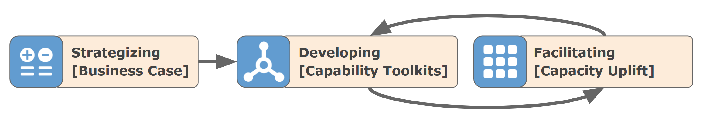

[\[07.02\] Enabling Team Framework](https://docs.google.com/presentation/d/1Zpwh1zZteiHXFWtyy-8ZBHMy7Z0abtJpWZ8AkBVFjg4/edit?usp=sharing)

# The Enabling Team Framework

Throughout my career, I've been asked the same questions by leaders facing the same frustrations: How do we develop a process-led culture? How do we mature our DevOps practices? How can we improve code quality? Why do our efforts to adopt new practices keep failing?

These conversations always follow a familiar pattern. The organization has tried before—they've invested in tools, run training sessions, launched initiatives—but nothing stuck. Teams reverted to old habits, adoption remained shallow, and the return on investment never materialized. Leaders are left wondering what went wrong and, more importantly, what they should do differently this time.

Time and time again, I've used this framework to diagnose the gaps in how they're running their business and advise on where investment is needed to increase the likelihood of deep cultural change. The framework reveals the missing pieces with remarkable consistency: a team built sophisticated tooling without establishing clear policy on why it matters, or they attempted to govern a process that was never properly defined, or they skipped operational execution and went straight to scaling before understanding what actually works in practice.

But this framework isn't just a diagnostic tool for advising others—it's become my personal checklist and definition of done for my own software engineering work. Before investing significant effort in building a solution, I ask: Can the team answer the advisory questions? Is this tool connected to an actual operational process? Have we collected data that proves this is needed? If the answers are no, I know we're heading toward low adoption and low ROI.

The lesson I've learned is simple but powerful: you need all the pieces of this framework at some level of maturity to get new solutions to stick. Skip the policy, and teams won't understand why it matters. Skip the operations, and your tools won't address real friction points. Skip the enablement, and teams will struggle and resist. The framework emerged from repeatedly seeing these patterns—and from learning that sustainable change requires addressing the entire system, not just one piece of it.

## What is an Enabling Team?

An **Enabling Team** is a fundamental team type that has a primary focus to reduce intrinsic cognitive load and increase flow in Stream-aligned teams. A group of experts who mentor & facilitate to uplift capabilities and detect gaps. This team type should not own any software components.

## What is their Primary Interaction Mode?

Enabling Teams secret-sauce is the **Facilitating Mode**, where one team helps another. This is the main operating model for enabling teams. This mode is used to help clear impediments and discover gaps or inconsistencies in existing components and services used by other teams. There should be a focus on the quality of interaction between the teams. Like the Collaboration mode, Facilitating is a temporary interaction mode \- the interaction should generally last for no more than a few weeks.

## What is the Enabling Team Framework?

The Enabling Team Framework is a structured approach for how enabling teams should think about, organize, and deliver capability transformation work across an organization. While the concept of an enabling team is well-established in Team Topologies, this framework provides the practical "how" - a systematic way to break down the complex work of capability uplift into clear roles, sequential elements, delivery modes, and work types.

At its core, the framework recognizes that enabling teams must operate in three distinct roles: **Advising** (defining the strategic "what" and "why"), **Developing** (building the enablement toolkit), and **Facilitating** (guiding teams through adoption). Each role has specific considerations that follow an intentional sequence, ensuring teams build the right foundation before moving to implementation.

The framework's value lies in its ability to prevent the most common failure modes of organizational change initiatives. Too often, teams jump directly to building tools without establishing clear policy and standards, or they attempt to govern processes that haven't been properly defined, measured, or that the business hasn't been enabled on. Trying to enforce governance without first ensuring teams understand the process, have the tools to execute it efficiently, and have received proper enablement is a fool's errand that breeds frustration and resistance. The framework provides a roadmap that ensures each element is addressed in the right order, with the right focus, at the right time.

By following this framework, enabling teams can systematically identify gaps in their approach, understand which delivery mode they should be operating in, and structure their work to maximize the likelihood of sustained adoption. It transforms the abstract concept of "enabling" into concrete, actionable steps that guide teams from initial business case through successful capability uplift. The framework ensures that enabling teams don't just deliver tools or training - they deliver lasting organizational change.

### What Responsibilities Align with the Framework?

The framework breaks the solution space into two primary roles:

1. **Advising:** The strategic role where the enabling team defines the "what" and "why" of the capability—establishing policy, standards, methodology, processes, and architecture. This work is definitional and strategic, setting the foundation for what needs to be accomplished.

2. **Facilitating:** The operational role where the enabling team guides and supports teams through implementation and execution. The enabling team does not perform the operations—the implementing team does. Instead, the enabling team ensures operations begin, observes execution, and provides analysis and recommendations. This includes facilitating data collection, tool deployment, enablement delivery, ongoing support, and governance.

### What About Development?

The enabling team's development work centers on building enablement toolkits—comprehensive packages that include libraries, frameworks, business processes, training materials, and other resources that target teams can use to implement the capability themselves. Critically, the enabling team is never an execution team of the target process. 

For example, when working with a development scrum team, the enabling team will not rebuild the application or modify the codebase directly. Instead, they provide a specific toolkit—whether it's a software package, a library, a framework, a business process, or training materials—that the targeted team can learn from and implement within their own codebase. This approach follows the principle: "Give a man a fish and you feed him for a day; teach a man to fish and you feed him for a lifetime." The enabling team builds the tools and knowledge that empower other teams to succeed independently, rather than performing the work on their behalf.

### What to Consider When Advising?

When the team is thinking about advising, it should consider the following topics:

1. **Policy:** Why is the work important and why do we want this business capability to mature? Policy establishes the business rationale and drives organizational alignment around the capability.

2. **Standards:** What must be done by teams to reach the desired level of maturity? Standards define the high-level controls and measurements that track how the organization is adopting new practices and building competency.

3. **Methodology:** What are the common best practices, rules, and definitions of done we can share across the enterprise? Methodology provides the guardrails that steer and direct each team toward consistent execution.

4. **Process:** How should the series of steps or procedures be conducted to achieve the desired outcome? Process defines the clear, standardized workflow teams will follow to accomplish the work.

5. **Architecture:** What designs, tools, software, and solutions help teams automate and comply with the new way of working? Architecture provides the technical foundation that enables efficient execution of the process.

### What to Consider When Facilitating?

When the team is thinking about facilitating, it should consider the following topics:

1. **Operations:** The hands-on execution of the process by the implementing team. The enabling team ensures operations begin and observes how teams work, providing analysis and recommendations. This initial operationalization generates real-world experience and identifies what actually works in practice versus what was theorized during the advising phase.

2. **Data:** Information and metrics collected from operational execution that inform where the process is working, where gaps exist, and where operations are needed most. This data drives evidence-based decisions about tooling, enablement needs, and process improvements.

3. **Tools & Solutions:** Technology, software, and automated systems that help teams scale and efficiently execute the process. These tools reduce manual effort, minimize errors, and enable consistent execution across the organization.

4. **Enablement:** Training, documentation, and knowledge transfer activities that build competency in the target teams. This includes developing the skills, understanding, and confidence needed for teams to successfully adopt and execute the new capability.

5. **Support:** Ongoing assistance, troubleshooting, and guidance provided to teams as they implement the capability. Support helps teams overcome obstacles, answer questions, and maintain momentum during adoption.

6. **Governance:** Oversight mechanisms, controls, and compliance measures that ensure teams are following the established process correctly. When operations, tools, and enablement are properly implemented, governance becomes less about enforcement and more about measurement and continuous improvement.

### Why Consider an Order to the Elements of the Framework?

The framework follows a deliberate sequence that builds from foundational understanding to practical implementation.

**The Advising Sequence:** Policy → Standards → Methodology → Process → Architecture

This sequence moves from "Why" to "What" to "How." **Policy** establishes the business rationale. **Standards** and **Methodology** define what must be done and what best practices guide the work. **Process** specifies the steps teams will follow. **Architecture** provides the tools and solutions that enable execution. Jumping directly to Architecture without establishing Policy and Standards often results in tools that don't align with business objectives. The order ensures each decision is informed by the appropriate level of context and strategic alignment.

**The Facilitating Sequence:** Operations → Data → Tools & Solutions → Enablement → Support → Governance

This sequence is less rigid but equally intentional. **Operations** must happen first—someone must operationalize the process before meaningful progress can occur. This execution generates **Data**, which reveals where operations are needed most and highlights gaps. The data identifies what **Tools & Solutions** are required to scale effectively. Once experts have executed the process and identified necessary tools, they understand what **Enablement** is truly needed. **Support** becomes ineffective without proper enablement in place. Finally, **Governance** should come last—it's a fool's errand if teams haven't been properly taught the process and provided with tools to execute it efficiently. A supported, automated process should guide teams along the ideal path without requiring heavy-handed oversight.

### Why Do Gaps Matter?

Gaps in the framework are diagnostic indicators that reveal why capability adoption is failing or struggling. When you map your current enabling work against the framework, missing or incomplete elements immediately highlight what's blocking success. These gaps create predictable failure patterns that undermine even the best intentions.

Consider a few common examples:

**Gap in Policy (Advising):** A team builds an elegant CI/CD toolkit and begins facilitating adoption, but struggles to gain traction. The gap? No executive policy establishing why automated deployment matters to the business. Without the "why," teams view the capability as optional overhead rather than strategic priority. Adoption remains sporadic and unsustained.

**Gap in Process (Advising):** An enabling team defines standards for data quality and builds sophisticated monitoring tools, but teams implement the capability inconsistently. The gap? No clear process defining the specific steps teams should follow. Each team interprets the standards differently, leading to fragmented implementations that can't be effectively supported or governed.

**Gap in Operations (Facilitating):** An enabling team develops comprehensive training materials and deploys automation tools for security scanning, but teams struggle to adopt the capability. The gap? No one from the enabling team actually executed the process operationally first. Without hands-on operational experience, the toolkit doesn't address real-world friction points, and the enablement misses critical practical details that only emerge during actual execution.

**Gap in Data (Facilitating):** An enabling team facilitates several teams through adopting a new testing framework but can't demonstrate value or prioritize where to focus next. The gap? No systematic data collection during operations. Without metrics on adoption challenges, time savings, or quality improvements, the team can't make evidence-based decisions about where the capability is working, where it's struggling, or which teams need the most support.

**Gap in Enablement (Facilitating):** An enabling team builds powerful infrastructure-as-code tools and begins rolling them out, but teams resist adoption and support requests overwhelm the enabling team. The gap? Insufficient enablement before expecting teams to use the tools independently. Teams lack the foundational knowledge and confidence needed to succeed, turning what should be an empowering toolkit into a frustrating obstacle.

The framework's power lies in making these gaps visible. When capability adoption struggles, you can systematically review each element and ask: "Have we addressed this?" The answer reveals not just what's missing, but what needs to happen next to get the capability back on track.

## How Does the Team Deliver Work?

The Enabling Team operates in three delivery modes that correspond to different phases of capability transformation: Strategizing, Developing, and Facilitating. These modes allow the team to focus on the most impactful work, build coalition support, and ensure sustained adoption.

1. **Strategizing:** The team works as a **trusted advisor** to identify, evaluate, and build business cases for new capabilities. This brings the Advising role to life—researching emerging practices, assessing organizational gaps, and determining which capabilities deliver the most value. The output is a business case that secures executive support and justifies investment before moving to development.

2. **Developing:** The team functions as a **development scrum team** to build the capability toolkit—software packages, libraries, frameworks, automation tools, templates, documentation, and training materials. The output is not the implementation itself, but the reusable toolkit that empowers target teams to implement the capability themselves. This mode transforms strategic vision into tangible, practical tools.

3. **Facilitating:** The team works as a **facilitator and coach** aligned with individual teams to guide them through adopting the capability toolkit. The team partners closely with a target team to ensure operations begin, observes execution, collects data on adoption challenges, provides recommendations, delivers enablement, and offers ongoing support. The output is a successfully enabled team that can independently execute the capability. This mode ensures the investment in Strategizing and Developing delivers sustained organizational value.

## How Does the Team Manage Work?

The Enabling Team is like any other scrum team and uses agile ceremonies and work management tools to increase velocity and fail early. However, instead of strictly building software, they build a variety of work deliverables that span **strategy, capability development, and enablement.** Commonly, I think of the types of work this team delivers as one of  **5 types of template epics**. Each epic template has its own scope, final deliverable, definition of done, and operating mode for the enabling team.

The Enabling Team begins in Strategizing mode, where it focuses on understanding the business and prioritizing. The team delivers a **(1) Business Case Development epic** in this mode. Once the value of the work is justified and sponsored by stakeholders, the team shifts to Developing mode. In this phase, the team builds a **(2) Capability Development epic**. The primary product is an Enabler Toolkit, which includes the required operations process, tooling, data collection, enablement, support, and governance to facilitate capability maturation. Because the team is agile, they test their new toolkit iteratively. This work is tracked as a **(3) Pilot or Incubation epic** where they work closely with one team to iterate on enhancements to their toolkit. Once the toolkit is fully validated, the enabling team transitions to Facilitating mode. In this phase, the enabling team manages work through loosely coupled epics that connect their **(4) Facilitation epic** to the target development scrum team's **(5) Implementation epic**. The two epics run in parallel until the target development scrum team successfully implements the new toolkit and reaches the desired level of competency with the capability.

The following is a more detailed definition of each type of work item epic:

* **(1) Business Case Development Epic**: Owned by the enabling team to collect work items related to defining the capability and developing a business case to support the prioritization of the toolkit.  
* **(2) Capability Development (Enabler Toolkit) Epic:** Owned by the enabling team to collect work related to the development work required to build the toolkit as a formal offering.  
* **(3) Pilot, Incubate, & Iterate Epic:** Owned by the enabling team to collect work related to the application of the toolkit to a specific pilot scrum team. This commonly runs in parallel to the development of the toolkit. It can be owned and run by the enabling team or the scrum team, depending on who is doing the majority of the work.  
* **(4) Facilitation Epic:** Owned by the enabling team to collect work items related to the delivery of facilitation services to a specific scrum team. These services include enablement and collaboration to apply the toolkit to a product feature.  
* **(5) Implementation Epic:** Owned by the scrum team to collect work items related to the development work for adopting the specific toolkit. This is delivered in parallel with the Facilitation Epic. A new implementation epic is required for each collaboration effort between a scrum team and the enabling team.

## How Do We Know It Works?

The driving goal of the Enabling Team Framework is to implement lasting, self-sustaining change. The framework follows a land-and-expand model focused on not only adding mature capabilities, but also changing organizational culture through developing competency in new capabilities. By launching with a complete and well-tested toolkit, the enabling team can measure key KPIs and ensure all supporting work is included in the solution to maximize adoption success while reducing the time required to facilitate target teams.

The framework is deliberately focused. It begins change on one business capability and ensures it is implemented fully before transitioning to a new capability. Organizations that want to transform faster can invest in multiple enabling teams to run facilitation and implementation work in parallel across the organization.

## Putting It Into Practice

The next time a leader asks you how to develop a process-led culture, mature DevOps practices, or improve code quality—or the next time you're about to invest significant effort building a new solution—use this framework as your diagnostic checklist.

Ask the hard questions: Have we established policy that explains why this matters? Can teams articulate the standards and process? Have we operationalized this ourselves to understand the real friction points? Have we collected data that proves this is needed? Do we have enablement in place before we expect adoption? Are we trying to govern something we haven't properly enabled?

The framework won't guarantee success, but it will reveal the gaps that predict failure. And by systematically addressing each element in the right order, you dramatically increase the likelihood that your capability transformation will stick—that teams will adopt it, sustain it, and ultimately make it part of how the organization naturally operates.

That's the difference between another failed initiative and lasting organizational change.

## References

Skelton, M., & Pais, M. (2019). *Team Topologies: Organizing Business and Technology Teams for Fast Flow*. IT Revolution Press.
