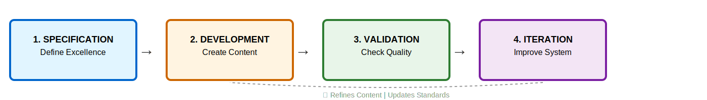
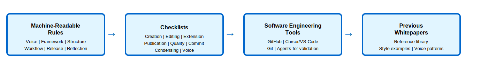
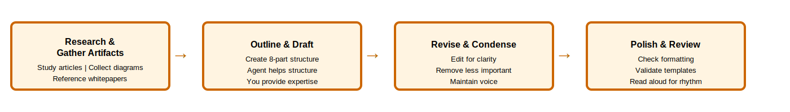
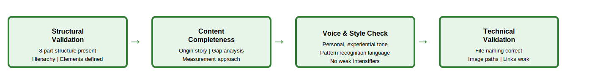
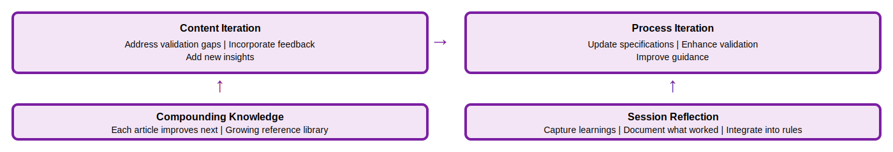

# The Spec-Driven Writing Framework: Building a Writer's Room with Agentic Workflows

Throughout my career, I've developed a sea of frameworks: tools for understanding organizational transformation, team effectiveness, capability maturity, and strategic decision-making. Each framework emerged from years of observing patterns, diagnosing failures, and advising leaders. But I faced a frustrating bottleneck: I couldn't scale and share them fast enough. Writing detailed whitepapers takes time I don't have. Each 5,000-word framework article requires weeks of effort. I need to extract the mental model, structure the content, craft examples, create diagrams, and iterate on clarity. The frameworks existed in fragments: diagrams from presentations, rough drafts I'd started, demos I'd given, voice notes I'd recorded. But these artifacts lacked the depth of a proper whitepaper. They were shared only through one-on-one conversations, consulting engagements, or brief explanations that didn't provide the full context and depth needed for others to apply them independently.

I wanted to move faster. I wanted to document these frameworks so they could help more people. But I was limited by the time I could invest in writing. Traditional approaches to technical writing (sit down, write, edit, polish, publish) don't scale when you have dozens of frameworks to document and limited hours to invest.

Then I asked myself a question: **"What if I used the same specification-driven design and agentic development lifecycle that makes software development scalable, but applied it to markdown and technical writing?"** What if I could create a writer's room (not a physical room, but a system of specifications, processes, and AI agents) that could help me with all the phases and needs of technical writing? Could I use agents within a writing framework to scale and accelerate the work?

But I took it further. What if I treated writing whitepapers exactly like software engineering? I use GitHub for change control and codebase management. I use Cursor (really VS Code and git tools) to review diffs and edits between versions. I run agents on top of the files and directories just like I would with code. This challenges the boundary of what we consider "software." What if we started treating writing like code? What if technical writing IS software engineering?

The answer was yes. By creating detailed specifications for what makes a framework article excellent, establishing clear quality standards, and building an agentic workflow to guide content development, I transformed technical writing from a time-intensive craft into a scalable engineering process. The specifications make the practice sticky. They're my enablement tools that drive adoption of consistent writing habits. The agents become collaborators in a writer's room, helping me extract frameworks from my head, structure them according to proven patterns, validate quality, and iterate toward publication. And the entire workflow uses the same tools and practices I use for software development: version control, diff reviews, automated validation, continuous integration.

This article documents that framework: the spec-driven writing system I built to scale my knowledge sharing. It's both a description of the approach and a demonstration of it in action. This very article was created using the framework, proving that specification-driven agentic workflows can produce high-quality technical content at scale.

## Table of Contents

- [The Spec-Driven Writing Framework](#the-spec-driven-writing-framework)
- [Understanding the Four Core Components](#understanding-the-four-core-components)
  - [Specification: Defining Excellence Before You Build](#specification-defining-excellence-before-you-build)
  - [Development: Transforming Expertise into Specified Content with Agentic Collaboration](#development-transforming-expertise-into-specified-content-with-agentic-collaboration)
  - [Validation: Ensuring Content Meets Specifications](#validation-ensuring-content-meets-specifications)
  - [Iteration: Continuous Improvement of Content and Process](#iteration-continuous-improvement-of-content-and-process)
- [Why Sequence Matters: Building the Foundation Before the Content](#why-sequence-matters-building-the-foundation-before-the-content)
- [Common Failure Modes: When Knowledge Transfer Breaks Down](#common-failure-modes-when-knowledge-transfer-breaks-down)
- [Measuring Success: Are You Scaling Knowledge Effectively?](#measuring-success-are-you-scaling-knowledge-effectively)
- [Putting It Into Practice: Building Your Own Writer's Room](#putting-it-into-practice-building-your-own-writers-room)
- [My Results and Your Path Forward](#my-results-and-your-path-forward)
- [References](#references)

## The Spec-Driven Writing Framework

The **Spec-Driven Writing Framework** is an approach to creating high-quality technical content by treating writing as software engineering. It applies specification-driven design, version control, automated validation, and agentic development (the same tools and practices that make software development scalable) to the challenge of documenting organizational frameworks, leadership practices, and transformation methodologies.

The framework emerged from my personal frustration: I had developed dozens of frameworks through years of consulting and leadership work, but I couldn't document them fast enough. Each whitepaper required weeks of effort, and I was limited by the time I could invest. I needed a way to move faster without sacrificing quality. The breakthrough came when I asked: "What if I applied the same agentic development lifecycle I use for software to technical writing?"

In software development, we don't start coding without specifications. We define what excellent looks like, establish quality standards, create validation criteria, and use tools to automate repetitive work. We collaborate with AI agents to accelerate development while maintaining quality. Why not do the same for technical writing?

This repository demonstrates the framework in action. It's a GitHub repository where whitepapers are markdown files managed with git. It contains detailed specifications for voice, structure, framework development, and quality standards. All of these are codified as machine-readable rules in `.cursor/rules/` that guide both me and AI agents in a collaborative writer's room. I use Cursor (VS Code) to edit, review diffs, and run agents on the files. I use git for version control, branching, and change management. The entire workflow mirrors software development. The specifications define what makes a framework article excellent: the 8-part structure, the pattern recognition language, the gap analysis approach, the measurement methodology. With these specifications in place, creating new framework articles becomes a repeatable process where agents help with extraction, structuring, drafting, and validation.

The framework's power lies in its ability to separate concerns and enable collaboration:

- **Content Specifications** define what excellent looks like: the structure, voice, and quality standards that make frameworks useful. These specifications are explicit, documented, and machine-readable.

- **Agentic Development Process** transforms my expertise into content that meets those specifications. AI agents become collaborators in a writer's room, helping extract frameworks from mental models, structure content according to patterns, generate examples, create diagrams, and draft sections.

- **Quality Validation** ensures the output matches standards through both automated checks and human review. Agents validate against specifications, catching structural issues, missing elements, and quality gaps.

- **Continuous Improvement** refines both the specifications and the process based on what works. Each article I create teaches me (and the agents) how to improve the next one. Previous whitepapers become reference material that grounds future work, establishing patterns for preferences, style, and voice.

By treating technical writing as spec-driven agentic product development, I've achieved what traditional approaches couldn't: I can create detailed framework articles in hours instead of weeks, maintain consistent quality across all content, and continuously improve the process over time. I'm not just writing articles. I've built a scalable writer's room that turns my expertise into documented frameworks at the speed of thought.

The framework consists of four primary components that flow sequentially, with iteration creating feedback loops back to development and specification. Each component plays a distinct role in transforming expertise into documented frameworks.

## Understanding the Four Core Components

The framework distinguishes four fundamentally different phases of the content development process, each requiring different mindsets, tools, and approaches.

### Specification: Defining Excellence Before You Build

**Specification** is the process of explicitly defining what excellent content looks like before you start creating it. This includes codifying the structure, voice, quality standards, and framework requirements that make technical content useful and impactful.

Most technical writing efforts fail at this stage because they skip it entirely. Writers start with a blank page and their expertise, hoping that quality will emerge through effort and iteration. But without clear specifications, you have no objective way to know when you're done, no criteria for evaluating quality, and no basis for improvement.

The specification phase answers critical questions: What structure should framework articles follow? What voice and tone make content engaging yet professional? What elements must every framework include? What quality standards must the content meet? How do you measure whether a framework article is complete and effective?

In this repository, specifications are codified as detailed rules covering six domains:

1. **Technical Writing Voice and Style**: Defines the personal, experiential voice; conversational yet professional tone; problem-focused openings; pattern recognition language; and diagnostic positioning that make frameworks engaging and credible.

2. **Framework Development Standards**: Specifies that frameworks must include origin stories from practice, clear element definitions, visual diagrams, sequence explanations, gap analysis with 3-5 examples, and measurement approaches.

3. **Article Structure and Quality**: Defines the 8-part structure (hook, introduction, elements, integration, application, measurement, conclusion, references) and quality standards for clarity, evidence, practical value, and consistency.

4. **Content Workflow and Process**: Establishes the 9-phase development process from research through final review, including how to gather artifacts, structure work, iterate effectively, and maintain quality throughout the workflow.

5. **Release Engineering and Version Control**: Defines how to manage changes, write commit messages, version content, and maintain the repository using git best practices.

6. **Session Reflection and Improvement**: Establishes the process for capturing learnings after work sessions and continuously improving specifications, templates, and checklists based on experience.

**The software engineering toolchain:** I use the same tools and practices for writing whitepapers as I do for software development:

- **GitHub** for version control and change management. Every edit is tracked. Every version is recoverable. The commit history tells the story of how the content evolved.
- **Cursor (VS Code)** for editing and reviewing. I can see diffs between versions, review changes line by line, and understand exactly what changed and why.
- **Git tools** for branching, merging, and collaboration. I can experiment with different approaches in branches, compare them, and merge the best version.
- **Agents running on files and directories** just like code analysis tools. The agent validates specifications, checks quality, and suggests improvements by analyzing the markdown files directly.
- **Machine-readable rules** in `.cursor/rules/` that function like linting rules for code. They define what "good" looks like and can be automatically validated.

This challenges the traditional boundary between "software" and "writing." If content is stored as markdown in a git repository, validated against specifications, reviewed through diffs, and collaboratively developed with agents, is it really different from software? The answer is no. Technical writing IS software engineering when you apply the same discipline, tools, and practices.

These specifications serve multiple purposes. They provide a checklist for writers to ensure completeness. They establish quality criteria for reviewers. They enable automated validation tools to check for common issues. Most importantly, they make excellence reproducible. You're not relying on individual talent or inspiration, you're following a proven specification.

**The key insight:** Specifications are not constraints that limit creativity. They're foundations that create consistency and scale. Just as software specifications let teams build complex systems reliably, content specifications let teams create high-quality knowledge products repeatably.

Consider a team trying to document their organizational frameworks. Without specifications, each person writes in their own style, with their own structure, at their own level of detail. The result is inconsistent, hard to navigate, and impossible to maintain. With clear specifications, every framework article follows the same structure, uses the same voice, includes the same critical elements. Readers know what to expect. Writers know what to deliver. Quality becomes measurable and improvable.

### Development: Transforming Expertise into Specified Content with Agentic Collaboration

**Development** is the process of taking expertise (mental models, frameworks, patterns observed in practice) and transforming it into content that meets the established specifications. This is where tacit knowledge becomes explicit, where experience becomes transferable frameworks. In the spec-driven approach, this phase becomes a collaboration between you and AI agents in a writer's room.

The development phase follows a structured 9-phase workflow that mirrors agentic software development practices:

**Phase 1: Research (1-2 hours)**: Before writing, you understand the repository's voice, style, and standards. Read 2-3 existing articles to internalize patterns. Identify your target audience's pain points. Research established frameworks you'll reference. This phase ensures consistency with the existing body of work.

**Phase 2: Gather Artifacts (30-60 minutes)**: Start with existing materials, never a blank page. Collect your diagrams from presentations, rough drafts you've started, demos you've given, voice notes from dictation. Importantly, you also have previous whitepapers you've written. These serve as examples of your preferences, writing style, and voice. The agent references them to understand what "good" looks like for you specifically. These artifacts ground the work and provide the raw material for transformation.

**Phase 3: Outline (30-60 minutes)**: Create a detailed outline following the 8-part article structure. Use templates for the opening pattern. Write topic sentences for each section. Identify where examples, diagrams, or case studies are needed. The agent helps structure your thinking while you focus on the framework's logic and flow.

**Phase 4: Draft (3-6 hours)**: Write the full draft, focusing on getting ideas down without worrying about perfection. The agent helps draft sections following specifications. You provide expertise and examples; the agent structures them according to voice and style standards. If you're working from a diagram, the agent asks probing questions about dependencies and failure modes. If you're working from a rough draft, the agent identifies gaps while maintaining your established voice.

**Phase 5: Revision (1-2 hours)**: Edit for clarity, consistency, and flow. Read the entire draft without editing first, then revise methodically. The agent helps simplify complex sentences, ensure terminology consistency, strengthen transitions, and verify logical flow. This is where rough content becomes clear content.

**Phase 6: Condensing (30-60 minutes, if needed)**: If the article is too long, remove entire ideas and explanations, not just words. The agent helps identify less important sections while maintaining voice and style. This phase ensures articles stay focused and scannable.

**Phase 7: Polish (30-45 minutes)**: Check formatting, references, and technical details. Verify heading hierarchy, image paths, bold emphasis, and citation formats. The agent validates file naming conventions, relative paths, and link integrity. This is where good content becomes publication-ready content.

**Phase 8: Template Validation (10-15 minutes)**: Ensure content matches established templates exactly. Validate the marketing post format, article header pattern, and README updates. The agent checks structural compliance against templates, not just thematic alignment.

**Phase 9: Final Review (20-30 minutes)**: Read the entire article aloud or use text-to-speech. Verify voice is personal and experiential, tone is conversational yet professional, and the article delivers on its opening promise. The agent performs final quality checks against all specifications.

The development process is iterative. You don't write the perfect article in one pass. You draft, review against specifications, refine, and repeat. Each iteration brings the content closer to the specifications.

**The critical difference from traditional writing:** Traditional writing is often unstructured. You write what feels right, edit until it seems good enough, publish when you're tired of working on it. Spec-driven agentic development is structured. You collaborate with an agent in a writer's room, write to meet specifications, validate against standards, iterate until specifications are met, publish when quality criteria are satisfied.

This approach has several advantages. First, it removes ambiguity about what "done" means. Done means the content meets all specifications. Second, it dramatically accelerates development. The agent handles structuring, formatting, and validation while you focus on providing expertise and examples. Third, it enables continuous improvement. When you identify gaps in content quality, you update the specifications, and both you and the agent benefit from the improved guidance.

**The writer's room in action:** Consider the development of this very article. I started by describing my frustration with scaling framework documentation and my "what if" moment about applying agentic development to writing. The agent, with specifications loaded and four previous whitepapers as reference, helped structure this into the opening hook following the pattern recognition language established in my earlier work. As I explained the four core components (Specification, Development, Validation, Iteration), the agent drafted sections following the 8-part structure, ensuring each element was defined clearly in a voice consistent with my previous articles. When I shared examples of failure modes, the agent formatted them according to the gap analysis template I'd used successfully before. The agent created the Mermaid diagram from my description of the framework's structure and converted it to PNG. Throughout, the agent validated against specifications and referenced my previous whitepapers, flagging when sections were missing or when voice drifted from the personal, experiential tone established across my body of work. The development process wasn't "write until it feels done." It was a collaborative dialogue where I provided expertise and the agent ensured it met specifications while maintaining consistency with my established style.

### Validation: Ensuring Content Meets Specifications

**Validation** is the process of checking whether developed content meets the established specifications. This is where you verify quality, completeness, and consistency before publication.

In software development, validation includes unit tests, integration tests, code reviews, and automated quality checks. In spec-driven writing, validation includes similar checks:

**1. Structural Validation**: Does the article follow the 8-part structure? Are all required sections present? Is the heading hierarchy correct? Are framework elements defined with proper formatting?

**2. Content Completeness**: Does the framework include all required elements: origin story, clear definitions, visual diagrams, sequence explanation (if applicable), gap analysis with 3-5 examples, measurement approach? Are examples concrete and realistic?

**3. Voice and Style Validation**: Does the content use personal, experiential voice? Is the tone conversational yet professional? Does it start with a problem-focused opening? Does it use pattern recognition language? Are key terms bolded appropriately?

**4. Quality Standards**: Is the content clear and practical? Are claims evidence-based? Is terminology consistent? Is there logical flow between sections? Is redundancy avoided?

**5. Technical Validation**: Are file names correct (lowercase with underscores)? Are images stored in the right directories? Are relative paths used correctly? Do all links work?

The power of spec-driven validation is that it's repeatable. You're not relying on subjective judgment. You're checking against explicit criteria. This gives you several capabilities:

**Automated Validation**: Many validation checks can be automated. Linters can verify file naming conventions, check for broken links, validate heading hierarchy, and flag formatting issues. Custom tools can check for required sections, verify that framework elements are properly defined, and ensure examples are present.

**Consistent Quality**: When multiple people create content, validation ensures consistent quality. Everyone's work is checked against the same standards. This prevents quality drift over time.

**Objective Feedback**: Validation provides objective feedback to writers. Instead of vague "this needs work," validation identifies specific gaps: "Missing gap analysis section," "Framework elements not bolded on first mention," "No measurement approach defined."

**Continuous Improvement**: Validation reveals patterns in what's commonly missed or done incorrectly. These patterns inform updates to specifications and development guidance.

In this repository, validation happens at multiple levels using eight specialized checklists:

**Workflow Checklists** guide you through complete processes:
- **Content Creation Workflow**: 9-phase checklist from research through final review
- **Editing Workflow**: 5-phase checklist for improving existing content
- **Framework Extension Workflow**: 5-phase checklist for expanding frameworks

**Quality Gate Checklists** ensure standards before publication:
- **Pre-Publication Checklist**: Final check covering structure, quality, formatting, and technical requirements
- **Framework Quality Checklist**: Framework-specific requirements (origin story, definitions, diagrams, gaps, measurement)
- **Pre-Commit Validation**: Technical validation before committing changes

**Specialized Checklists** address specific needs:
- **Condensing Content Checklist**: Guidance for reducing article length while maintaining quality
- **Voice Validation Checklist**: Voice and style validation before publication

The detailed rules serve as the foundation. The checklists provide milestone-based validation. Linters catch technical issues. Human review validates that content delivers practical value and diagnostic power.

**The key distinction:** Traditional editing is subjective. Does this feel right? Spec-driven validation is objective. Does this meet the specifications? Both have value, but validation provides a foundation of measurable quality that editing alone cannot achieve.

Consider the validation of a framework article. Structural validation confirms all 8 sections are present and properly formatted. Content validation verifies that the framework includes origin story, element definitions, gap analysis, and measurement. Voice validation checks for personal narrative, pattern recognition language, and problem-focused opening. Quality validation ensures clarity, evidence-based claims, and practical value. Technical validation confirms correct file naming, image paths, and links. Only when all validations pass is the content ready for publication.

### Iteration: Continuous Improvement of Content and Process

**Iteration** is the process of continuously improving both the content you create and the specifications that guide creation. This is where learning happens and the system gets better over time.

Iteration operates through four interconnected practices:

**Content Iteration**: Refining individual articles based on validation feedback, reader response, and evolving understanding. When validation reveals gaps, you iterate on the content. When readers provide feedback, you iterate to address their needs. When you gain new insights about the framework, you iterate to incorporate them.

**Process Iteration**: Improving the specifications, development process, and validation approaches based on what you learn from creating content. When you discover a common quality issue, you update specifications to address it. When you find a development technique that works well, you codify it in the process. When you identify a validation check that catches important issues, you add it to the checklist.

**Session Reflection**: After completing major work, you capture learnings in the `plans/` directory (working memory). You document what worked, what didn't, voice patterns discovered, process improvements identified, and quality issues found. These reflections are temporary. Once you've integrated learnings into rules, templates, or checklists (long-term memory), you delete the reflection. This creates a continuous improvement loop: experience → reflection → codification → better specifications → better content.

**Compounding Knowledge**: Each article you create improves the next. Your growing reference library provides examples of voice, structure, and framework patterns. Previous whitepapers inform new ones. The specifications get sharper. The validation gets more comprehensive. The development process gets more efficient. Over time, the entire system becomes more effective at transforming expertise into documented frameworks.

**Content Iteration Patterns:**

- **Validation-Driven Iteration**: When validation identifies missing elements or quality issues, iterate to address them. This is the most common iteration pattern: develop, validate, refine, repeat until specifications are met.

- **Feedback-Driven Iteration**: When readers identify confusion, request clarification, or suggest improvements, iterate to enhance clarity and value. Reader feedback reveals what's working and what's not.

- **Insight-Driven Iteration**: When you gain new understanding of the framework or identify better examples, iterate to incorporate improved insights. Frameworks evolve as you continue to apply them in practice.

- **Consistency-Driven Iteration**: When you notice inconsistencies across articles (different terminology, varying structure, conflicting guidance), iterate to align with specifications and improve consistency.

**Process Iteration Patterns:**

- **Specification Refinement**: When you discover ambiguity in specifications or identify missing guidance, update the specifications. For example, if multiple articles struggle with gap analysis, enhance the specification with clearer guidance and examples.

- **Validation Enhancement**: When you identify quality issues that current validation doesn't catch, add new validation checks. For example, if articles often lack concrete examples, add a validation check for example presence and quality.

- **Development Process Improvement**: When you discover techniques that make development more effective, codify them in process guidance. For example, if creating visual diagrams early helps structure thinking, add that to the development process.

- **Tool Development**: When manual validation becomes tedious or error-prone, develop automated tools. For example, create linters that check for common formatting issues or scripts that verify required sections are present.

The iteration cycle never stops. Each article you create teaches you something about what works and what doesn't. Each validation reveals patterns in quality issues. Each reader interaction provides insights into what's valuable and what's confusing. These learnings feed back into improving specifications, process, and validation.

**The meta-insight:** This very article is an example of iteration. The repository already contained four framework articles and detailed specifications. Creating a fifth article about the spec-driven process itself provides an opportunity to validate whether the specifications work, identify gaps, and improve the system. The article you're reading is both a product of the framework and a test of the framework. It's a meta-application that reveals how well the system works.

Consider how iteration has improved this repository over time. Early articles may have had inconsistent structure or voice. Creating specifications codified what worked. Applying specifications to new articles revealed ambiguities. Validation identified common gaps. Each iteration made the specifications clearer, the process more repeatable, and the content more consistent. Importantly, each completed whitepaper becomes a reference for future work. The agent can look at previous articles to understand your preferences, style, and voice, ensuring new content maintains consistency with your established body of work. The result is a system that gets better with use, where your growing collection of whitepapers continuously refines the agent's understanding of your writing.

## Why Sequence Matters: Building the Foundation Before the Content

The framework follows a deliberate sequence that builds from foundation to execution to improvement. Understanding this sequence is critical because violating it leads to predictable failure modes.

### The Core Sequence: Specification → Development → Validation → Iteration

**Specification comes first** because you need to know what you're building before you build it. Trying to develop content without specifications is like building software without requirements. You'll create something, but you won't know if it's what you need until you're done, and by then you've wasted significant effort.

**Development follows specification** because you're building to meet defined standards. With specifications in place, development becomes structured rather than exploratory. You know what sections to include, what voice to use, what quality standards to meet.

**Validation follows development** because you need content to validate. Validation checks whether what you built meets what you specified. Without development, there's nothing to validate. Without specifications, there's nothing to validate against.

**Iteration follows validation** because validation reveals what needs improvement. You iterate based on what validation tells you. Without validation, iteration is random. You're changing things without knowing what needs to change or whether changes improve quality.

### The Iteration Loop: Validation → Development → Validation

Within the overall sequence, iteration creates a loop between validation and development. You develop content, validate it against specifications, identify gaps, iterate on development, validate again, and repeat until specifications are met.

This loop is critical for quality. First drafts rarely meet all specifications. Validation reveals what's missing or what needs improvement. Iteration addresses those gaps. The loop continues until validation confirms the content is ready.

### The Meta-Loop: Content Creation → Process Improvement → Better Content

At a higher level, there's a meta-loop where creating content improves the process, which improves future content. Each article you create teaches you something about the specifications, development process, or validation approach. These learnings feed back into improving the system. Better specifications make development easier. Better validation catches issues earlier. Better process guidance helps writers create higher quality content faster.

### What Happens When You Violate the Sequence

**Developing without specifications**: You create content based on intuition and experience, but you have no objective criteria for quality or completeness. Different writers produce inconsistent content. You can't tell when you're done. Quality is subjective and variable.

**Validating without specifications**: You try to review content but have no clear standards to check against. Review becomes subjective opinion rather than objective assessment. Feedback is vague and inconsistent.

**Iterating without validation**: You make changes without knowing what needs improvement. You're guessing rather than addressing identified gaps. Iteration doesn't improve quality.

**Skipping iteration**: You publish content without learning from the experience. The same quality issues appear in future content. The process doesn't improve. Specifications don't evolve to address real-world challenges.

The sequence ensures that each phase builds on the previous one and informs the next. Specifications guide development. Development produces content for validation. Validation identifies improvements for iteration. Iteration enhances both content and process. The system continuously improves.

## Common Failure Modes: When Knowledge Transfer Breaks Down

The framework's diagnostic power lies in revealing why knowledge transfer efforts fail. These failure modes are predictable and preventable.

**The Blank Page Failure:** An expert tries to document their framework without specifications or starting artifacts. A VP of Engineering ignores their existing presentations and diagrams, opens a blank document, and three hours later has disconnected thoughts with no coherent structure. The gap: no specification for what to include, no artifacts to ground the work. The consequence: expertise stays trapped. What should have happened: gather artifacts (diagrams, presentations, voice recordings), establish specifications, then shape existing content into a complete whitepaper.

**The Consistency Failure:** Multiple people document frameworks independently without shared specifications. Five team members create wildly different outputs: academic paper, brief overview, detailed how-to, presentation deck, blog post. The gap: no shared standards. The consequence: unusable collection. What should have happened: establish shared specifications for structure, voice, and quality before anyone starts writing.

**The Quality Drift Failure:** Teams try to maintain quality through subjective review rather than objective validation. Over two years, early high-quality articles give way to shorter, less detailed work as "good enough" gradually shifts downward. The gap: no objective validation criteria. The consequence: quality erodes. What should have happened: validate every article against explicit specifications and checklists.

**The Stagnation Failure:** Teams establish specifications but never iterate to improve them. After ten articles, patterns emerge (weak gap analysis, insufficient examples), but specifications never evolve. The gap: no iteration loop. The consequence: same issues persist. What should have happened: treat specifications as living documents that evolve based on experience.

**The Over-Specification Failure:** Specifications become so rigid they constrain rather than enable. Teams prescribe exact paragraph counts and rigid templates. Writers spend more time checking format than developing insights. The gap: specifications focused on format over substance. The consequence: formulaic, disengaging content. What should have happened: specify structure and required elements, but preserve freedom for unique voice and insights.

## Measuring Success: Are You Scaling Knowledge Effectively?

The driving goal is to transform tacit expertise into explicit, transferable knowledge at scale. Success metrics should measure whether knowledge is being effectively transferred and applied.

**Content Quality**: Validate articles against specifications through checklists. Does it include all required sections (8-part structure, origin story, definitions, diagrams, gap analysis, measurement)? Does it maintain consistent voice and style? Quality is not subjective when you have clear specifications.

**Production Efficiency**: Track time to first draft and iterations to publication. The goal is reducing time and iterations while maintaining quality. If time is high, specifications may be unclear. If iterations are high, validation may be catching preventable issues.

**Knowledge Transfer**: Measure reader engagement, practical application, and problem-solving impact. Track whether frameworks reduce repetitive questions and whether new team members can learn without extensive mentoring. Content that meets specifications but doesn't help readers has failed its purpose.

**System Improvement**: Track whether specifications evolve based on learnings, whether validation catches issues earlier, and whether the process becomes more efficient. The virtuous cycle: better specifications lead to better content, which improves specifications, which creates even better content.

**Portfolio Health**: Ensure frameworks are complete, consistent, interconnected, and maintained. A successful knowledge base is a coherent system, not just a collection of articles.

## Putting It Into Practice: Building Your Own Writer's Room

I started with frameworks trapped in my head and limited time. By applying agentic spec-driven design to technical writing, I built a writer's room that transformed how I share knowledge. You can build the same system.

**The key insight:** you don't need to write alone anymore. With specifications and AI agents, you can scale knowledge sharing without sacrificing quality.

**Build your writer's room:**

**1. Start with one specification**: Pick your most important aspect (structure, voice, or required elements). Write it explicitly in `.cursor/rules/` or as a prompt template.

**2. Gather your artifacts**: Collect your diagram, rough draft, presentation slides, or record 15 minutes of dictation. Include previous whitepapers as reference. These ground the work.

**3. Follow the 9-phase workflow**: Use the content creation workflow checklist to guide you from research through final review. Each phase has clear deliverables and time estimates. The agent helps you progress through each phase.

**4. Validate at each milestone**: Use the appropriate checklist for your workflow phase. The 8 checklists ensure you don't miss critical steps or quality standards.

**5. Collaborate with the agent**: Share specifications, artifacts, and previous work. The agent structures your materials while maintaining your voice and style, following the established workflow.

**6. Reflect and improve**: After completing major work, capture learnings in a session reflection. Document what worked, what didn't, and what should change. Integrate insights into rules, templates, or checklists. Delete the reflection once learnings are codified.

**7. Expand the system**: Add more specifications (voice, quality standards, validation criteria). Create new templates for repeated patterns. Add checklists for new workflows. Each addition makes the agent more effective.

**8. Build the virtuous cycle**: Each article teaches you and the agent how to work better together. Your growing collection becomes a reference library that helps the agent understand your preferences. Session reflections continuously improve the specifications. Each new whitepaper benefits from all previous ones, creating a compounding effect.

## My Results and Your Path Forward

I went from weeks per article to hours. I maintained consistent quality. I documented frameworks I'd been meaning to write for years. The specifications made the practice sticky. I do it now because the friction is so low.

This repository demonstrates the framework in action. It's a GitHub repository where whitepapers are code. The specifications in `.cursor/rules/` define excellence through 6 detailed rules. Eight checklists guide workflow execution. Multiple framework articles show consistent application. The commit history shows evolution. The diffs show refinements. This article itself was created through the 9-phase agentic process: collaboration between my expertise and an agent following specifications, all managed through git.

You can build the same system. Set up a GitHub repository. Write whitepapers in markdown. Define specifications in machine-readable rules. Use VS Code or Cursor to edit and review diffs. Collaborate with agents running on your files. Validate against standards. Use git to track every change. Scale your expertise with AI as your writing partner and software engineering as your process.

That's how you turn frameworks into documented knowledge. That's how you move from limited by time to limited only by the frameworks you want to share. That's how you blur the line between writing and software engineering, proving that when you apply the same discipline, tools, and practices, technical writing IS software engineering.

## References

This framework applies software engineering principles to technical writing:

- **Cursor IDE**: AI-powered code editor with support for spec-driven development workflows. https://cursor.com

- Delimarsky, D. (2024). "Spec-driven development with AI: Get started with a new open-source toolkit." *GitHub Blog*. https://github.blog/ai-and-ml/generative-ai/spec-driven-development-with-ai-get-started-with-a-new-open-source-toolkit/

- **GitHub Spec Kit**: Open-source toolkit for spec-driven development with AI coding agents, supporting `/specify`, `/plan`, and `/tasks` commands. https://github.com/github/spec-kit

- Beck, K., et al. (2001). *Manifesto for Agile Software Development*. Agile Alliance. https://agilemanifesto.org/

- Nonaka, I., & Takeuchi, H. (1995). *The Knowledge-Creating Company: How Japanese Companies Create the Dynamics of Innovation*. Oxford University Press.

- This repository: https://github.com/thomas-bohn/thomas-bohn-articles - Demonstrates the framework in practice with specifications in `.cursor/rules/` and multiple framework articles.

