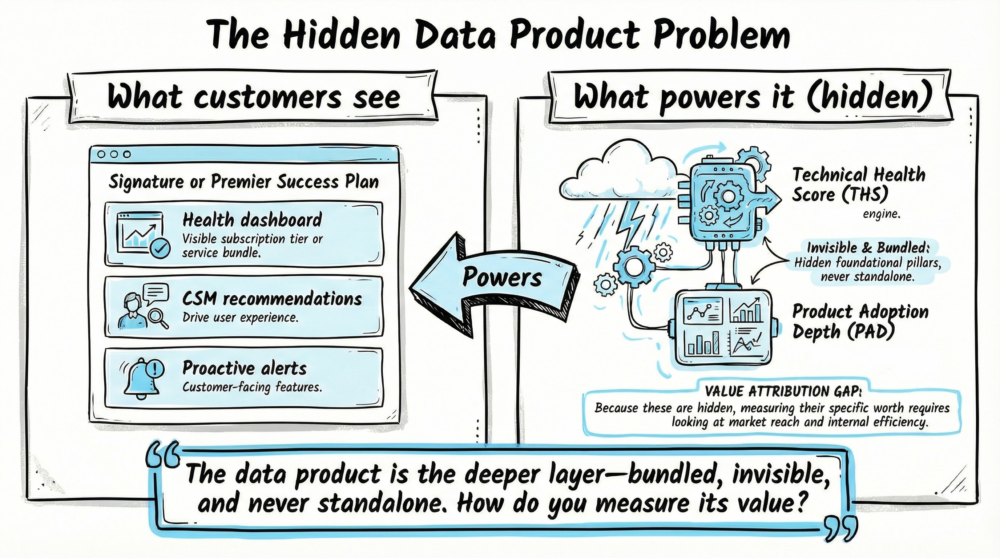
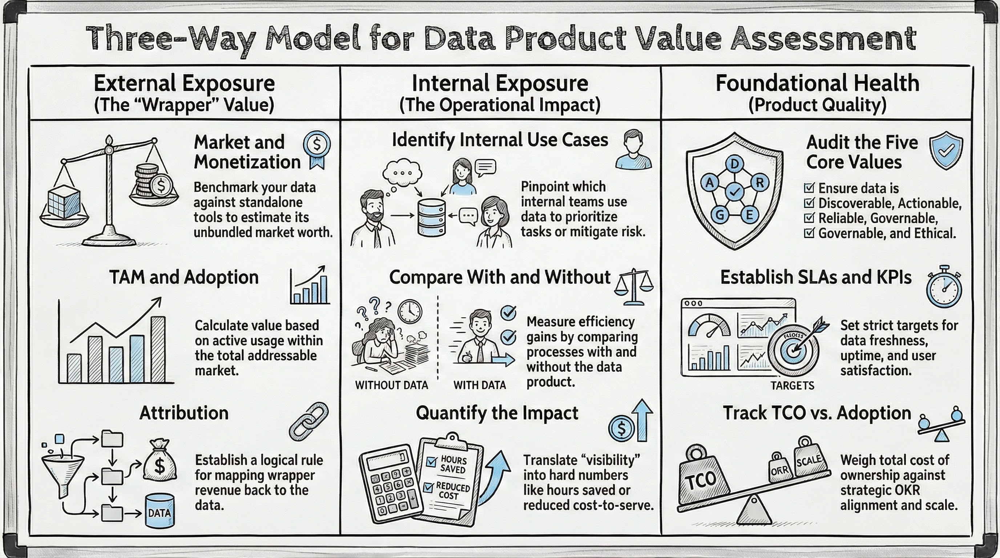
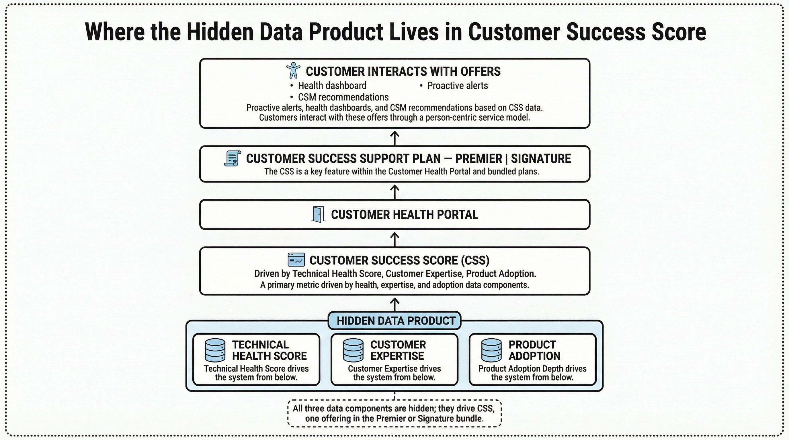

# Measuring Value for Data Products: A Three-Way Model for External Exposure, Internal Impact, and Foundational Product Health

*A framework for product managers who own data products to assess value through the wrapper that exposes them, the internal use that consumes them, and the foundational qualities that make them worth building.*

**Document Type:** Whitepaper  
**Status:** Draft  
**Last Updated:** 2026-02-27  
**Owner:** Thomas L. Bohn

<!-- Visualization Strategy: Simple Whiteboard Visual Style -->
<!-- Visual Strategy: Create this infographic using a **whiteboard visual style** with hand-drawn/sketch aesthetic where lines and shapes have a slightly irregular, informal quality (avoid perfect geometric precision). MUST include a subtle dotted line border around the entire image. Use a strictly limited color palette: Black (#000000) for all outlines, text, and symbols (including checkmarks, X marks, arrows, and all visual elements)—NO other colors allowed. White (#FFFFFF) background. Light Blue (#ADD8E6) accent used sparingly ONLY for icon fills within circular sections—no other color usage permitted. Use simple conceptual iconography with minimalist line art icons (gears, clouds, bar charts, funnels, speedometers, compass roses, simple human figures), avoiding photorealistic or highly detailed illustrations. Use icons consistently—one icon per major section or concept, placed within circular sections or at the start of boxed sections. Typography hierarchy: Main titles bold hand-drawn style 1.5x larger than section headers; section headers bold hand-drawn style 1.2x larger than body text; body text clear and concise. Use boxed sections (rounded rectangles with slightly irregular edges) as the primary container type for consistency; reserve circular sections only for special emphasis (central hubs, key concepts, North Star elements). Layout patterns: Horizontal flow (left-to-right) for processes/pipelines; vertical stacking (top-to-bottom) for problem-solution pairs/layers; three-section layouts (left-center-right) for comparisons/value propositions; layered architectures (bottom-to-top) for system layers. Use straight arrows with slightly irregular hand-drawn quality (not perfectly straight) to show flow and relationships—one arrow per relationship. Maintain consistent spacing: minimum 1.5x element height between major sections, minimum 1x element height between related sub-elements, adequate white space (at least 20% of image area). Visual hierarchy: Largest elements for main concepts/central hubs, medium for supporting sections, smallest for details/annotations. Maximum 5-7 major visual elements per infographic. Focus on communicating ONE main idea clearly, avoiding overwhelming detail and prioritizing clarity over completeness. Keep the design approachable, easy to understand, and feeling like a collaborative whiteboard session. -->

## Executive Summary

**How do you measure the value of a data product?** When a data asset acts as the unseen engine beneath a customer-facing "wrapper," attributing its true worth can be difficult. To solve this, I evaluate data product value across three distinct dimensions:

1. **External exposure.** The market value, monetization, and adoption of the product or bundle that exposes the data (e.g., Success Plans and Total Addressable Market).
2. **Internal exposure.** The operational impact within the organization, such as how internal teams use the data to improve efficiency, reduce cost-to-serve, and mitigate risk.
3. **Foundational data product health.** The core quality of the data product itself—ensuring it is Discoverable, Actionable, Reliable, Governable, and Ethical—alongside its internal adoption and alignment to OKRs.

Over the past two years, I applied this exact framework to my work on Salesforce's **Customer Success Score (CSS)** as we looked to enhance and expand the product. While CSS consists of three pillars, I led the development of two: the **Technical Health Score (THS)** and **Product Adoption Depth (PAD)**.

By running THS and PAD through this three-way model, we successfully quantified their worth. We sized their value based on the market reach of their wrapper, the tangible efficiency gains for Customer Success teams, and the reliability of the scores themselves. The result was a clear, defensible measurement of the data product's value, grounded in explicit assumptions and reproducible math.

---

## The Problem: Data Products Hide Behind Wrappers

Throughout my career as a product manager focused on data products, leaders and stakeholders have consistently asked me the same questions: How do we justify investment in this data asset? How do we attribute value when the data is bundled into a larger offering and never sold on its own? How do we know we're building the right thing? Underneath all of that is a single, fundamental question: *How do you measure the value of a data product?*

These conversations follow a familiar pattern. The data product itself, the scores, the signals, the pipelines, is a deeper layer that rarely surfaces directly to customers. Instead, it powers a **wrapper**: the product, experience, or subscription plan that users actually see and pay for. As product managers, we end up arguing that "the data is what makes the product valuable," but we often lack a clear way to prove it, size it, or connect it to the cost of building and running it.

To diagnose these gaps, I rely on a simple mental model. Value for a data product can be assessed in three places: **external exposure** (the wrapper's market and adoption), **internal exposure** (how the same product is used inside the organization), and **foundational health** (how well the data product behaves as a first-class asset and how widely it gets adopted). This model does not replace product intuition; rather, it structures it so you can have objective, reality-based conversations with finance, strategy, and engineering.

<!-- Image Description: A two-column comparison diagram showing the gap between what customers see and what powers the product. The left column is labeled 'What customers see' and contains a boxed section representing the 'Signature or Premier Success Plan' with three sub-elements: 'Health dashboard,' 'CSM recommendations,' 'Proactive alerts.' A simple human figure icon sits at the bottom of the left column representing the customer. The right column is labeled 'What powers it (hidden)' and contains a boxed section with two data product components: 'Technical Health Score (THS)' and 'Product Adoption Depth (PAD)' with a sub-label 'Never sold directly.' A gear icon sits at the start of the right column boxed section. A straight arrow flows from the right column to the left column, labeled 'Powers.' Below both columns, a shared callout reads: 'The data product is the deeper layer—bundled, invisible, and never standalone. How do you measure its value?' Title at top: 'The Hidden Data Product Problem.' The diagram communicates that data products hide behind wrappers, making direct value attribution impossible—and establishes why an indirect, three-dimensional measurement model is necessary. Visual Strategy: Create this infographic using a **whiteboard visual style** with hand-drawn/sketch aesthetic where lines and shapes have a slightly irregular, informal quality (avoid perfect geometric precision). MUST include a subtle dotted line border around the entire image. Use a strictly limited color palette: Black (#000000) for all outlines, text, and symbols (including checkmarks, X marks, arrows, and all visual elements)—NO other colors allowed. White (#FFFFFF) background. Light Blue (#ADD8E6) accent used sparingly ONLY for icon fills within circular sections—no other color usage permitted. Use simple conceptual iconography with minimalist line art icons (gears, clouds, bar charts, funnels, speedometers, compass roses, simple human figures), avoiding photorealistic or highly detailed illustrations. Use icons consistently—one icon per major section or concept, placed within circular sections or at the start of boxed sections. Typography hierarchy: Main titles bold hand-drawn style 1.5x larger than section headers; section headers bold hand-drawn style 1.2x larger than body text; body text clear and concise. Use boxed sections (rounded rectangles with slightly irregular edges) as the primary container type for consistency; reserve circular sections only for special emphasis (central hubs, key concepts, North Star elements). Layout patterns: Horizontal flow (left-to-right) for processes/pipelines; vertical stacking (top-to-bottom) for problem-solution pairs/layers; three-section layouts (left-center-right) for comparisons/value propositions; layered architectures (bottom-to-top) for system layers. Use straight arrows with slightly irregular hand-drawn quality (not perfectly straight) to show flow and relationships—one arrow per relationship. Maintain consistent spacing: minimum 1.5x element height between major sections, minimum 1x element height between related sub-elements, adequate white space (at least 20% of image area). Visual hierarchy: Largest elements for main concepts/central hubs, medium for supporting sections, smallest for details/annotations. Maximum 5-7 major visual elements per infographic. Focus on communicating ONE main idea clearly, avoiding overwhelming detail and prioritizing clarity over completeness. Keep the design approachable, easy to understand, and feeling like a collaborative whiteboard session. -->

## The Three-Way Model

The **three-way model for measuring data product value** divides your assessment into three actionable dimensions: **external exposure**, **internal exposure**, and **foundational health**. Because a data product is often the core asset sitting inside a **wrapper**, like a Success Plan, a dashboard, or an API, its value extends far beyond the raw quality of the data. True value comes from how that data reaches the market, how it gets leveraged internally, and how well it is built and maintained.

As mentioned in the summary, my work building the foundational pillars of Salesforce's **Customer Success Score (CSS)** is exactly where this framework originated. Customers do not buy the **Technical Health Score (THS)** or **Product Adoption Depth (PAD)** directly; they receive them as part of a Success Plan bundle.

To answer the constant question of what these data products were actually worth, we had to size them through the market (TAM), through efficiency gains (cost-to-serve), and through reliability and strategic alignment (OKRs).

I now use this model whenever I am defining or defending the value of a data product. It forces the conversation out of silos. It is far too easy to focus only on external revenue or internal efficiency, while forgetting to ask whether the data product is actually trustworthy, findable, and actively used.

<!-- Image Description: A three-column value model diagram showing the Three-Way Model for measuring data product value. The diagram uses a three-section layout (left-center-right) with three equally-sized boxed sections, each connected by a straight arrow to a central circular hub labeled 'Value of data product.' Left column labeled 'External exposure' contains two sub-elements in smaller boxed sections: 'Market / monetization' with a bar chart icon and 'TAM and adoption' with a funnel icon. Center column labeled 'Internal exposure' contains: 'Process and efficiency' with a gear icon and 'Operational efficiency / risk mitigation' showing the internal impact lens. Right column labeled 'Foundational health' contains: 'Core reliability / governance / adoption' with a compass icon and 'OKR alignment' with a bar chart icon. Three straight arrows, one from each column, converge on the central hub. Title at top: 'Three-Way Model for Data Product Value.' The diagram communicates that data product value is assessed across three distinct, measurable dimensions—external market reach, internal operational impact, and foundational product health—all cleanly mapped to organizational OKRs. Visual Strategy: Create this infographic using a **whiteboard visual style** with hand-drawn/sketch aesthetic where lines and shapes have a slightly irregular, informal quality (avoid perfect geometric precision). MUST include a subtle dotted line border around the entire image. Use a strictly limited color palette: Black (#000000) for all outlines, text, and symbols (including checkmarks, X marks, arrows, and all visual elements)—NO other colors allowed. White (#FFFFFF) background. Light Blue (#ADD8E6) accent used sparingly ONLY for icon fills within circular sections—no other color usage permitted. Use simple conceptual iconography with minimalist line art icons (gears, clouds, bar charts, funnels, speedometers, compass roses, simple human figures), avoiding photorealistic or highly detailed illustrations. Use icons consistently—one icon per major section or concept, placed within circular sections or at the start of boxed sections. Typography hierarchy: Main titles bold hand-drawn style 1.5x larger than section headers; section headers bold hand-drawn style 1.2x larger than body text; body text clear and concise. Use boxed sections (rounded rectangles with slightly irregular edges) as the primary container type for consistency; reserve circular sections only for special emphasis (central hubs, key concepts, North Star elements). Layout patterns: Horizontal flow (left-to-right) for processes/pipelines; vertical stacking (top-to-bottom) for problem-solution pairs/layers; three-section layouts (left-center-right) for comparisons/value propositions; layered architectures (bottom-to-top) for system layers. Use straight arrows with slightly irregular hand-drawn quality (not perfectly straight) to show flow and relationships—one arrow per relationship. Maintain consistent spacing: minimum 1.5x element height between major sections, minimum 1x element height between related sub-elements, adequate white space (at least 20% of image area). Visual hierarchy: Largest elements for main concepts/central hubs, medium for supporting sections, smallest for details/annotations. Maximum 5-7 major visual elements per infographic. Focus on communicating ONE main idea clearly, avoiding overwhelming detail and prioritizing clarity over completeness. Keep the design approachable, easy to understand, and feeling like a collaborative whiteboard session. -->

The diagram above illustrates these three dimensions and how they feed into the overall value story. The following sections define each dimension in detail and apply them directly to CSS and THS.

---

## External Exposure: Value Through the Wrapper

**External exposure** is the value inferred from the product, service, or offering that brings your data to market. When your data asset is bundled into a broader **wrapper**, like a premium tier, a platform, or a Success Plan, you must assess its financial worth by measuring the size and scale of that wrapper.

**What to do:**

1. **Market and monetization.** Identify comparable products that sell either standalone or as part of a similar bundle. If your data product provides diagnostic analytics, find third-party tools that charge for similar capabilities (e.g., [Hubbl](https://www.salesforceben.com/health-check-your-salesforce-processes-and-metadata/), which charges per-org for Salesforce process diagnostics). Use their pricing to benchmark what your asset "could be worth" if unbundled, and use that proxy to explain its value inside your wrapper.
2. **TAM and adoption.** Define your total addressable market (e.g., all customers eligible for a premium plan). Then track the actual adoption of the wrapper. Value is capped by usage: you can only claim credit for the data's share of the value actually delivered to active users of the score, dashboard, or feature.
3. **Attribution.** Establish a logical rule for attributing bundle value back to the data product. Whether it's a flat percentage of the bundle's revenue or an adoption-weighted metric, defining this upfront allows you to confidently report the "value of the data product" without overclaiming.

**In practice: CSS and THS**

For **CSS** and **THS**, the wrappers are the [Signature Success Plan](https://www.salesforce.com/services/success-plans/signature/) and [Premier Success Plan](https://www.salesforce.com/services/success-plans/). A Forrester Total Economic Impact study anchored the value of the Signature bundle in concrete terms: a 104% ROI incremental to Premier, 4,500 hours saved, and $3.6M in adoption and efficiency gains over three years.

Crucially, these numbers characterize the value of the entire wrapper, not CSS or THS alone. But that is exactly the point of this framework. By establishing a definitive ceiling for the Success Plan's total value, we created a baseline. From there, we could size the TAM across our premium customer base, benchmark against standalone tools like Hubbl, and confidently attribute a proportional slice of that overarching value to CSS and THS without overclaiming.

---

## Internal Exposure: Value Through Use

**Internal exposure** captures the value generated when your external-facing data product is leveraged inside your own organization. Most data products built for customers inherently become essential tools for internal teams, like Customer Success, support, product, and sales, allowing them to operate more effectively and efficiently.

**What to do:**

1. **Identify internal use cases.** Pinpoint exactly who relies on the data product internally and why. Are Customer Success Managers (CSMs) using it to prioritize at-risk accounts? Is the support team using it to accelerate troubleshooting and avoid critical incidents?
2. **Compare with and without.** Run time studies, A/B tests, or historical before-and-after comparisons. Measure the difference in operational efficiency, time-to-diagnose, cost-to-serve, and risk mitigation between workflows that embed the data product and those that do not.
3. **Quantify the impact.** Translate vague benefits like "better visibility" into hard numbers: hours saved, direct reductions in cost-to-serve, or statistically significant correlations with key business outcomes.

**In practice: CSS and THS**

For **CSS** and **THS**, internal exposure translates into measurable operational leverage. Customer Success teams use the scores to triage accounts, cutting diagnosis time by more than half. THS correlates with Sev1 incidents and overall cost-to-serve, linking the data product directly to bottom-line business outcomes.

You do not need a flawless, scientifically controlled experiment to make this case. Comparing the new, data-driven workflow against the old baseline of manual health checks and legacy tools and documenting those efficiency gains is usually enough to prove value.

---

## Foundational Data Product: Value Through Health and Adoption

**Foundational health** captures the value generated by treating your data asset as a **first-class product**. According to the Data As A Product curriculum, a high-quality data asset must embody five core values: **Discoverable**, **Actionable**, **Reliable**, **Governable**, and **Ethical**. Value in this dimension is driven by how consistently you deliver on these principles, which directly dictates adoption: more users, more workflows, and more teams depending on your data.

**What to do:**

1. **Audit the five core values.** Use the curriculum's principles as a strict checklist. Is the product easy to find (**Discoverable**)? Does it drive clear decisions (**Actionable**)? Is it trustworthy (**Reliable**)? Is it compliant (**Governable**)? Is it used responsibly (**Ethical**)? Quantify these traits through catalog usage, support ticket volume, and direct user feedback.
2. **Establish SLAs and KPIs.** Make foundational health observable and improvable by setting strict service-level agreements and key performance indicators. Track uptime, data freshness, query response times, and user satisfaction scores.
3. **Track TCO vs. adoption.** Weigh the total cost of ownership (build, run, maintain) against internal adoption rate. Monitor exactly who uses the product, in which processes, and how often. True foundational value is proven when the data product is actively tied to the organization's strategic OKRs.

**In practice: CSS and THS**

For **CSS** and **THS**, the foundational story is rooted in reliability, clarity, and strict governance. For the scores to be valuable, they have to be completely trustworthy, the signals must prescribe clear actions, and the underlying architecture must be highly defensible.

By managing **THS** and **PAD** as first-class products, we achieved significant scale. Today, these scores reach roughly **85,000 customers** and are deeply embedded in both premium Success Plans and critical internal workflows. That level of cross-functional adoption is the ultimate proof of foundational health.

---

## Architecture in Action: Customer Success and Technical Health Scores

Because we have already mapped **CSS** against the three dimensions of the model, we do not need to rehash the individual metrics. However, to fully understand why this framework is necessary, it helps to visualize exactly where data products like the **Technical Health Score (THS)** and **Product Adoption Depth (PAD)** live within the broader ecosystem.

Both are highly complex scoring engines that surface inside **CSS**. They power critical decisions for Customer Success teams, but they are never sold directly.

<!-- Image Description: A layered architecture diagram (top-to-bottom) showing where THS and PAD sit within the Customer Success Score ecosystem. Top layer: a wide boxed section labeled 'Customer Success Score (CSS)' with sub-label 'Signature and Premier Success Plans — never sold standalone.' Bottom layer: three equally-sized boxed sections side by side. Left pillar labeled 'Product Adoption (50%)' with a bar chart icon; nested inside, a smaller boxed section labeled 'Product Adoption Depth (PAD)' with annotation 'Data product — built by TLB.' Center pillar labeled 'Customer Expertise (20%)' with a human figure icon; no nested data product. Right pillar labeled 'Technical Health (30%)' with a gear icon; nested inside, a smaller boxed section labeled 'Technical Health Score (THS)' with annotation 'Data product — built by TLB.' Straight arrows point upward from each pillar to the CSS top layer — one arrow per pillar. A callout below reads: 'THS and PAD: hidden inside CSS, never sold directly. Sizing their value requires an indirect model.' Title at top: 'Where THS and PAD Live: Inside CSS.' The diagram communicates that THS and PAD are foundational data products embedded inside a larger wrapper—bundled into Success Plans, never sold directly—making the three-way model the only way to size their true impact across market, operational, and foundational dimensions. Visual Strategy: Create this infographic using a **whiteboard visual style** with hand-drawn/sketch aesthetic where lines and shapes have a slightly irregular, informal quality (avoid perfect geometric precision). MUST include a subtle dotted line border around the entire image. Use a strictly limited color palette: Black (#000000) for all outlines, text, and symbols (including checkmarks, X marks, arrows, and all visual elements)—NO other colors allowed. White (#FFFFFF) background. Light Blue (#ADD8E6) accent used sparingly ONLY for icon fills within circular sections—no other color usage permitted. Use simple conceptual iconography with minimalist line art icons (gears, clouds, bar charts, funnels, speedometers, compass roses, simple human figures), avoiding photorealistic or highly detailed illustrations. Use icons consistently—one icon per major section or concept, placed within circular sections or at the start of boxed sections. Typography hierarchy: Main titles bold hand-drawn style 1.5x larger than section headers; section headers bold hand-drawn style 1.2x larger than body text; body text clear and concise. Use boxed sections (rounded rectangles with slightly irregular edges) as the primary container type for consistency; reserve circular sections only for special emphasis (central hubs, key concepts, North Star elements). Layout patterns: Horizontal flow (left-to-right) for processes/pipelines; vertical stacking (top-to-bottom) for problem-solution pairs/layers; three-section layouts (left-center-right) for comparisons/value propositions; layered architectures (bottom-to-top) for system layers. Use straight arrows with slightly irregular hand-drawn quality (not perfectly straight) to show flow and relationships—one arrow per relationship. Maintain consistent spacing: minimum 1.5x element height between major sections, minimum 1x element height between related sub-elements, adequate white space (at least 20% of image area). Visual hierarchy: Largest elements for main concepts/central hubs, medium for supporting sections, smallest for details/annotations. Maximum 5-7 major visual elements per infographic. Focus on communicating ONE main idea clearly, avoiding overwhelming detail and prioritizing clarity over completeness. Keep the design approachable, easy to understand, and feeling like a collaborative whiteboard session. -->

As the diagram shows, **THS** and **PAD** are the hidden foundational pillars. Sizing their value effectively, without overclaiming or underclaiming, is what makes the three-way model so critical.

---

## Tying to OKRs and Strategy

Ultimately, the three-way model is about more than justifying a data product's existence; it connects your day-to-day feature work directly to organizational strategy.

A highly effective frame for this is the **Pyramid** from the Data As A Product curriculum. It establishes a clear hierarchy:

- **Strategy** (at the top) sets the long-term direction.
- **Capabilities** are the skills, tools, and processes needed to get there.
- **OKRs** give the organization clear objectives and measurable key results.
- **Features** (at the base) are what actually gets built and delivered.

Data products are features. Therefore, they must map cleanly up the pyramid. The three-way model makes these strategic connections visible and explicit:

- **External exposure** maps to growth OKRs (e.g., Success Plan adoption, market penetration, new ARR).
- **Internal exposure** maps to operational OKRs (e.g., reduced cost-to-serve, faster time-to-diagnose, incident mitigation).
- **Foundational health** maps to product and engineering OKRs (e.g., data reliability SLAs, system uptime, internal adoption rates).

By mapping your data product's value across these three vectors, you keep your asset aligned with what the business actually cares about, giving leadership a clear, unbroken line of sight from the data you build to the strategic goals they own.

---

## Conclusion

Measuring the value of a data product is notoriously difficult when the asset is bundled and serves both external and internal customers. Lacking a clear framework, most product managers fall into one of two traps: wildly overclaiming the data's impact or drastically underclaiming its worth. The three-way model gives you a definitive way out.

Rather than relying on vague intuition, this framework structures your value narrative into three measurable dimensions, all cleanly mapped to organizational OKRs:

- **External exposure** sizes value through the market reach and monetization of the wrapper.
- **Internal exposure** proves value through the measurable operational efficiency and risk mitigation the data enables inside the business.
- **Foundational health** grounds value in the asset's core reliability, governance, and widespread adoption.

So, when leadership asks how I measure the value of a data product, my answer is always the same: in three ways. For the technical health and adoption scores I built at Salesforce, that meant confidently sizing our impact across the Success Plan market, the internal Customer Success organization, and the foundational reliability of the data itself.

---

## References

### Data As A Product Curriculum

- Data As A Product curriculum (2024). Five core values (Discoverable, Actionable, Reliable, Governable, Ethical); Pyramid (Strategy → Capabilities → OKRs → Features); SLAs, monitoring, and KPIs; Enhancing and Scaling (Module 6). (Slide assets in repo; course link TBD.)

### Customer Success Score and Technical Health Score

- [Get to Know the Salesforce Customer Success Score](https://trailhead.salesforce.com/content/learn/modules/customer-success-score/get-to-know-the-salesforce-customer-success-score). Trailhead.
- [Learn How We Calculate the Score](https://trailhead.salesforce.com/content/learn/modules/customer-success-score/learn-how-we-calculate-the-score). Trailhead.
- [Dive Deeper and Improve Your Score](https://trailhead.salesforce.com/content/learn/modules/customer-success-score/dive-deeper-and-improve-your-score). Trailhead.
- [Salesforce Help: Customer Success Score](https://help.salesforce.com/s/articleView?id=000396261&type=1).
- [Salesforce+ – Boost Your ROI with the Customer Success Score for Premier](https://www.salesforce.com/plus/experience/dreamforce_2025/series/customer_success_and_partners_at_dreamforce_2025/episode/episode-s1e5). Dreamforce 2025.

### External exposure (Wrapper, Total Addressable Market, Benchmark)

- [Salesforce Success Plans](https://www.salesforce.com/services/success-plans/).
- [Signature Success Plan](https://www.salesforce.com/services/success-plans/signature/) (Customer Success Score, Forrester TEI).
- [Health Check Your Salesforce Processes and Metadata](https://www.salesforceben.com/health-check-your-salesforce-processes-and-metadata/) (Hubbl Technologies). Salesforce Ben.

### Market Context (optional)

- [How Many Companies Use Salesforce in 2025?](https://www.linkedin.com/pulse/how-many-companies-use-salesforce-2025-ibirds-services-x8btc/). LinkedIn.
- [Salesforce Industry Overview and Insights](https://cdn.hl.com/pdf/2025/april-2025-salesforce-industry-overview-and-insights-hl.pdf). Houlihan Lokey (PDF).
