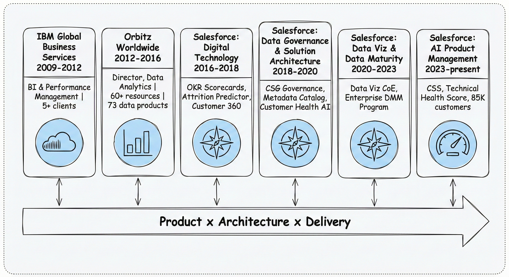
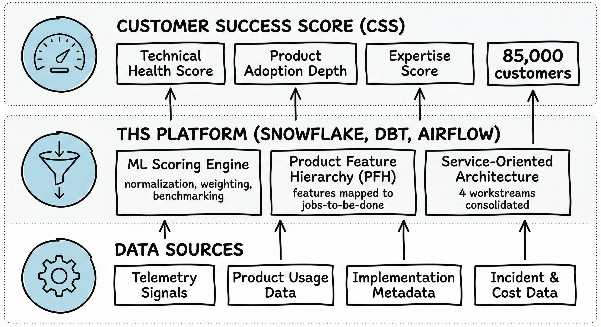
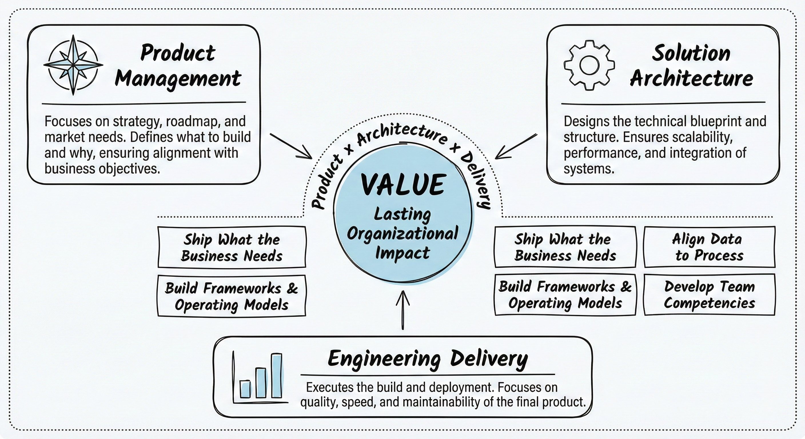

<!-- Visualization Strategy: Simple Whiteboard Visual Style -->
<!-- Visual Strategy: Create this infographic using a **whiteboard visual style** with hand-drawn/sketch aesthetic where lines and shapes have a slightly irregular, informal quality (avoid perfect geometric precision). MUST include a subtle dotted line border around the entire image. Use a strictly limited color palette: Black (#000000) for all outlines, text, and symbols (including checkmarks, X marks, arrows, and all visual elements)—NO other colors allowed. White (#FFFFFF) background. Light Blue (#ADD8E6) accent used sparingly ONLY for icon fills within circular sections—no other color usage permitted. Use simple conceptual iconography with minimalist line art icons (gears, clouds, bar charts, funnels, speedometers, compass roses, simple human figures), avoiding photorealistic or highly detailed illustrations. Use icons consistently—one icon per major section or concept, placed within circular sections or at the start of boxed sections. Typography hierarchy: Main titles bold hand-drawn style 1.5x larger than section headers; section headers bold hand-drawn style 1.2x larger than body text; body text clear and concise. Use boxed sections (rounded rectangles with slightly irregular edges) as the primary container type for consistency; reserve circular sections only for special emphasis (central hubs, key concepts, North Star elements). Layout patterns: Horizontal flow (left-to-right) for processes/pipelines; vertical stacking (top-to-bottom) for problem-solution pairs/layers; three-section layouts (left-center-right) for comparisons/value propositions; layered architectures (bottom-to-top) for system layers. Use straight arrows with slightly irregular hand-drawn quality (not perfectly straight) to show flow and relationships—one arrow per relationship. Maintain consistent spacing: minimum 1.5x element height between major sections, minimum 1x element height between related sub-elements, adequate white space (at least 20% of image area). Visual hierarchy: Largest elements for main concepts/central hubs, medium for supporting sections, smallest for details/annotations. Maximum 5-7 major visual elements per infographic. Focus on communicating ONE main idea clearly, avoiding overwhelming detail and prioritizing clarity over completeness. Keep the design approachable, easy to understand, and feeling like a collaborative whiteboard session. -->

# My Background: Ten Years at the Intersection of Product, Architecture, and Engineering

## Executive Summary

Over the last 15 years, spanning roles at IBM, Orbitz, and Salesforce, my career has been defined by operating at the exact intersection of product management, solution architecture, and engineering delivery. I specialize in taking massive, complex enterprise data problems—like predicting customer attrition or mapping technical health—designing the scalable architecture to solve them, and leading the cross-functional engineering teams to actually ship the product. By focusing not just on the technology, but on the data governance, frameworks, and operating models that support it, my product and platform work has driven over $100M in enterprise value through retained revenue, cost savings, and reduced cost-to-serve. Ultimately, my goal is to build the engines and architectures that make enterprise scale possible.

## Introduction

The through-line across every role in my career has been the same: ship the solutions the business needs, help the organization understand how data fits into its processes, and build the frameworks and tools that let teams deliver at progressively higher levels. What I care about is value. Aligning capacity to work. Prioritizing ruthlessly. Developing the competencies that let a team rise to the best it's capable of.

This piece is a window into that arc. It's grounded in what I've actually done and the outcomes I've driven, written so I can speak to it clearly in conversation and leave something for anyone who wants the fuller picture.

<!-- Image Description: A horizontal timeline diagram showing a career arc from 2009 to present. The timeline flows left to right as a single horizontal arrow beneath six labeled milestone boxes. Each milestone is a boxed section with slightly irregular edges positioned above the timeline arrow with a short vertical connector. Left to right: (1) 'IBM Global Business Services 2009-2012' with subtext 'BI & Performance Management | 5+ clients'; (2) 'Orbitz Worldwide 2012-2016' with subtext 'Director, Data Analytics | 60+ resources | 73 data products'; (3) 'Salesforce: Digital Technology 2016-2018' with subtext 'OKR Scorecards, Attrition Predictor, Customer 360'; (4) 'Salesforce: Data Governance & Solution Architecture 2018-2020' with subtext 'CSG Governance, Metadata Catalog, Customer Health AI'; (5) 'Salesforce: Data Viz & Data Maturity 2020-2023' with subtext 'Data Viz CoE, Enterprise DMM Program'; (6) 'Salesforce: AI Product Management 2023-present' with subtext 'CSS, Technical Health Score, 85K customers'. One minimalist icon per box: cloud for IBM, bar chart for Orbitz, compass for mid-career Salesforce roles, speedometer for current role. The horizontal arrow carries the centered label 'Product x Architecture x Delivery'. The visual communicates a 15-year career arc building from BI consulting to platform product leadership at Salesforce. Visual Strategy: Create this infographic using a **whiteboard visual style** with hand-drawn/sketch aesthetic where lines and shapes have a slightly irregular, informal quality (avoid perfect geometric precision). MUST include a subtle dotted line border around the entire image. Use a strictly limited color palette: Black (#000000) for all outlines, text, and symbols—NO other colors allowed. White (#FFFFFF) background. Light Blue (#ADD8E6) accent used sparingly ONLY for icon fills within circular sections. Use simple conceptual iconography with minimalist line art icons, avoiding photorealistic illustrations. Typography hierarchy: Main titles bold hand-drawn style 1.5x larger than section headers; section headers 1.2x larger than body text. Use boxed sections as primary container type. Use straight arrows with slightly irregular hand-drawn quality. Maintain consistent spacing: minimum 1.5x element height between major sections, 20% white space minimum. Maximum 5-7 major visual elements. Focus on communicating ONE main idea clearly. -->

---

## Where I Am Today: Technical Health and the Customer Success Platform

Since October 2023, I've been Senior Manager of AI Product Management at Salesforce, leading product and engineering for the **Customer Success Score (CSS)**. CSS is Salesforce's 360-degree customer health signal, distributed to every customer on a Customer Success plan. It demystifies Product Adoption, Expertise, and Technical Health so customers and our internal teams have something concrete to act on.

My focus within that platform has been the **Technical Health Score (THS)** and **Product Adoption Depth Score**, the two data products that form the technical and usage pillars of CSS. On the THS side, I designed the solution architecture and built the initial version, migrating the score onto a modern data stack built on S3, Spark, SageMaker, dbt, and Tableau. Product Adoption Depth required a different kind of investment: I led the solution architecture end-to-end and then drove the software engineering and data engineering implementation to bring it to production. Both efforts required deep work across the full data value stream, from source signals through scoring models to the experience layer. CSS as a whole, combining these two workstreams with the expertise and other components built by partner teams across the larger 360 product, now reaches roughly 85,000 customers. The results on the THS side have been concrete: we cut Customer Success effort by more than half to diagnose and resolve implementation risks, the THS score demonstrates strong predictive power correlating with Sev1 incidents and cost-to-serve, and we externalized it within 12 months and packaged it into Success Plans. That work earned the TSIA Customer Success Innovation Award.

The engineering wins on THS led to my promotion to Customer Success Score Engineering Lead, where I took on oversight of the full cross-functional product engineering group spanning PM, Data Science, Data Engineering, and Analytics. The team grew to 16 engineers across those functions. On the platform side, I led the consolidation of four previously disparate workstreams (product adoption breadth and depth, Technical Health Score, and customer expertise) into a single service-oriented architecture on Snowflake, dbt, and Apache Airflow. That consolidation is estimated to reduce duplicate engineering by 50% or more and avoid millions in annual build and maintenance costs. I also architected and built the **Product Feature Hierarchy (PFH)**, the taxonomy that maps all Salesforce product content and features to customer jobs-to-be-done. PFH is what enables our product adoption depth score and powers the data science models we run for Sales Cloud and Service Cloud.

<!-- Image Description: A layered architecture diagram showing how raw data signals are transformed into customer-facing health scores. Uses bottom-to-top layout with three distinct layers. Bottom layer labeled 'Data Sources' contains four boxed sections arranged horizontally: 'Telemetry Signals', 'Product Usage Data', 'Implementation Metadata', 'Incident & Cost Data'. Middle layer labeled 'THS Platform (Snowflake, dbt, Airflow)' contains three boxed sections: 'ML Scoring Engine' with subtext 'normalization, weighting, benchmarking', 'Product Feature Hierarchy (PFH)' with subtext 'features mapped to jobs-to-be-done', 'Service-Oriented Architecture' with subtext '4 workstreams consolidated'. Top layer labeled 'Customer Success Score (CSS)' contains three boxed sections: 'Technical Health Score', 'Product Adoption Depth', 'Expertise Score', plus a final box '85,000 customers'. Straight arrows with hand-drawn quality connect each bottom-layer source upward through the middle platform and then upward to the top CSS output layer. One icon per layer: gear for data sources, funnel for THS platform, speedometer for CSS output. The visual communicates how four disparate workstreams were consolidated into a single platform delivering unified customer health signals at scale. Visual Strategy: Create this infographic using a **whiteboard visual style** with hand-drawn/sketch aesthetic where lines and shapes have a slightly irregular, informal quality (avoid perfect geometric precision). MUST include a subtle dotted line border around the entire image. Use a strictly limited color palette: Black (#000000) for all outlines, text, and symbols—NO other colors allowed. White (#FFFFFF) background. Light Blue (#ADD8E6) accent used sparingly ONLY for icon fills within circular sections. Use simple conceptual iconography with minimalist line art icons, avoiding photorealistic illustrations. Typography hierarchy: Main titles bold hand-drawn style 1.5x larger than section headers; section headers 1.2x larger than body text. Use boxed sections as primary container type; reserve circular sections only for special emphasis. Use straight arrows with slightly irregular hand-drawn quality. Maintain consistent spacing: minimum 1.5x element height between major sections, 20% white space minimum. Maximum 5-7 major visual elements. Focus on communicating ONE main idea clearly. -->

---

## The Maturity and Visualization Years

The two chapters that immediately preceded my current role were about operating at enterprise scale: one in data management maturity, one in data visualization. Together they sharpened something I'd been building since my first years at Salesforce, the conviction that technical work is necessary but not sufficient. Frameworks, governance models, and institutionalized knowledge are what separate a team that improves year over year from one that reinvents the wheel every cycle.

From March 2022 to March 2023, I was Director of Program Management for Data Management Maturity (DMM) in the Office of the Chief Data Officer. I ran the enterprise program to improve the CMMI Data Management Maturity score by 20% year over year, coaching data governance teams across 13 business units on defining and executing data management roadmaps and best practices. I oversaw the lifecycle of 20 enterprise data standards, led the effort to define the future state of the Global Data Governance operating model, and directed the working group that selected DCAM (Data Capability Assessment Model) and CDMC (Cloud Data Management Capabilities) as the enterprise frameworks for Salesforce.

Before that, from September 2020 to March 2022, I founded and ran the Data Visualization Center of Excellence as Director, directly managing a team of 2 Visualization Engineers. Together we built a shared strategy, consistent processes, and expanded institutional knowledge across the organization. We documented six guidelines and over 150 best practices for Tableau and data visualization, which drove 4x efficiency gains for certain processes and meaningfully improved quality across the data visualization SDLC. I mentored and coached over 200 Tableau creators and Data Visualization Engineers supporting a user base of 30,000 in Distribution and Customer Success. I also spearheaded Customer Success on Tableau, defining an analytics strategy for 8,000 users in CSG, establishing a governance model, and enabling a community of 40 or more creators.

Both of these chapters reinforced a pattern I'd already seen repeatedly: you can build excellent data products and still fail to scale the value if you don't invest in the operating model alongside the technology.

---

## Data Governance, Metadata, and the Roots of Customer Health Intelligence

From June 2018 to September 2020, I operated as a data product manager and solution architect across two Director roles: first in Data Governance, then in Solution Architecture for Data Management and Data Science Products. These two years were among the most foundational of my career at Salesforce, and the work from this period is directly traceable to what THS is today.

The product management side came first. I defined the data product strategy for the CSG Data Governance Program, establishing the data assets, governance processes, and quality standards that 8,000 employees across the four pillars of Customer Success needed to rely on. That meant owning the product backlog for the Data Governance Office, driving 10 core processes, four governance councils, and 20 governed data entities, and improving the business unit Data Management Maturity score by 25% year over year.

The solution architecture work built directly on that foundation. I designed and architected the Success Program Metadata Catalog as a data product, resolving the data management and data quality issues with customer success engagement programs that were blocking the data science team. Cleaning up those metadata and reference data deficiencies was the prerequisite that allowed the algorithms behind the **Customer Health Intelligence Application Suite** to be trained and deployed, producing proactive health insights and engagement recommendations for Salesforce's $20B customer base. We achieved roughly 75% improvement in record-level data quality in the targeted areas.

From there I moved into applied product work on the AI side. I led the application design team for the Customer Success recommendation engine, delivering near real-time trend data and recommendations on programs and feature usage by customer context. The core of the suite was an attrition prediction model built on XGBoost, and the recommendations surfaced to CSMs were designed to drive the interventions most likely to reduce attrition risk. I also rolled up my sleeves in Python to develop and tune the human-language outputs of the models, including stencil-and-token design patterns that improved interpretability of non-linear models in natural language. Making the reasoning behind predictions legible to stakeholders was as important as making the predictions accurate. That work drove a 15% increase in CSAT scores.

The lesson from this chapter: data quality is the prerequisite for everything downstream. A recommendation engine is only as trustworthy as the metadata feeding it. I've carried that forward into every architecture decision since.

---

## The First Salesforce Chapter: Scorecards, Attrition, and Customer 360

I joined Salesforce in January 2016 in Digital Technology and Data Analytics. These first years were where I learned how to operate in a large enterprise, deliver at scale, and earn the trust that opens the door to bigger problems.

I designed and managed the program that delivered OKR scorecards to 4,000 employees and reduced total cost of ownership by 80% for those OKRs. I led the front-end workstream for the Attrition Predictor, contextualizing predictions in an application that gave managers something they could actually act on. I led a finance-focused ETL project for Revenue Reconciliation that resolved data quality issues with the Net Revenue Rule and enabled the Renewals org to recognize over $2M per year in additional renewals. That project was recognized with the Terraformer Award from Business Technology for excellence in collaboration and business process improvement. I also designed customer 360 dashboards covering KPIs on contract attrition, ACV, price uplift, productivity, and customer engagement, improving data access efficiency and saving an estimated $6M per year in wasted time.

What this period gave me was breadth: I saw how data quality problems propagate from finance through operations, how visualization choices affect whether insights actually drive decisions, and how much organizational trust matters when you're asking business partners to rely on a number.

---

## Before Salesforce: Orbitz and IBM

Before Salesforce, I led at scale in travel and in consulting.

At Orbitz Worldwide, from June 2012 to January 2016, I was Director and Group Leader for Data Analytics, Applications, and Operations, managing 60 or more resources across Data Analytics, Salesforce Development, and Hotel Operations. We owned 73 unique data products, Qlikview and MicroStrategy applications, data pipelines, and ETLs. I built the first Salesforce Center of Excellence at Orbitz to centralize development and business process improvement. The project I'm most proud of from that period is the Salesforce Service Cloud digital transformation for 90,000 hotel partners: we increased automation for 8,000 hotel cases per month, consolidated technology platforms from four to one, and increased team efficiency by over 50% and throughput by 80% within seven months. Earlier in that tenure, I led a team of seven through data visualization, pipelines, and ETL across the full SDLC and increased revenue by over $1M annually by aligning the sales compensation plan for 250 or more employees to five OKRs.

Orbitz was where I first learned to manage at scale, build a CoE from nothing, and connect engineering delivery directly to business outcomes. The playbook I developed there, centralizing development, operationalizing best practices, and aligning technical work to measurable business goals, traveled with me into every role after.

Before Orbitz, I was a Senior Consultant in the Business Analytics and Optimization practice at IBM Global Business Services, from August 2009 to June 2012. I delivered business intelligence and performance management for five or more clients across industrial, consumer products, IT, and financial sectors, from requirements through testing, cut-over, and hypercare. I completed the Consulting by Degrees rotational program and was promoted from Consultant to Senior Consultant in July 2011. IBM gave me rigor: structured delivery, stakeholder management, and the discipline to document and validate before you build.

---

## Throughline

The arc is consistent across every chapter. I operate where product, architecture, and delivery meet. I ship the solutions the business needs. I help organizations understand their processes, how data integrates, and how to automate decisions and augment them with insight. And I invest in the frameworks, tools, and operating models that let teams deliver at progressively higher levels.

What that looks like in practice: I care about developing competencies, aligning capacity to work, and prioritizing ruthlessly so the investment in the team yields the highest return. I believe technical excellence and organizational maturity have to advance together. One without the other stalls. Back-of-envelope, the data products and platform work I've contributed to across my decade at Salesforce add up to on the order of $100M or more in retained revenue, cost savings, and reduced cost-to-serve. That's the compounded return on that belief.

<!-- Image Description: A hub diagram showing the convergence of three disciplines into a central value proposition. Three boxed sections (rounded rectangles, slightly irregular edges) positioned at top-left, top-right, and bottom-center with icons: compass rose icon at top-left box labeled 'Product Management', gear icon at top-right box labeled 'Solution Architecture', bar chart icon at bottom-center box labeled 'Engineering Delivery'. Straight arrows with hand-drawn quality from each of the three outer boxes point inward toward a central circular hub (special emphasis element) labeled 'Value' in bold. Below the central hub, four small boxed sections in a 2x2 grid: 'Ship What the Business Needs', 'Align Data to Process', 'Build Frameworks & Operating Models', 'Develop Team Competencies'. A curved label around the hub reads 'Product x Architecture x Delivery'. The visual communicates that the intersection of product management, solution architecture, and engineering delivery is where lasting organizational value is created. Visual Strategy: Create this infographic using a **whiteboard visual style** with hand-drawn/sketch aesthetic where lines and shapes have a slightly irregular, informal quality (avoid perfect geometric precision). MUST include a subtle dotted line border around the entire image. Use a strictly limited color palette: Black (#000000) for all outlines, text, and symbols—NO other colors allowed. White (#FFFFFF) background. Light Blue (#ADD8E6) accent used sparingly ONLY for icon fills within circular sections. Use simple conceptual iconography with minimalist line art icons, avoiding photorealistic illustrations. Typography hierarchy: Main titles bold hand-drawn style 1.5x larger than section headers; section headers 1.2x larger than body text. Use boxed sections as primary container type; reserve circular sections only for special emphasis such as the central hub. Use straight arrows with slightly irregular hand-drawn quality. Maintain consistent spacing: minimum 1.5x element height between major sections, 20% white space minimum. Maximum 5-7 major visual elements. Focus on communicating ONE main idea clearly. -->

That's the background I bring to the table, and the lens I use every day.
