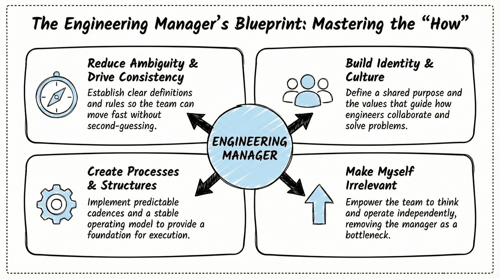
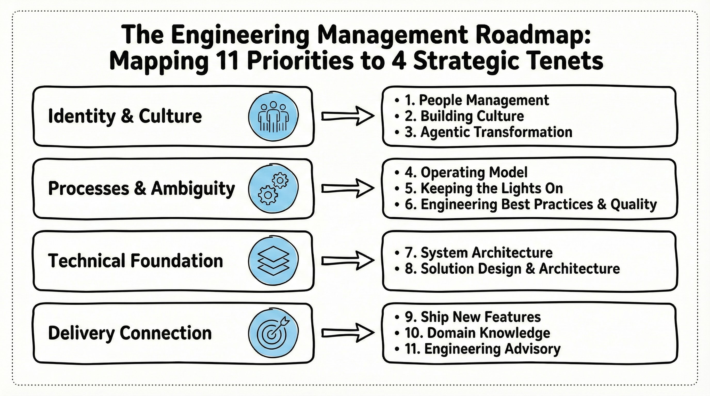
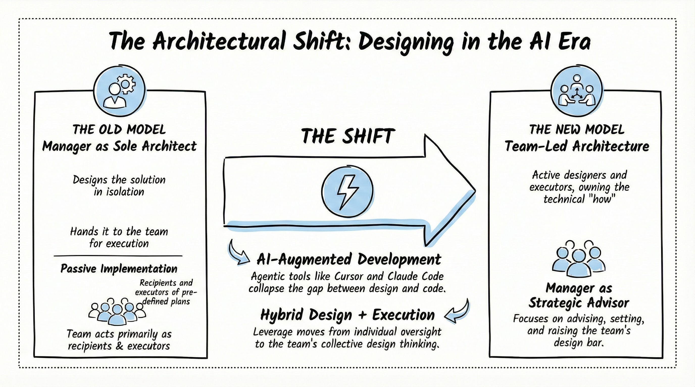

# My Leadership Style: How I Approach Engineering Management

<!-- Visualization Strategy: Simple Whiteboard Visual Style -->

## Executive Summary

As an engineering leader, my focus has shifted from the what—the products and strategies—to the how—the operating models, architecture, and culture that make delivery possible. My role is to build the engine that allows engineers and data scientists to do their best work. My leadership philosophy is grounded in four core tenets:

1. **Reduce Ambiguity:** Define clear roles, rules, and "done" states so the team can move fast.

2. **Create Predictable Structures**: Establish the cadences and operating models that ensure stability and quality.

3. **Build Identity & Culture**: Foster a shared purpose and drive agentic, AI-forward ways of working.

4. **Make Myself Irrelevant**: Empower the team to think, decide, and design independently.

In an AI-augmented world, my ultimate goal is to transform my team from pure executors into empowered solution designers, while I orchestrate the systems that drive consistent, high-quality impact.

## Introduction

Throughout my career I've focused on the *what*: the products we're building, the impact we're measuring, the strategy we're executing. More recently, as I've moved into engineering management, I've shifted my attention to the *how*. Delivering engineering effectively comes down to how we run our lifecycle, our methodologies, and our architecture. My job is to put the right enablers in place so engineers can stay focused on building and shipping good product, supported by the technology, processes, and people management that help them do their best work.

I want to be transparent with my team and with myself. Not just that we're accomplishing the mission, but how I plan to execute and what my roadmap is. These are the things where the buck stops with me. Everyone has a job; engineers need to engineer. My job is to provide the orchestration and get the right pieces in place so we can work effectively as a group. This piece is that roadmap. I'll walk through four core tenets: reduce ambiguity and drive consistency, create processes and structures so the team is predictable and stable, build and develop identity and culture, and constantly make myself irrelevant. From there, I'll show how those tenets show up in practice, how I think about designer versus executor in the AI era, and how I manage my time and focus.

<!-- Image Description: A framework diagram showing the four core tenets of engineering management arranged in a 2x2 grid. Four boxed sections (rounded rectangles with slightly irregular edges) occupy each quadrant. Top-left: "Reduce Ambiguity & Drive Consistency" with subtext "Clear definitions, roles, and rules so the team can move fast." Top-right: "Build Identity & Culture" with subtext "Shared purpose and what it means to be an engineer here." Bottom-left: "Create Processes & Structures" with subtext "Predictable cadences, operating model, and stable foundation." Bottom-right: "Make Myself Irrelevant" with subtext "Empower the team to think, decide, and operate independently." A central circular section labeled "Engineering Manager" sits at the intersection with four straight arrows (hand-drawn quality) pointing outward to each quadrant box. One minimalist line art icon per box: compass (top-left), people figure (top-right), gear (bottom-left), upward arrow (bottom-right). The central circular hub icon filled with Light Blue accent. The overall visual communicates that the manager's role is to drive all four tenets simultaneously from the center. Visual Strategy: Create this infographic using a **whiteboard visual style** with hand-drawn/sketch aesthetic where lines and shapes have a slightly irregular, informal quality (avoid perfect geometric precision), and include a subtle dotted line border around the entire image. Use a strictly limited color palette: Black (#000000) for all outlines and text, White (#FFFFFF) background, Light Blue (#ADD8E6) accent used sparingly only for icon fills within circular sections—no other colors. Use simple conceptual iconography with minimalist line art icons (compass, people figures, gears, arrows), avoiding photorealistic illustrations. One icon per major section. Typography: bold hand-drawn style for titles 1.5x larger than section headers, headers 1.2x larger than body text. Use boxed sections as primary containers; circular section only for the central Engineering Manager hub. Straight arrows with hand-drawn quality pointing from center to each quadrant. Adequate white space (at least 20% of image area). Maximum 5 major visual elements. Focus on ONE main idea. Keep the design approachable and feeling like a collaborative whiteboard session. -->

---

## Reduce Ambiguity and Drive Consistency

My first priority is to reduce ambiguity and drive consistency for the team. When people don't know what "done" looks like, or how decisions get made, or what the priorities are, they spend energy guessing and aligning instead of executing. I see my job as making the rules of the game clear. That means locking in **Definition of Done** and **Definition of Ready**, how we groom and prioritize, who owns what, and what we mean by quality and reliability. Clarity doesn't mean rigidity. It means the team can move fast because they're not constantly resolving the same uncertainties. I aim to say things once in a way that sticks, document them where it matters, and reinforce them in how we run the operating model so that consistency becomes the default.

---

## Create Processes and Structures for a Predictable and Stable Team

Second is creating the processes and structures that make the team predictable and stable. Predictable doesn't mean slow. It means we have cadences, roles, and a clear operating model so that work flows through the system in a way everyone can rely on. Product figures out the *what*. We own how we build and ship, from the Agile cadence to backlog grooming to delivery. We also own "keeping the lights on" (reducing operational overhead, technical debt, and reliability risk) so we stay productive even when we're not shipping new features. Stability is what lets people do their best work. They know how to get unblocked, who to go to, and what "good" looks like. I invest in the operating model, engineering best practices and quality as a stated priority, and the system architecture (pipelines, platform, data mesh) so that the foundation doesn't shift under people's feet.

---

## Build and Develop Identity and Culture

Third is building and developing the team's identity and culture, the shared understanding of what we care about and what matters. I think of this as giving the team a clear sense of purpose. Why are we uniquely positioned to solve these problems for our customers? How does that positioning let us provide value in a way no one else can? Where we sit in the organization matters. The problems we're built to solve are specific. That clarity of purpose drives real meaning.

Culture isn't a poster on the wall. It's the tone we set for what it means to be an engineer in our group and at the company. It shows up in how we collaborate, how we give feedback, how we handle failure, and what we celebrate. I want the team to have a shared sense of what "good" looks like and what we're optimizing for. That includes making space for agentic transformation. Leadership expects us to use AI and agentic ways of working, and we need concrete actions to make that real, not just a line item. Culture and agentic transformation have to coexist, so I give each its own focus.

---

## Constantly Make Myself Irrelevant

Fourth is an aspiration that sounds counterintuitive but is central to how I think about the role. My goal is to constantly make myself irrelevant. If I'm doing the job well, things are documented, running efficiently, and the team can operate without me in the loop for the day-to-day. I'm not trying to be the bottleneck. I'm trying to empower people to think like me, make decisions consistently with the bar we've set, and own their domains. Once we're there, we can expand scope, drive deeper value, and I can move on to helping the next layer (other managers or the broader org). I'm always looking for where to delegate, who's ready to take on a responsibility, and how to raise the bar so that when someone steps up, they're set up to succeed. Making myself irrelevant is the ultimate compliment. The team doesn't need me to run.

Those four tenets need to show up somewhere concrete. At Salesforce we manage goals and priorities with a framework called **V2MOM**.

---

## Enablers in Practice

**V2MOM** stands for Vision, Values, Methods, Obstacles, Measures. It's how we turn vision and values into actionable goals and a concrete list of priorities (the Methods). In my experience, a lot of V2MOMs are very product-focused, centered on *what* projects we're doing and *what* impact we're measuring. In my current role I've focused my methods list on the process, specifically *how* we deliver engineering and data science effectively and *how* we shore up our approach holistically as an organization. My role is to be an accountable facilitator and help orchestrate the larger system that is delivery and engineering operations.

The focus on process isn't because product outcomes don't matter. It's because no one else is going to own the *how*. Product has the roadmap. They have the customer feedback, the solution requirements, the feature priorities. If I show up and position my contribution as "here's what we need to build too," I'm not adding value to that conversation. The value I add as a leader focused on data science, engineering, and AI is grounded in the *how*. That's the complementary piece that connects with what Product brings to the table. Together, we build something truly powerful. But if we're both focused on what we're building, no one is establishing the enablers and the foundation for how we actually get there. That's what I'm accountable for. Here's the list I'm running with, in priority order:

1. **People management:** I directly manage and develop the engineers reporting to me and own their growth, happiness, and effectiveness. No one else is responsible for managing them.

2. **Building culture:** I work to establish the culture we want (collaboration, tone, and what it means to be an engineer in our group and at the company).

3. **Agentic transformation:** I drive adoption of AI and agentic ways of working so the team can succeed. Leadership expects us to use AI, and we need concrete actions to make that real.

4. **Operating model:** I own how we build and ship. That includes Agile cadences, Definition of Done and Definition of Ready, roles (Product Owner, Scrum Lead), backlog grooming, and delivery. We run this system. Product decides what goes in.

5. **Keeping the lights on:** I focus on reducing the cost of running what we own (operational overhead, technical debt, reliability) so we stay productive and efficient even when we're not shipping new features.

6. **Engineering best practices and quality:** I make reliability and engineering quality a stated priority with clear objectives and work to improve process and output over time (Six Sigma mindset).

7. **System architecture:** I own system-level architecture and infrastructure (pipelines, dbt, enterprise data mesh) and how we design and run the platform.

8. **Solution design and architecture:** I work with principal engineering to standardize solution design and architecture and to influence how we build at a high level.

9. **Ship new features:** I partner with Product so the "what" is groomed into epics and backlog. We then build and ship to the highest quality we can deliver.

10. **Domain knowledge:** I work to understand our customers and their domain deeply. We rely on Product to lead here, but we need enough context to deliver well.

11. **Engineering advisory:** I advise Product and others when asked (work digestion, decomposition, architecture) further up the funnel. This is last priority. We start work when epics are well-groomed and meet our Definition of Done.

You can map this list back to the tenets: people management, building culture, and agentic transformation (1–3) are where identity and culture get built. Operating model, keeping the lights on, and engineering best practices and quality (4–6) are where we create the processes and structures that make the team predictable and stable, and where we reduce ambiguity through DoD, DoR, and clear roles. System and solution design and architecture (7–8) are the technical foundation. Shipping features (9), domain knowledge (10), and advisory (11) are how we stay connected to the *what* while owning the *how*. My job isn't to do all of this myself. It's to facilitate these enablers so the team has the process, standards, architecture, and culture to deliver. Product still owns the *what*. I own the conditions under which we deliver.

<!-- Image Description: A vertical stacking diagram showing how eleven engineering management priorities map to four strategic tenet clusters. Four stacked rows flow top-to-bottom, each row as a boxed section (rounded rectangle with slightly irregular edges) with two parts: a left header box (tenet cluster label) and a right content box (numbered priorities). Row 1 labeled "Identity & Culture": priorities "1. People Management," "2. Building Culture," "3. Agentic Transformation." Row 2 labeled "Processes & Ambiguity": priorities "4. Operating Model," "5. Keeping the Lights On," "6. Engineering Best Practices & Quality." Row 3 labeled "Technical Foundation": priorities "7. System Architecture," "8. Solution Design & Architecture." Row 4 labeled "Delivery Connection": priorities "9. Ship New Features," "10. Domain Knowledge," "11. Engineering Advisory." One minimalist line art icon per tenet cluster header: people figure (Identity & Culture), gear (Processes & Ambiguity), stacked layers (Technical Foundation), arrow/target (Delivery Connection). Straight arrows (hand-drawn quality) flow from each header box to its priority list box. The overall visual communicates how the 11 concrete priorities directly implement the four management tenets. Visual Strategy: Create this infographic using a **whiteboard visual style** with hand-drawn/sketch aesthetic where lines and shapes have a slightly irregular, informal quality (avoid perfect geometric precision), and include a subtle dotted line border around the entire image. Use a strictly limited color palette: Black (#000000) for all outlines and text, White (#FFFFFF) background, Light Blue (#ADD8E6) accent used sparingly only for icon fills within circular sections—no other colors. Use simple conceptual iconography with minimalist line art icons (people figures, gears, stacked layers, arrows), avoiding photorealistic illustrations. One icon per tenet cluster header. Typography: bold hand-drawn style for titles 1.5x larger than section headers, headers 1.2x larger than body text. Use boxed sections as primary containers. Vertical stacking layout (top-to-bottom). Straight arrows with hand-drawn quality for each row connection. Adequate white space (at least 20% of image area). Maximum 4 major visual elements (the four rows). Focus on ONE main idea. Keep design approachable and feeling like a collaborative whiteboard session. -->

---

## Designer vs. Executor in the AI Era

One of the biggest shifts I've had to make is around solution design and architecture. Two years ago I would have said that as a manager I carry significant responsibility for that. I sort out the design and hand it to the team. Now I think that's the wrong model, especially with agentic software development and tools like Cursor and Claude Code. The best thing I can do for data scientists and engineers is move them into a hybrid role. They're both designing and solutioning, thinking about how to build the right thing for short-term and long-term value while meeting business needs, and doing the technical work. I can't sort out the design and hand it over. I have to develop the team's capacity to think that way. I delegate solution design and architecture to the team, in partnership with principal engineering, and I advise and set direction. My job is to make sure the bar for "how we design" is clear and that people are developing that muscle. In an AI-augmented world, the leverage is in the thinking and the design, not in me being the single source of solution architecture.

<!-- Image Description: A three-section comparison diagram showing the shift from old to new model for solution design and architecture. Three boxed sections (rounded rectangles with slightly irregular edges) arranged left to right. Left section labeled "Old Model": a single human figure at top representing the manager as sole architect, downward arrow to label "Manager designs the solution," second downward arrow to "Hands to team for execution," team shown below as passive recipients. Center section labeled "The Shift": upward arrow pointing right as the primary directional element, with key drivers listed: "AI-augmented development," "Agentic tools (Cursor, Claude Code)," "Hybrid design + execution role." Right section labeled "New Model": a group of human figures representing the team at center as active designers and executors, manager shown to the side in a smaller advisory position with label "Advise & set direction," upward arrows from the team showing empowerment. One minimalist line art icon per section: single person with gear (Old Model), lightning bolt or forward arrow (The Shift), group of people (New Model). The main straight arrow in the center section points left-to-right showing direction of change. The overall visual communicates that in an AI-augmented world, the leverage is in developing the team's design capacity, not the manager being the single source of architecture. Visual Strategy: Create this infographic using a **whiteboard visual style** with hand-drawn/sketch aesthetic where lines and shapes have a slightly irregular, informal quality (avoid perfect geometric precision), and include a subtle dotted line border around the entire image. Use a strictly limited color palette: Black (#000000) for all outlines and text, White (#FFFFFF) background, Light Blue (#ADD8E6) accent used sparingly only for icon fills within circular sections—no other colors. Use simple conceptual iconography with minimalist line art icons (human figures, gears, arrows, lightning bolt), avoiding photorealistic illustrations. One icon per section. Typography: bold hand-drawn style for titles 1.5x larger than section headers, headers 1.2x larger than body text. Use boxed sections as primary containers. Three-section horizontal layout (left-center-right). Straight arrows with hand-drawn quality. Adequate white space (at least 20% of image area). Maximum 3 major visual elements (the three sections). Focus on ONE main idea. Keep design approachable and feeling like a collaborative whiteboard session. -->

---

## Where I Spend My Time

I hold myself accountable for where my time goes. Two dimensions matter most.

**Upward and outward versus internal and downward.** As a frontline manager I have to balance time with stakeholders, strategy, and the rest of the organization (upward and outward) with time inside the team, making sure we're a high-performing unit of delivery (internal and downward). I try to be explicit about that split so I don't default to one or the other. The team needs me present for the operating model, the culture, and the unblocking. The business needs me present for alignment, prioritization, and advisory. I don't want to disappear into the org or disappear into the team. I want a conscious balance.

**Time across the year's goals and priorities.** For the methods I'm accountable for (the list above), I try to set a rough time budget. What percentage of my time do I want to spend on each of these over the year, the quarter, the month? I hold myself accountable to that. It's easy to react to the loudest thing. A time budget forces me to be upfront and proactive about where the business needs my management and oversight. I also remind myself that holding accountability doesn't mean doing everything myself. I'm building responsibility in others and acting as facilitator and advisor so the team solves problems together. The time budget applies to the *categories* of impact I'm trying to have, not to me being the doer of all of it.

---

## Conclusion

My leadership style boils down to four commitments. Reduce ambiguity so the team can move fast. Build processes and structures that create stability and predictability. Develop identity and culture so people know what they're optimizing for. Work every day toward making myself irrelevant. I own the *how* we deliver. I delegate solution design and architecture to the team while advising and setting direction. I manage my time consciously, balancing upward and outward work against internal team presence, and distributing attention across the priorities that matter most. The goal isn't to do everything. It's to create the conditions where the team can do everything well. That's the engineering management approach I bring, and the one I'm still refining.
