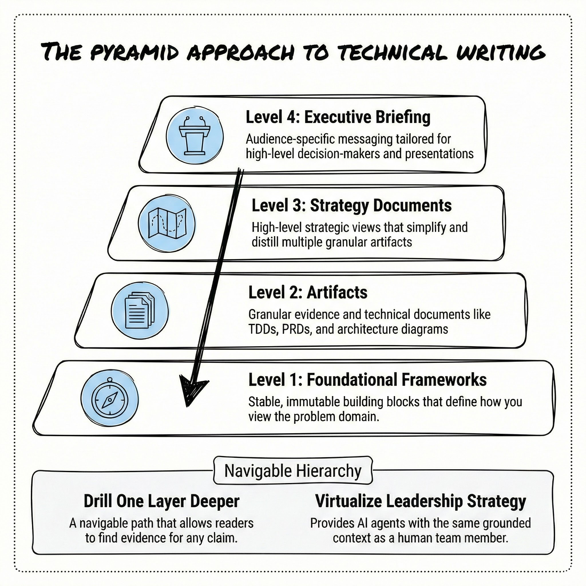
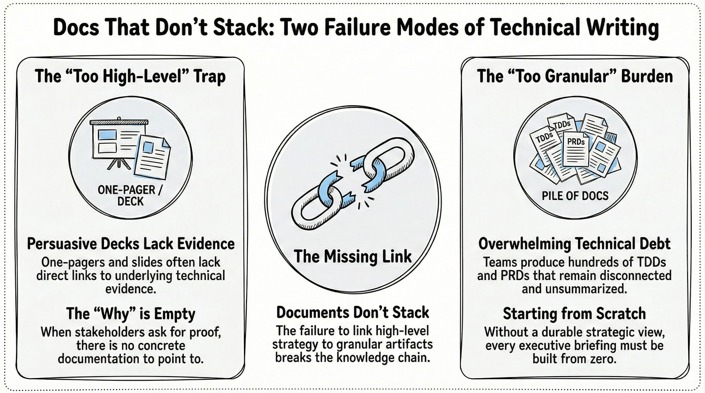
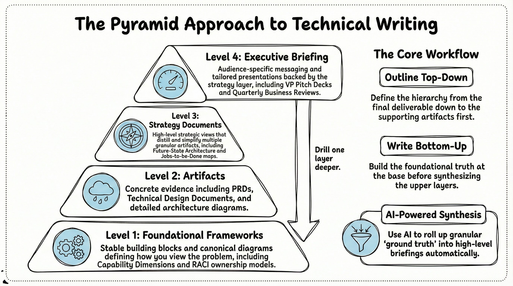
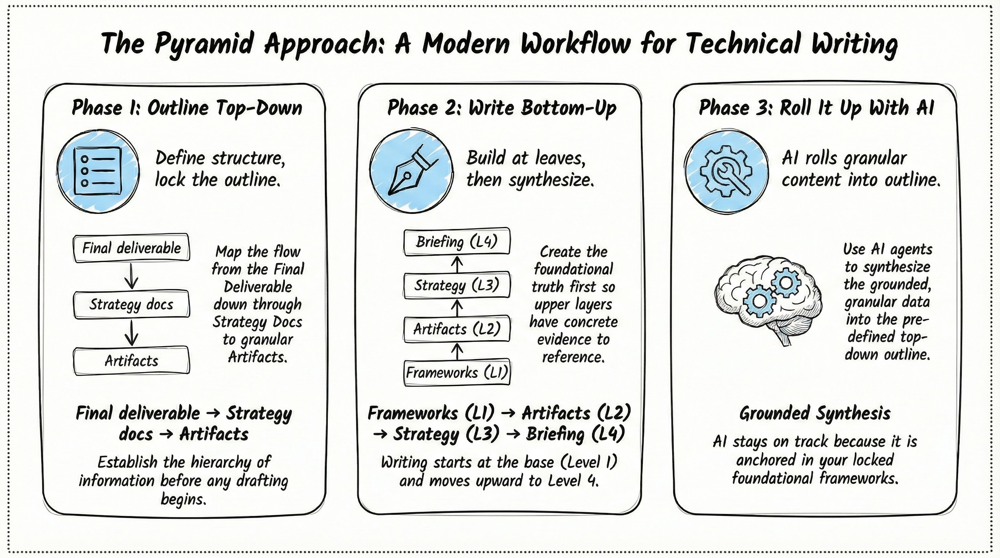
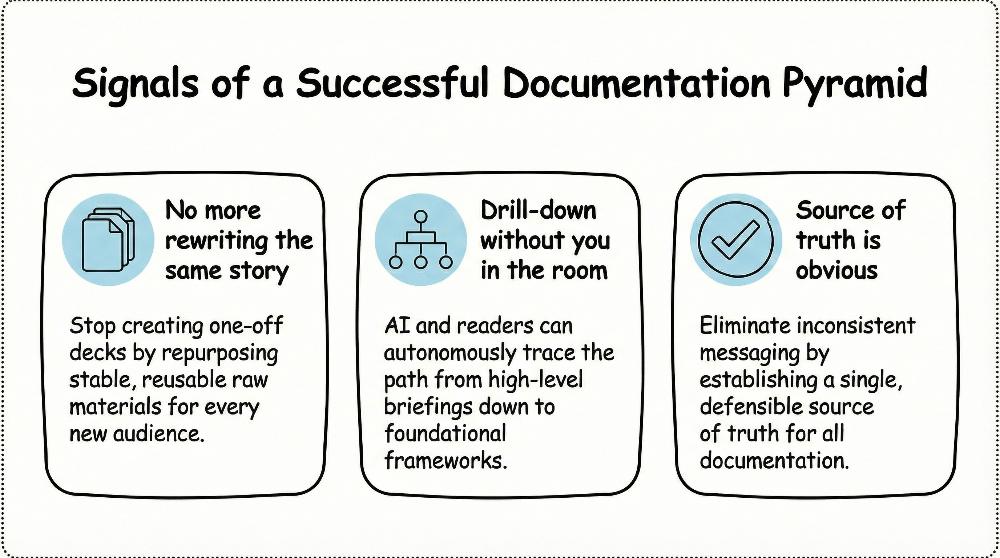

# The Pyramid Approach to Technical Writing: Decomposition, Reuse, and AI Grounding

*A framework for organizing technical and product documentation in four levels, from foundational frameworks to executive briefings. Each piece is a reusable part. AI and human readers can tailor your ground truth to any audience or situation. The key insight: decompose strategic asks into grounding components, then build the story from those raw materials.*

**Document Type:** Whitepaper  
**Status:** Draft  
**Last Updated:** 2026-03-01  
**Owner:** Thomas L. Bohn

<!-- Visualization Strategy: This document uses the Simple Whiteboard Visual Style. See .cursor/resources/technical-writing/add-images/visualization-strategy-simple.md for full specifications. All infographics in this document MUST follow that whiteboard visual style (dotted border, three-color palette, boxed sections, layout patterns, 5-7 major elements). -->
<!-- Diagram: Four-tier pyramid, base to top: Foundational frameworks | Artifacts | Strategy documents | Executive briefing. Optional dashed "drill one layer deeper" arrows from top to base. See plans/pyramid_approach_technical_writing/pyramid_approach_framework_spec.md §5 for full diagram spec. -->

## Executive Summary

How do you make technical writing reusable, consistent, and useful for both humans and AI? 

Throughout my career, I have watched teams pour effort into one-off decks and documents that never connect to a single source of truth. When a stakeholder or an AI assistant asks "Why?" or "Where is the backup?", there is rarely a clear path from the presentation slide to the underlying thinking. The result is duplicated work, inconsistent messaging, and AI agents that hallucinate because they cannot ground themselves in how you actually see the world.

The **Pyramid approach** fixes this by applying software-engineering principles of decomposition to technical writing. Documents are organized into four levels. At the base sit **foundational frameworks** (how you see the world). Next are **artifacts** (granular, specific deliverables like TDDs and PRDs). Above those sit **strategy documents** (high-level strategic views). At the top is the **executive briefing** (audience- and purpose-specific messaging). 

Each layer serves as a reusable component. Readers and AI can drill one layer deeper whenever they need more detail. This structure virtualizes your leadership strategy, making it accessible to agents like Cursor and Copilot whenever they need to reason over your document structure or answer a complex question.

<!-- Image Description: A four-tier pyramid diagram (layered architecture layout, bottom-to-top). Four boxed sections (rounded rectangles): Base "Foundational Frameworks," then "Artifacts," then "Strategy Documents," top "Executive Briefing." One straight arrow (hand-drawn quality) from top to base labeled "Drill one layer deeper." One minimalist line-art icon per tier (compass, document stack, map, podium). Max 5 major elements (four tiers plus drill path). Communicates documentation levels and navigable hierarchy. Visual Strategy: Create this infographic using a **whiteboard visual style** with hand-drawn/sketch aesthetic where lines and shapes have a slightly irregular, informal quality (avoid perfect geometric precision). MUST include a subtle dotted line border around the entire image. Use a strictly limited color palette: Black (#000000) for all outlines, text, and symbols (including checkmarks, X marks, arrows, and all visual elements)—NO other colors allowed. White (#FFFFFF) background. Light Blue (#ADD8E6) accent used sparingly ONLY for icon fills within circular sections—no other color usage permitted. Use simple conceptual iconography with minimalist line art icons (gears, clouds, bar charts, funnels, speedometers, compass roses, simple human figures), avoiding photorealistic or highly detailed illustrations. Use icons consistently—one icon per major section or concept, placed within circular sections or at the start of boxed sections. Typography hierarchy: Main titles bold hand-drawn style 1.5x larger than section headers; section headers bold hand-drawn style 1.2x larger than body text; body text clear and concise. Use boxed sections (rounded rectangles with slightly irregular edges) as the primary container type for consistency; reserve circular sections only for special emphasis (central hubs, key concepts, North Star elements). Layout patterns: Horizontal flow (left-to-right) for processes/pipelines; vertical stacking (top-to-bottom) for problem-solution pairs/layers; three-section layouts (left-center-right) for comparisons/value propositions; layered architectures (bottom-to-top) for system layers. Use straight arrows with slightly irregular hand-drawn quality (not perfectly straight) to show flow and relationships—one arrow per relationship. Maintain consistent spacing: minimum 1.5x element height between major sections, minimum 1x element height between related sub-elements, adequate white space (at least 20% of image area). Visual hierarchy: Largest elements for main concepts/central hubs, medium for supporting sections, smallest for details/annotations. Maximum 5-7 major visual elements per infographic. Focus on communicating ONE main idea clearly, avoiding overwhelming detail and prioritizing clarity over completeness. Keep the design approachable, easy to understand, and feeling like a collaborative whiteboard session. -->

---

## The Problem: Docs That Don't Stack

Over the last decade at Salesforce, we operated as a highly meeting-driven, face-to-face organization. I have created hundreds of strategy decks to speak to various leaders. We routinely move slides around from deck to deck, but we fail to recognize the consistent resources and descriptive information that power those facts. 

What is broken might not even be the writing itself. Often, the failure lies in the directory structure and hierarchy for how we store content. We fail to recognize that the story we tell is fundamentally different from how we organize the knowledge powering that story. We tend to store knowledge like verbal storytelling, much like books sitting passively on a shelf. AI and reusable components require a completely different structure. They operate best when we break information down into specific problem-solving themes and frameworks. 

With remarkable consistency, these conversations follow a familiar pattern. The documents do not stack. 

* **They are too high-level:** Persuasive decks and one-pagers lack links to underlying evidence. When asked, "Why do we believe that?", there is nothing concrete to point to.
* **They are too granular:** Teams generate hundreds of TDDs, PRDs, and architecture documents that never get summarized into a durable strategic view. Every executive briefing is built from scratch.

During the generative AI transformation of the last year, I asked myself a fundamental question: *What if we treated technical writing like software?* In software, we decompose systems into layers of abstraction. We do not build one giant blob of code per audience. We build reusable components and compose them. The same principle applies directly to documentation. If we break technical writing into linked levels, we achieve reuse, consistency, and a hierarchy that AI can navigate.

<!-- Image Description: A comparison diagram (three-section layout: left-center-right). Left boxed section: "Too high-level" with deck/one-pager icon; bullets "Persuasive decks lack links to evidence," "When asked 'Why?' nothing concrete to point to." Right boxed section: "Too granular" with pile-of-docs icon; bullets "Hundreds of TDDs, PRDs, architecture docs," "No durable strategic view; every briefing built from scratch." Center: "Documents don't stack" label or broken-chain visual. One straight arrow or gap between sections emphasizing missing link. One icon per side; max 5 major elements. MUST include dotted line border. Communicates two failure modes. Visual Strategy: Create this infographic using a **whiteboard visual style** with hand-drawn/sketch aesthetic where lines and shapes have a slightly irregular, informal quality (avoid perfect geometric precision). MUST include a subtle dotted line border around the entire image. Use a strictly limited color palette: Black (#000000) for all outlines, text, and symbols (including checkmarks, X marks, arrows, and all visual elements)—NO other colors allowed. White (#FFFFFF) background. Light Blue (#ADD8E6) accent used sparingly ONLY for icon fills within circular sections—no other color usage permitted. Use simple conceptual iconography with minimalist line art icons (gears, clouds, bar charts, funnels, speedometers, compass roses, simple human figures), avoiding photorealistic or highly detailed illustrations. Use icons consistently—one icon per major section or concept, placed within circular sections or at the start of boxed sections. Typography hierarchy: Main titles bold hand-drawn style 1.5x larger than section headers; section headers bold hand-drawn style 1.2x larger than body text; body text clear and concise. Use boxed sections (rounded rectangles with slightly irregular edges) as the primary container type for consistency; reserve circular sections only for special emphasis (central hubs, key concepts, North Star elements). Layout patterns: Horizontal flow (left-to-right) for processes/pipelines; vertical stacking (top-to-bottom) for problem-solution pairs/layers; three-section layouts (left-center-right) for comparisons/value propositions; layered architectures (bottom-to-top) for system layers. Use straight arrows with slightly irregular hand-drawn quality (not perfectly straight) to show flow and relationships—one arrow per relationship. Maintain consistent spacing: minimum 1.5x element height between major sections, minimum 1x element height between related sub-elements, adequate white space (at least 20% of image area). Visual hierarchy: Largest elements for main concepts/central hubs, medium for supporting sections, smallest for details/annotations. Maximum 5-7 major visual elements per infographic. Focus on communicating ONE main idea clearly, avoiding overwhelming detail and prioritizing clarity over completeness. Keep the design approachable, easy to understand, and feeling like a collaborative whiteboard session. -->

---

## The Pyramid Framework

The Pyramid approach mirrors the levels of abstraction we already use in conversation, scaling from "How we see the world" up to "Here is the strategy" and finally "Here is the tailored message for today." 

Executives frequently deliver these presentations, but they rarely build the full pyramid themselves. They rely on their "writing rooms" (product managers, architects, and technical designers) to prepare the material. This framework empowers those technical teams to build a rich repository of source material that leadership can rely on.

If you are familiar with the **C4 model** for software architecture, the parallel is direct. C4 utilizes four levels (System, Containers, Components, Code) to let architects zoom from high-level context down to implementation details. The Pyramid does the exact same thing for documentation.

<!-- Image Description: Same four-tier pyramid (layered architecture, bottom-to-top). Four boxed sections: Foundational Frameworks, Artifacts, Strategy Documents, Executive Briefing. One arrow "Drill one layer deeper" top to base. One icon per tier; max 5 major elements. Dotted border. Communicates levels and drill-down. Visual Strategy: Create this infographic using a **whiteboard visual style** with hand-drawn/sketch aesthetic where lines and shapes have a slightly irregular, informal quality (avoid perfect geometric precision). MUST include a subtle dotted line border around the entire image. Use a strictly limited color palette: Black (#000000) for all outlines, text, and symbols (including checkmarks, X marks, arrows, and all visual elements)—NO other colors allowed. White (#FFFFFF) background. Light Blue (#ADD8E6) accent used sparingly ONLY for icon fills within circular sections—no other color usage permitted. Use simple conceptual iconography with minimalist line art icons (gears, clouds, bar charts, funnels, speedometers, compass roses, simple human figures), avoiding photorealistic or highly detailed illustrations. Use icons consistently—one icon per major section or concept, placed within circular sections or at the start of boxed sections. Typography hierarchy: Main titles bold hand-drawn style 1.5x larger than section headers; section headers bold hand-drawn style 1.2x larger than body text; body text clear and concise. Use boxed sections (rounded rectangles with slightly irregular edges) as the primary container type for consistency; reserve circular sections only for special emphasis (central hubs, key concepts, North Star elements). Layout patterns: Horizontal flow (left-to-right) for processes/pipelines; vertical stacking (top-to-bottom) for problem-solution pairs/layers; three-section layouts (left-center-right) for comparisons/value propositions; layered architectures (bottom-to-top) for system layers. Use straight arrows with slightly irregular hand-drawn quality (not perfectly straight) to show flow and relationships—one arrow per relationship. Maintain consistent spacing: minimum 1.5x element height between major sections, minimum 1x element height between related sub-elements, adequate white space (at least 20% of image area). Visual hierarchy: Largest elements for main concepts/central hubs, medium for supporting sections, smallest for details/annotations. Maximum 5-7 major visual elements per infographic. Focus on communicating ONE main idea clearly, avoiding overwhelming detail and prioritizing clarity over completeness. Keep the design approachable, easy to understand, and feeling like a collaborative whiteboard session. -->

### Level 1: Foundational Frameworks (The Base)
These are the stable, relatively immutable building blocks of your domain. They dictate how you view the world. 
* *Examples:* A canonical diagram of your product space, the dimensions you use to segment capabilities, or a RACI-like view of ownership. 
* *The Goal:* These form your foundational truth. They are what a reader reaches when they drill all the way down and ask, "Why do you think about the problem this way?"

### Level 2: Artifacts
These are highly granular, specific documents. You will maintain many of these per product area. They serve as the concrete evidence that your strategy summarizes.
* *Examples:* Technical Design Documents (TDDs), Product Requirements Documents (PRDs), or detailed C4 architecture diagrams.
* *The Goal:* Without artifacts, strategy is unsupported. With them, every executive claim can be traced back to a concrete deliverable.

### Level 3: Strategy Documents
These provide the high-level strategic view. They simplify and distill an entire artifact domain. You typically maintain one document (or a small set) per strategic topic. 
* *Examples:* Current-state architecture, future-state architecture, or a breakdown of the product space and jobs-to-be-done.
* *The Goal:* They sit above the artifacts and below the executive briefings. When your strategy shifts, you update this document once. Consequently, all briefings that reference it stay perfectly aligned.

### Level 4: Executive Briefing (The Top)
These are your audience- and purpose-specific deliverables. 
* *Examples:* A tailored 30-minute presentation for VPs or a quarterly pitch deck.
* *The Goal:* Almost every slide is backed by a Strategy Document. The briefing does not stand alone. The stack beneath it is what makes it defensible.

---

## The Paradigm Shift: Outline Top-Down, Write Bottom-Up

To execute this framework effectively, you must fundamentally change how you write. 

I used to operate as a top-down writer. I would receive an ask and jump straight into building the presentation deck. Now, I operate as a bottom-up writer. 

1. **Outline Top-Down:** Start at the top (the final deliverable) and work your way down to define the structure. Identify the presentation. Identify the strategy documents that back it. Identify the artifacts sitting under those. Lock the outline.
2. **Write Bottom-Up:** Do not start writing the deck. Start at the leaves. Build the frameworks (Level 1), inventory the artifacts (Level 2), and synthesize the strategy (Level 3).
3. **Roll It Up With AI:** Once you establish rich, well-understood context at the granular level, let your AI agent roll those components up into the outline you originally started with.

If I cannot fully describe why my frameworks work, I cannot start writing the upper levels.

<!-- Image Description: A process flow diagram (horizontal flow, left-to-right). Three boxed sections: (1) "Outline Top-Down" with list icon; flow Final deliverable → Strategy docs → Artifacts; label "Define structure, lock the outline." (2) "Write Bottom-Up" with pen icon; flow Frameworks (L1) → Artifacts (L2) → Strategy (L3) → Briefing (L4); label "Build at leaves, then synthesize." (3) "Roll It Up With AI" with gear icon; AI rolls granular content into outline. Straight arrows (one per relationship), hand-drawn quality between sections. One icon per phase; max 5-7 major elements. Dotted border. Communicates outline top-down, write bottom-up, roll up with AI. Visual Strategy: Create this infographic using a **whiteboard visual style** with hand-drawn/sketch aesthetic where lines and shapes have a slightly irregular, informal quality (avoid perfect geometric precision). MUST include a subtle dotted line border around the entire image. Use a strictly limited color palette: Black (#000000) for all outlines, text, and symbols (including checkmarks, X marks, arrows, and all visual elements)—NO other colors allowed. White (#FFFFFF) background. Light Blue (#ADD8E6) accent used sparingly ONLY for icon fills within circular sections—no other color usage permitted. Use simple conceptual iconography with minimalist line art icons (gears, clouds, bar charts, funnels, speedometers, compass roses, simple human figures), avoiding photorealistic or highly detailed illustrations. Use icons consistently—one icon per major section or concept, placed within circular sections or at the start of boxed sections. Typography hierarchy: Main titles bold hand-drawn style 1.5x larger than section headers; section headers bold hand-drawn style 1.2x larger than body text; body text clear and concise. Use boxed sections (rounded rectangles with slightly irregular edges) as the primary container type for consistency; reserve circular sections only for special emphasis (central hubs, key concepts, North Star elements). Layout patterns: Horizontal flow (left-to-right) for processes/pipelines; vertical stacking (top-to-bottom) for problem-solution pairs/layers; three-section layouts (left-center-right) for comparisons/value propositions; layered architectures (bottom-to-top) for system layers. Use straight arrows with slightly irregular hand-drawn quality (not perfectly straight) to show flow and relationships—one arrow per relationship. Maintain consistent spacing: minimum 1.5x element height between major sections, minimum 1x element height between related sub-elements, adequate white space (at least 20% of image area). Visual hierarchy: Largest elements for main concepts/central hubs, medium for supporting sections, smallest for details/annotations. Maximum 5-7 major visual elements per infographic. Focus on communicating ONE main idea clearly, avoiding overwhelming detail and prioritizing clarity over completeness. Keep the design approachable, easy to understand, and feeling like a collaborative whiteboard session. -->

---

## The Pyramid in Practice: A Worked Example

Recently, I needed to deliver a clean 30-minute presentation to senior leadership regarding Technical Health Scores and telemetry modernization. The presentation required a persuasive, lean narrative covering current-state versus future-state architecture across multiple interacting product areas. 

Instead of opening Google Slides immediately, I utilized the Pyramid. I did not know how to solve the entire problem from the start, but I had a strong point of view on specific components. I wanted to collaboratively write with AI to generate new ideas, but I needed my core frameworks to remain completely stable. 

1. **Level 1:** Therefore, I documented the frameworks first. They served as my anchor, defining exactly how I think about technical health and the broader product space. 
2. **Level 2 & 3:** I collaboratively wrote with AI to apply those frameworks to current-state and future-state strategy documents, pointing directly to specific PRDs and deep-dive analytical artifacts. Because the frameworks were locked, the AI stayed grounded.
3. **Level 4:** I aggregated everything into the persuasive deck. 

I built a wide base with exceptionally high velocity using AI. I captured my ground truth, and then I tailored the story for the executives. Anyone in that meeting could drill from a slide, to the strategy document, to the artifact, and finally to my foundational framework. 

### Virtualizing Leadership Strategy
You can find success with any agentic experience, but this requires connecting your files and rules appropriately. The fundamental goal is to provide your agents the exact same context you would give to a new human team member. This successfully virtualizes your leadership strategy. Here is my ecosystem:

* **Cursor IDE:** Central to my workflow. I use explicit technical writing rules to guide the agentic generation and roll-ups.
* **GitHub:** My single source of truth. Repositories with rich directory structures give me the best velocity for pulling context into agentic conversations. 
* **Docusaurus:** Used to publish Wiki-style strategy and technical documents as internal sites. It is writing-as-code distributed through a web interface.
* **Slack AI:** We place our strategic documents behind a Slack AI wrapper (RAG). People ask product questions and receive answers strictly from the Pyramid. When the bot cannot answer a question, that serves as a breakthrough signal. It means we have not fully answered it in writing yet, which is a great problem to have because it dictates exactly what we need to write next.

---

## 6 Ways to Break the Pyramid (Failure Modes)

The Pyramid only functions when all four levels exist and remain linked. If you struggle to implement this, you have likely hit one of these failure modes:

1. **Missing Foundational Frameworks:** You lack a shared view of the world. Different authors use different mental models, and AI has no stable ground truth. *The fix: Name and document your core dimensions first.*
2. **Thin Artifacts:** Your strategy documents make claims with no supporting detail. *The fix: Ensure every major strategy claim ties directly to at least one PRD or design diagram.*
3. **The Missing Strategy Layer:** Every deck is a one-off built directly from granular artifacts. *The fix: Write the strategy document before the briefing. Use it as the translation layer.*
4. **Unlinked Briefings:** Slides exist but do not reference the strategy. *The fix: Add a short "Backed by: [Doc Name]" to your speaker notes or slides to enable drill-down.*
5. **Taxonomy and Hierarchy Instability:** Getting your directory structure right on the first pass is exceptionally difficult. Every iteration breaks links and forces you to refactor how content connects. Moving content in Git requires significant labor, and naming is hard even for agents. *The fix: Spend time upfront defining your major artifacts and mapping out your taxonomy before you generate a massive volume of documents.*
6. **Skipping the Human Editor:** AI-generated content is stochastic. You will produce significantly more documentation, but you must shift from being a writer to being an editor. This requires critical reading, redlining, and continuous feedback to keep the AI on track.

---

## How You Know It Is Working

You know you have successfully implemented the Pyramid when you observe these signals:
* You stop rewriting the exact same story for every new audience.
* AI agents or new hires can easily drill from a briefing down to a framework without you being in the room.
* "Where is the source of truth?" becomes a strictly rhetorical question.

<!-- Image Description: A value/signals diagram (vertical stacking or three-section layout) showing three success indicators. Three boxed sections (rounded rectangles): (1) "No more rewriting the same story" with reuse/copy icon; (2) "Drill-down without you in the room" with path icon (briefing to framework); (3) "Source of truth is obvious" with check or anchor icon. Optional tagline "Build raw materials first; tailor with AI." One icon per section; max 5 major elements. Dotted border. Communicates success signals: reuse, self-service drill-down, single source of truth. Visual Strategy: Create this infographic using a **whiteboard visual style** with hand-drawn/sketch aesthetic where lines and shapes have a slightly irregular, informal quality (avoid perfect geometric precision). MUST include a subtle dotted line border around the entire image. Use a strictly limited color palette: Black (#000000) for all outlines, text, and symbols (including checkmarks, X marks, arrows, and all visual elements)—NO other colors allowed. White (#FFFFFF) background. Light Blue (#ADD8E6) accent used sparingly ONLY for icon fills within circular sections—no other color usage permitted. Use simple conceptual iconography with minimalist line art icons (gears, clouds, bar charts, funnels, speedometers, compass roses, simple human figures), avoiding photorealistic or highly detailed illustrations. Use icons consistently—one icon per major section or concept, placed within circular sections or at the start of boxed sections. Typography hierarchy: Main titles bold hand-drawn style 1.5x larger than section headers; section headers bold hand-drawn style 1.2x larger than body text; body text clear and concise. Use boxed sections (rounded rectangles with slightly irregular edges) as the primary container type for consistency; reserve circular sections only for special emphasis (central hubs, key concepts, North Star elements). Layout patterns: Horizontal flow (left-to-right) for processes/pipelines; vertical stacking (top-to-bottom) for problem-solution pairs/layers; three-section layouts (left-center-right) for comparisons/value propositions; layered architectures (bottom-to-top) for system layers. Use straight arrows with slightly irregular hand-drawn quality (not perfectly straight) to show flow and relationships—one arrow per relationship. Maintain consistent spacing: minimum 1.5x element height between major sections, minimum 1x element height between related sub-elements, adequate white space (at least 20% of image area). Visual hierarchy: Largest elements for main concepts/central hubs, medium for supporting sections, smallest for details/annotations. Maximum 5-7 major visual elements per infographic. Focus on communicating ONE main idea clearly, avoiding overwhelming detail and prioritizing clarity over completeness. Keep the design approachable, easy to understand, and feeling like a collaborative whiteboard session. -->

The foundation of technical writing should never be persuasive messaging tailored to a single person. It must be how we fundamentally think about the problem. Build your raw materials first. From there, you and your AI can tailor that ground truth to any message, audience, and situation.

***

**References**

* **C4 Model for Software Architecture** (c4model.com). 
* **Zettelkasten Method** (Wikipedia). Principles of hierarchy and linking that inform directory organization in the Pyramid.
* **Cursor** (cursor.com). AI-powered editor used for agentic conversations over code and documentation.
* **Docusaurus** (docusaurus.io). Static-site generator for documentation.

---

## Repository and Internal References

*Omit this section when publishing the article externally (e.g., to Medium or a public blog). The links below are for readers working in this repository.*

- Repository conventions for technical writing and framework articles: [AGENTS.md](../AGENTS.md), [.cursor/resources/technical-writing/](../.cursor/resources/technical-writing/).
- Framework specification (full definition, diagram spec, gap analysis): [plans/pyramid_approach_technical_writing/pyramid_approach_framework_spec.md](../plans/pyramid_approach_technical_writing/pyramid_approach_framework_spec.md).
